# Intro

## Basics

- need to know decimal, binary, hexadecimal 

  - 1 "hexit" is 1 hex digit (i.e `0xA`) and it's 4 bits (basically 0.5 bytes - also known as a "nibble")
  - **<u>1 byte = 8 bits = 2 hex digit</u>**

- addressing bytes

  - each memory address houses one byte of data
    - note: the mem address is not one byte - the content thats **in the mem address** is one byte in size
  - ex. address = `0xdeadbeef` 
    - the address is 8 hexit so 4 bytes long 
  
- data types

  - in this course we assume 64 bit CPU
  - for now: assume
    - `char` is 1 byte
    - `short` is 2 bytes
    - `unint32_t` explicitly defines a 32 bits (4 bytes) unsigned int
      - leave out the `u` and it'll be signed byte
      - by default, it's signed (i.e for short or char)
    - everything else doesn't really have a set size
      - to make sure run `sizeof(var)`
    - <u>**pretty sure we assume pointers are 8 bytes in size for us in this course**</u>

- signed vs unsigned

  - signed numbers can be negative, unsigned is non-negative
  - two's complement
    - if you know the number is signed, the most significant bit (MSB - the first bit) is the signed bit (i.e first bit is 1 - that means it's negative)
  - range
    - unsigned: $[0, 2^n-1]$
    - signed: $[-2 ^{n-1}, 2^{n-1}-1]$

- bit shifting

  	

  - `<<`: left shifting - basically get rid of the leading bits (add 0 to the end)

    - same as multiplying by 2 each time

  - `>>`: right shifting - basically get rid of the right most bits (add 0 to the front)

    - same as dividing by 2 each time

  - edge case

    	

    - some implementation of sign will keep the signed-ness of the integer

- type casting (integer types)

  - truncation: casting to smaller types

    	

    - gets rid of the leading bits

  - signed extension: casting to larger types

    	

    - it'll extend according to the signed bits
    - i.e for the second case, it added all 1s to the front &rightarrow; this will happen if the if the leading hexit is `>= 0x8`

## Memory 

- structs

  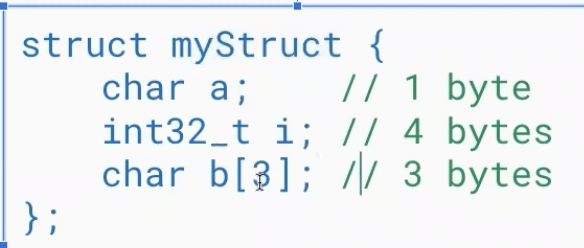	

  - code 

    	

- alignment rules: struct in C are larger than they appear

  1. whole struct must be aligned by size of its <u>largest</u> field
     - ex. if the largest is 8 bytes, the whole struct needs to be aligned to multiplication of 8s (8, 16, 24, ...)
  2. each variable is aligned to a multiple to its own type size
     - ex. a short (2 bytes) must start at an address that's 2-aligned
  3. when having an array/struct as a field, the alignment rule about sizing applies to the individual elements (not the array/struct itself)

  - if any rules not satisfied, add padding (empty space) to the struct until they are

  - computing size of the struct above

    	

    - `i` needs to be 4-aligned, so it has to start at 4 (add padding in front)
    - at the end, the entire struct needs to be aligned to the largest size (4) so we pad at the end

- endianess

  - big: most significant digit on the lowest address - makes sense to human

  - little: most significant digit on the highest address - more commonly esen

  - note: endian-ness does not affect the bytes themselves

    - i.e **<u>`BE` is still `BE` in both endianness</u>** 
    - but `BE AB` is `BE AB` in big and `AB BE` in small
    - **<u>you still read left to right</u>**

  - example:

    	

  - example in structs

    	

    - notice that the `char` array is the same on both, this is because the <u>individual bytes themselves stay  the same in both endian-ness</u> 
      - important because strings are just char arrays
    - but you can see that the ints members get flipped
    - note: if the array was of another type that was bigger than one byte, the individual element in the array would have been flipped in little endian

## Pointers

- `*`: dereference operator 

- `&`: "address of" operator

- remember - pointers are addresses!

- in code:

  	

- segfault 

  - happens when you're trying to access memory you're not supposed to

  - common case: you forget to initialize your pointer and try to deref null

    	

- dangling pointer: when a pointer points to something that no longer exists

  	

  - at the end, once you're out of that local scope, `c` no longer exists, `p` is pointing to nothing

- stack vs heap memory 

  	

- memory leak: allocate memory but don't de-allocate

  	

  - the actual pointer `*ptr` is gone after the call finishes, but 10 is still assigned in memory - it's just lost forever
  - technically ok, nothing will happen

- type casting pointers

  	

  - for the first example (<u>downcasting</u>), since we say it's a `char *`, it will only read the first byte starting at that memory
  - 2nd example (<u>upcasting</u>), you're reading into memory that may or may not have been allocated for you
    - could be garbage value or null and seg fault

## C Program

- example

  	

  - `argc` is the number of arguments you have (arg count)
    - note: it counts the function name as well
    - you can think of it as `len(argv)`
  - `argv` is argument vector (size undertermined) and it's the actual argument itself
    - `argv[0]` is always the name of the program being run
    - flags are parsed directly as a string (i.e if you pass in `./program -f`, `argv[1] == "-f"`)
  - `gcc` arg is compiling to a `test` executable
    - or you can use `make` if there'a a makefile
  - run with `./test arg1 arg2 arg3`

- debugging

  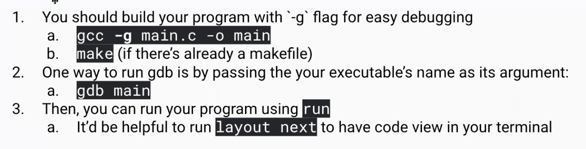	

  - gdb commands

    	

- strings in C

  - `strlen` takes $O(n)$ time and it's looping over the string looking for the `\0` character
  - `printf("%s\n", text);` will also print until the `\0` and ignore whatever is after
  - unicode character of `\0` is `00` 
  - by default, when you define a `char text[]` - it will add the terminating character at the end

- `lvalue` and `rvalue`

  - `lvalue` (locator values): they are objects with an identifiable memory address

    - `lvalue` must provide a variable which can be assigned with the value (<u>will always be a variable</u>)

  - `rvalue` (read value): anything that's not `lvalue`

    - it's the value that's being READ and USED
    - rvalue must provide a value that be used for assignment
    - expressions can't have values assigned to them

  - example:

    ```c
    int x = 20;
    ```

    - x is the `lvalue` - it has a memory address
    - 20 is an `rvalue` - it will be stored in memory but it doesn't have a memory address associated with it
      - you also can't say `20 = x`, you'll get an error

  - another example:

    ```c
    a = 2; 			// a is the lvalue, 2 is the rvalue
    b = a; 			// b is the lvalue here, a is the rvalue (reading the value from a)
    c = a + b; 	// c is the lvalue, a and b are both rvalue 
    ```

  - invalid example:

    ```C
    &x = 5; // THIS IS NOT ALLOWED
    ```

    - `&x` itself gets the memory address of `x`,  and you can't assign 5 to it
    - locally, it'll look something like `0x10 = 0x05` which is simply not possible

  - another example:

    ```c
    int x = 20;
    int *ptr1 = &x; 		// this is OK
    int *ptr2 = &(x+4); // this is NOT OK
    ```

    - for the 2nd ptr, we're treating `x` as a value (`x + 4 = 24 = rvalue`) and so you can't just get a memory of an `rvalue`
    - first line you're trying to get the address of an object, which is OK 

  - special case: surprisingly `void *newptre = &"abc"` is OK because string literals are stored as arrays in memory 

    


### Super basic refresher

- hex to decimal

  - a bit like binary to decimal but it's based 16 instead

  - ex. `0x7CF` to decimal

    - 7 = 7 in hex
    - C = 12 
    - F = 15
    - so in total it's $\text{0x7CF} = (7 × 16^2) + (12 × 16^1) + (15 × 16^0) = 1999$

  - reminder of hex digits

    	

- decimal to hex 

  - one way is to convert to binary first, then from binary to hex
  - one way is to do division by 16 and use remainder
    - divide the number by 16, you get 2 parts: quotient and remainder - remainder gets turned into hex digit
    - the quotient from above, you divide by 16 again
    - rinse and repeat
    - <u>**(note: you're building out the hex from right to left - least significant bit first)**</u>
  - ex. hex of the number 540
    - `540 // 16 = 33` and `540 % 16 = 12` (remainder is 12) - hex representation of remainder is `C`
    - `33 / 16 = 2, R = 1` - hex representation of remainder is `1`
    - `2 / 16 = 0, R = 2 ` - hex representation of remainder is `2`
    - so finally - the total hex representation is `0x21C`


# Y86 Intro

- the y86 processor

  	

  - it's like the x86 but with less commands

  - <u>Registers</u>: high speed storage used to manipulate data

    - most processors have a few tens of register (y86 has 15 of them)
    - some registers have special name (the first 8) for special purposes
      - ex. `%r4` is also called `%rsp` which is used as the stack pointer

  - <u>Condition Codes</u>: bits of state that tells you things about the most recent ALU operations

    - ZF (zero flag): last ALU operation produced a 0
    - SF (signed flag): last ALU operation produced a negative number
    - OF (overflow flag): last ALU operation produced overflow
    - these are useful for jump conditions and things like that

  - <u>Status Registers</u>: indicate normal operation or error condition 

    	

  - <u>Program Counter</u>: contains address of next instruction to execute

  - <u>Memory (DMEM)</u>: byte-addressable storage array

    - can think of this as "main memory" or "how much DRAM my machine has"
    - ==data stored in Little Endian order==

## Instructions

- Instruction classes: the classes are based on their size

  	

  - first nibble (half byte) is always the op-code, second nibble is always the function (not always needed - needed for things like `jmp` instructions)
  - sometimes we have registers after, or constant value
  - <u>note: each of the "squares" is 0.5 bytes - so 2 of them make 1 byte</u>

- simple instructions: have nothing but op code

  - `halt`: `00` set program status register to HLT (and halt the program)
  - `nop`: `10` do nothing

- move instructions

  - register to register
    - notation: `R[%rB] <- R[%rA]` means place whatever is in register A to register B
    - 2-byte instruction: `2 0 rA rB` (so op code is 2, function is null, give it register A and register B)
    - in code: `rrmovq %r8 %r9` (move whatever is in register 8 to register 9)
    - memory encoding: `0x20 0x89` 

  - constants to registers: move value (intermediate) to a register

     

    - notation: `R[%rB] <- val`
    - put `0xcafe` into `%r9`
      - notice that `0xcafe` is "backwards" (little-endian) in memory - the nibbles themselves stay normal
  
  - memory to register: move value from memory to a register
  
    	
  
    - notation: `R[%rA] <- M_8[D + R[%rB]]`
  
      - take the content of rB, add the offset and that gives us an address in memory - use that address to **<u>access the data then put it back into rA</u>**
      - note: `M_8[address]` means that we're reading/writing 8 bytes starting from `address`
      - the order is a little weird here, it's `mrmovq D(rB), rA` so `rB` comes first which is a little unusual

    - so basically, in this function, we know that `rsp` has the value `0x4000` (which is some address in memory), we will read from memory from the address `0x4000 + 0x4 = 0x4004` then put whatever's there to register 9

    - visually

      	

  - register to memory operation

    	

    - take whatever is in r9, put it into memory at address of 4 + value in rsp (so memory address is `0x4004`)

    - notation: `M_8[D + R[%rB]] <- R[%rA]`

    - visually
  
      	

## Writing Programs Example

- first example

  	

  - first, put some value into the registers
  - then move values of one of the registers to a "temp" register
  - swap the value (using the temp)

- 2nd example: swap data but from memory addresses

  	

  - notice at the bottom - this is how you can declare where things are in memory

  - `.pos 0x100` I would like to put something at 0x100

    - put some quadword into `a` and some quadword into `b`

    - `a` and `b` is a way for us to give a name to the memory location

    - we get this after

      	

  1. we are use `a` to reference the address in the very first memory,

     - note that we are putting the address that a represents into the register 

     - basically, we're putting `0x100` into `r11`

  2. move value from the address within `r11` into reg `rax`

     - so `rax` now has `0xFACE`

  3. move value from the address within `r11 + 8` into reg `rbx`

     - now `rbx` has `0xCAFE`

  4. move value from `rax` into address of `r11` + 8

  5. move value from `rbx` into address of `r11`


# y86 ALU & Control Flow

## ALU

- ALU = arithmetic and logical instructions 

- usual format of an ALU instruction is op code, function, then 2 registers (some can be null)

- notation: `R[%rB] <- R[%rB] <fun> R[%rA]`

  - we're going to take whatever is in `rB`, apply the `fun` to the value inside `rA`, then put the result of that back into `rB`
  - format: `fun %rA, %rB`
  - ex. `ADDQ %r8, %r9` means we're adding values in `%r8` and `%r9` and putting it back into `%r9`
  - ex. `SUBQ %r8, %r9` means `R[%r9] <- R[%r9] - R[%r8]` (orders matter)

- byte encoding

  - all ALU instruction has an op code of `6`

  - then they'll have specific value to correspond to function (i.e add is `0`)

  - then you specify the registers next

  - ex. some 2 byte instructions and their corresponding decodings 

    	

  - 313 has some bonus function(remember, order matters for some matters)

     

- ALU instructions also sets the condition codes

   

  - these are set on every ALU operations (and then used to control condition instructions)
  - a bit being set here means that it's "lit" - becomes a one
    - in the simulator, the format is `(Z, S, O)`
    - say you produce a negative number it'll look like `(_, S, _)` meaning `S` flag was lit
  - (note: no bits are set if the operations produce something positive)
    - also note that it's only set after an ALU operation so even if you move a new positive number into a register, a flag won't be set because a move is not an ALU

- example ([link](https://www.youtube.com/watch?v=510nFQaO09c) - start at 4:05)

  	

## Control Flow Instructions

- jump instructions (op code `7`)

  	

  - format: `JMP <address>`
    - `<address>` can be a hex or a label
  - notation: `PC <- Dest`
    - the address will be placed in the PC (hence that's the next instruction you're going to execute)

- unconditional jump: `jmp` - just jump to the specified address

- conditional jump: jump based on the state of the condition codes

  	

  - blanks mean that the flag can be either 0 or 1

- example ([link](https://www.youtube.com/watch?v=Der1muiMUPc) - starts at 3:50):

  	

  - if you just want to check a condition on a register value but don't want to have to do any subtraction, <u>you can `AND` the register with itself, it keeps the value in the reg the same, but `AND` is an ALU so it will set the op code</u>

- conditional move (`CMOVXX`)

  - recall that we are allowed to have a function place for the move instructions (we've been leaving it as 0 - example below)

    	

  - `CMOVXX` basically says only move into this register, if this condition is true (condition code is the same as above)

    - remember to fill in the `xx` with desired condition code (i.e `ccmovg` means move if it's greater than)

  - ex. 

    		

    - both of the codes is trying to decide what to put inside `%rax` (either 0 or 1)
    - left side is using the regular jump flow, right is using the conditional move
    - note: left side is a very popular way to do jumps
      - `r10 = rsi`
      - `r10 = r10 - rdi`
      - let say the jump instruction was `jg` so jump if `r10 - rdi > 0`
      - this is the same as saying `if: r10 > rdi then jump`

> PL Example
>
> ```assembly
> irmovq    $-0xc, %rbx # rbx <- -12
> irmovq    $0xa, %rdi	# rdi <- 10
> addq   %rbx, %rdi			# rdi <- 10 + -12 = -2
> jle   0x1d8d					# bit flag is (Z=0,S=1,O=0)
> ```
>
> Since the bit flag after line 3 sets `S=1` (signed flag was on because result of previous ALU instruction was negative), the jump condition WILL execute


# Stack and Call

## Stack

- video: https://www.youtube.com/watch?v=84uumZmyeCQ&ab_channel=MargoSeltzer

- in our case: ==<u>**stacks grows down**</u>==

  - largest memory to smallest memory
  - program and data (heap and static) grows up - from smallest to largest address
    - so this allows the stack and the data to grow towards each other
    - ==we also read memory UP (so read from lowest memory address to largest memory address)==

- `PUSHQ`

   	

  - is a 2-byte instruction
  - you specify a register which has the value that you want to place on the stack
  - `%rsp` stores the stack pointer
    - <u>so first you need to decrement it by 8 first</u> 
    - (you need to decrement by 8 first because we write up)
  - then we put it into memory at the stack pointer (little-endian)
  - <u>basically: allocate 8 bytes (by subtracting 8 from `%rsp`), then write</u>

- `POPQ`

  	

  - also takes a register where you will store the value after popping from the stack
  - after taking the value, you increment the stack pointer
  - note: the value that was in the stack is still there in the pointer, it's just that we can't find it anymore since the stack pointer no longer points to it
  - <u>basically: read 8 bytes, then de-allocate those 8 bytes (adding 8 from `%rsp`</u>)

- example: swap using stack

  	

  - no longer needs an extra characters
  - need to initialize the stack pointer first
  - the stack will serve as our temporary store
  - pushq "saves" the value to memory
  - put what was in `%rbx` into `%rax`
  - then pop from memory and put it into `%rax`

## Call and Return Instructions

- video: https://www.youtube.com/watch?v=nAypoHglkpU&ab_channel=MargoSeltzer

- huge example

  	

  - the code on the right
    - we have a simple program that will call some function `sum` that's at address 0x1000
    - program first initialize stack pointer 
    - it'll put some value into `%rdi` and `%rsi` and then call `sum` (which add the value in those 2 registers then put it into `%rax`)
    - `call` takes the address of the function (either as a label or a memory address)
  - op code for `call` is 8
    - the next 8 bytes is the address of the function we want to call 

- function call and return

  - `call`

    	

    - problem `call` has to solve
      - when function completes, it has to return to the right place
      - the challenge is telling `ret` where to return to
      - use the stack
    - note: the address stored to the stack is the address of the next instruction (so current PC + 9 because `call` is 9 bytes long)
  
- `ret`
  
  	
  
  - convention note: functions are supposed to return their values in `%rax`
  
- basically
  
  - when doing `call`, store the address of where you want to return (usually the next line) onto the stack
    - change the PC to `dest` (actually do the jump to the function)
  - `ret` pop the `return_address` from the stack, then jump to it
      - note: since it's a pop, need to read before de-allocating

- example

  	

  - the purple stuff next instruction we want to run after our function - its address is at `0x0027` - hence it's getting added to the stack
  - we then jump to `0x1000`, do some stuff there
  - as we call ret, ret reads `0x0027` from the stack, then put that into the PC

> PL Example
>
> Given the following y86 program
>
> ```assembly
>   .pos 0x678
>       call foo
>   ```
> 
>What value will be pushed on the stack (in hex)?
> The call function takes 9 bytes (1 for op code, 8 for function address) so the "return address" that will be stored in the stack is `0x678 + 9`

- a note on exploits
  - a very common exploit people like to run is stack smashing 
  - usually, in this class, we want to call a function, but when that function returns, we want it to return to an "evil" function, as opposed to the correct place in the caller function
  - what this means is we basically want to override the `return_address` that was placed on the stack by `call` so that the return address will be the address of our evil function

# Calling Conventions

## Calling Conventions

- how do procedures pass arguments to other procedures?
  1. on the stack
     - old machines did this
  2. registers
     - have a convention to say that arguments will be stored in this reigster
     - need to account for cases like you have more args than registers or arg don't fit into registers
  3. ==both in registers and one the stacks==
     - what the y86 uses
- the rules that callers and callees use to communicate information are called <u>**calling convention**</u>
- the structure we use to store this information is called a <u>**stack frame**</u>

### Parameters

- based mostly on x86

- return value goes in `%rax`

- arguments/parameters are passed in registers, in this order
  - `%rdi`, `%rsi`, `%rdx`, `%rcx`, `%r8`, `%r9`
  - more than 6 arguments?
    - push the remaining ones on the stack ==<u>in reverse order</u>==
  - what if argument is too big to fit in register (i.e passing in a struct)
    - pass the too-large argument on the stack
    - if there is more than one too-large argument, these arguments get pushed in ==reverse order==
  
- example:

  	

  - A is placed in `%rdi`

  - B is pushed onto the stack (because it's too big)

  - C is placed in register `%rsi`

  - notice that we don't skip `%rsi` after placing B onto the stack


### Register Usage

- `%rsp` is the stack pointer

- `%rbp` is the frame (base) pointer

- <u>**caller saved registers**</u>

  - these are scratch registers - the callee is allowed to scribble all over them, so if the caller cares about their contents, the caller must save them 

    - (you can save them on the stack)

  - these includes all the argument and return registers plus `%r10`, `%r11`

    	

  - there are 9 of these

- <u>**callee saved registers**</u>

  - if the callee uses them, then the callee must restore original values before returning
    - (at a high level, you are not allowed to touch them - so if you were to change them, you have to change them back before returning)
  - these are: `%rbx`, `%rbp`, `%r12`, `%r13`, `%r14`  as well
  - there are 6 of these (counting stack pointer)

## Stack Frames

- how do procedures organize data such as local variables, return addresses, etc

- recall that we use the stack to store a return address

- we can also use the stack to

  - transmit parameters (if we cannot use registers)
  - store local variables 
  - the structure used to store this information is called a <u>**stack frame**</u>

- a picture

  	

  - when the `main` function invokes the `sum` function, it creates a new stack frame

- there are 2 ways to manage your stack frames

  1. no base pointer

     	

     - since we have no reserve registers, we have to use the stack pointer instead
     - the stack pointer will move down and allocate some space for the local variables
       - the size that's needed for local variables is determined by the compiler - it has to figure this out (probably by looking at types and things like that)
       - in our example here, we know that we need 32 bytes, so we decrement the stack pointer by 32 bytes
     - both local variables and stack parameters (if any) are referenced by positive offsets from the stack pointer
     - stack frame teardown: after callee end, we have to tear down the stack frame (add back to to the `%rsp`)
       - caller also need to move the stack to "remove" any stack parameter that was placed (do this yourself)

  2. <u>**with**</u> base pointer: designated register (`%rbp` to keep track of the current stackframe)

     	

     - at the beginning of the call `%rbp` points to the beginning of stack frame (not at the very beginning)

     - when we call another function, before anything happens, we PUSH the current `%rbp` onto the stack

       - (this also moves `%rbp` because we've also pushed something onto the stack)

         

       - (essentially create a linked list between the stack frames)

       - next, move `%rbp` to the new stack frame (will have a new value)

          

         - so this has 2 operations

            

     - then, just like before, we subtract off some space for our local variable and we have a new stack frame

       	

     - now, instead of accessing local var from the stack pointer, we can locate them off of the base pointer

       - nice because you can access local variable by adding negative offset to base pointer
       - also nice because you can access stack parameter (if any) by adding positive offset to the base pointer

     - we still have to tear down the stack frame at the end

       - move stack pointer back to where it was 

         	

       - pop the saved base pointer from the stack (back into `%rbp`)

         

- note: return address comes "before" stack parameters (lower down in the stack)

  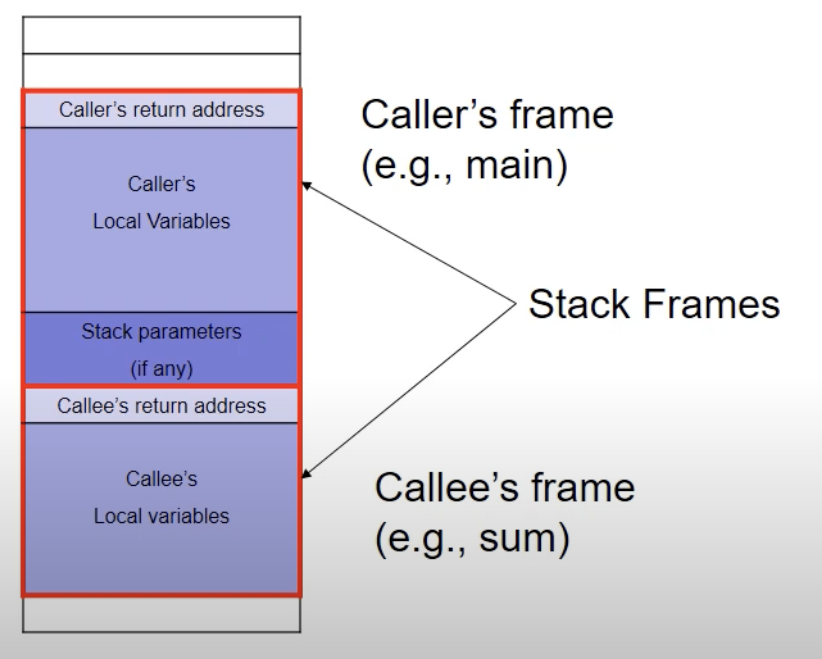	

  

# Implementation (Sequential)

- legend
  - dark blue boxes are procesor states (we've seen before)
  - rounded boxes are logic we have to design
  - oval or internal registers

## Fetch

- what we're doing in this stage

  - <u>**read instruction from memory**</u>
  - break the instruction apart into various pieces
  
- parts of processor that's involved

  - the program counter
  - memory
  - PC increment 
  - logic to identify invalid instruction

- implementing fetch

  - use value that's in PC to read something from memory - call this the instructions	
  
    	
  
  -  `icode`, `ifun`, `rA/B`, `valC` ovals are internal registers that get populated when we read and break up the instruction
    - (`icode` is crucial) 

  - based on the op code, that tells us how many bytes to read

    - we can also figure out how to potentially increment the PC (based on the size of the instruction) - this is the `Increment PC` logic box (literally just `PC + size(instruction)`)
  - output of that is called `valP` (sometime we won't use this though - but it's always computed)
  
- note: if the instruction doesn't use the other internal registers like `rA` and `rB` and so on - it's not particularly clear to me what happens, but we don't use them anyways so we don't care
  
  	

## Decode

- what must we do in this stage:

  - <u>**determine what to read from the register file**</u>
  - read those values

- what parts of the processor are involved

  - `rA`, `rB` **and** `icode` (op code) from the `Instruction`
  - register file
  - <u>logic to determine which registers are used to produce `valA` and `valB`</u>

- implementing decode

  	

  - normally, we would pass `rA` and `rB` into `srcA/srcB` logic that will tell it which register to read, then it'll read it and return `valA` and `valB`

  - interesting cases: `push`/`pop` and `call`/`ret`

    - these don't specify the register we need - but it has an implied register, the stack pointer `%rsp`

    - so in addition to sending in `rA` and `rB`, you also have to send in the `icode`

      	

## Execute

- most complicated part

- what must we do in this stage

  - <u>**use the ALU**</u>
  - <u>**set condition codes**</u>

- what parts of the processor are invovled

  - `valA`, `valB` from the register file
  - `valC` from the instruction (sometimes)
  - ALU
  - condition codes
  - logic to 
    1. select inputs to ALU
    2. set condition codes

- implementing execute

  	

  - the inputs into the ALU will be determined by 2 logic blocks `ALU A` and `ALU B`

    - most of the time, they will come directly from `valA` and `valB`

  - we call the output of the ALU to be `valE` (or value execute)

  - and somehow the output of the ALU will also set the condition codes

  - when do we need `valC`: when we do address calculation

    

    - we'll use ALU during execute stage to generate an address that will be used in the memory stage to be accessed 

      - so `ALU A = valC` and `ALU B = valB = rB` and add them together

    - how do we decide to whether `ALU A` should **take** `valA` or `valC` (it's one or the other) &rightarrow; we need the `opcode`

    - very obviously, it also needs the `ifunc` to know whether to add/subtract/etc
    
      

- <u>**note: some tricks**</u>

  - `push/pop` and `call/ret` both uses the ALU because they need to inc/dec the stack pointer by 8

    - stack pointer will come out of `valB` and get fed into ALU B
    - so the `+/- 8` needs to go into ALU A
    - for `push`
      - we are pushing `R[rA]` and so `valA` takes on that value
      - `ALU A` will just discard this `valA ` value and take the +/- 8 instead, but we will feed this into memory stage
    - for all of these, `valE` is the stack pointer after making some dec/inc

  - we're also going to use the ALU for `rrmovq` and `irmovq` to add 0 

    -  register that we're reading is from `valA` 
       -  for `rrmovq` it's `rA` but for `irmovq` it's actually nothing, we don't read from register at all
    -  so the 0 has to go into `ALU B`
    -  this is to be consistent and having a lot of things going to the ALU is good because it reduces the number of wires you need
    -  it also helps that the results get written to `valE` so latter logic can stay the same

  - picture

    	

- implementation for the tricky ones

  - `push/call/j`

    	

  - `pop/ret`

    	
  
- however, we ONLY want to set the CC for REAL ALU operations (and not for shit like register to register move)

  - so we feed the `icode` into a logic block for the CC

  - need to to take the output of CC to feed it into a logic block `cond` which takes the function and given the function and state of the flags, compute whether we should do the operation or not (conditional jump/move)

    		

  
  
  > PL Question
  >
  > 
  >
  > Explanation: Arithmetic and logical instructions have to use ALU, because that's where the calculations take place and the condition codes are set. For pushq and popq, we move the stack pointer by 8 or -8 bytes and this calculation is done in the ALU. For call and ret, we jump to a different address location from a certain address and they use push and pop internally to do so, so ALU is used there. And lastly, mov instructions are just adding 0 so that we are consistent and don't have to go past the ALU
  
  

## Memory

- what must we do in this stage

  - <u>**read from or write to memory**</u>

- what parts of the processor are involved

  - memory
  - `valE` (address)
  - `valA` (data)
  - `valP` (from the PC increment)

- memory implementation 

  - <u>feed `valE` into the `Addr` logic box to tell where we are reading from or writing to</u>

  - if we want to write

     

    - feed contents of `valA` into `Data` logic box because that's the data we want to write
      - we don't want to feed this into the ALU because we need the ALU for address calc and we can only use the ALU once per instruction

  - if we want to read

    - we will take the output of the memory operation called `valM` and put it back into the register file

      

    - we still need to know where to put the `valM` (which register) - introduce a new piece of logic called `dstM` - it calculates where (which register) we hold the data that **came from memory** 

      - feed it `rA` because is memory-to-register instructions it uses `rA` as destination
      - also feed it the `opcode` so `dstM` can decide when it needs to activate the memory port 

      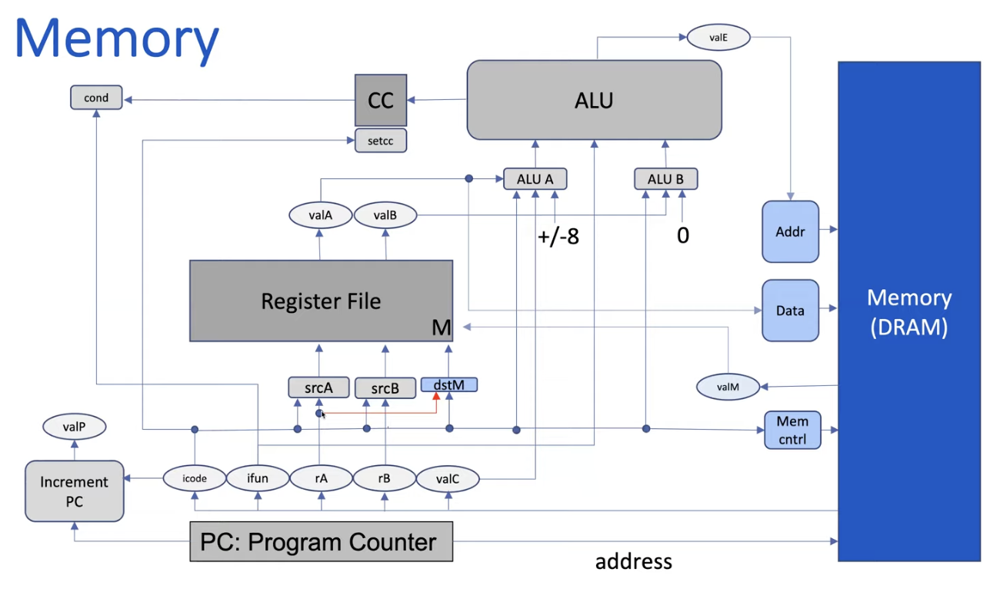	

  - `push` and `pop` operation

    - for `push`: we decrement the stack pointer before reading

      - can use `valE` because we want to use the stack pointer after it's been decremented

    - for `pop`: we increment the stack pointer after reading

      - we need the value of the stack pointer before it goes through ALU 

      - so steal the signal out of `valB` and feed it into the `Addr` address box to (before we increment it)

        

    - to decide which value we're going to use (`valE` vs `valB`) - we feed the `opcode`

- call and return operation

  - `call`: 

    - address is similar to push

    - we also need the address of the next instruction (after the call) &rightarrow; this is `valP` 

    - again, we have 2 choices, so we add the opcode

      

  - `ret`

    - we `pop` the address off the stack
    - instead of writing it to the register file, it needs to go to a piece of logic that calculates what the next piece of instruction is (wait till next video?)

- note: there are no instruction that both read from and write to memory

## Writeback

- what must we do in this stage:

  - <u>**write values into the register files**</u>

- what parts of the processor are involved

  - register file
  - `valM` (from the memory)
  - `valE` (from the ALU)
  - `cond `(conditional moves)

- write back implementation

  - introduce an E port and logic box `destE`

    - the value that we write into the E port will come from `valE`

    - which register do we write to? usually this comes from `rB`

    - but depending on the op code, we may not want to write anything - so we feed in the `opcode` as well

    - for those conditional moves, we need the `cond` logic too - so we feed that in as well

      	

  - for `push/pop` and `call/ret` - rather than taking in `rB`, it'll use the stack pointer instead

- note: the difference between the E and M port

  - M: this one writes value read from memory into register (memory-to-register move)
  - E: this ones write values produced by ALU into register (i.e add)
  - we need both these ports because some instructions write both `valE` and `valM` into reigsters
    - i.e `pop` and `ret` (read some value from stack pointer and then write the new stack pointer into `%rsp`)


## PC Update

- what must we do in this stage

  - <u>**identify the address of the next instruction to execute**</u>

- what parts of the processor are involved

  - `PC`
  - `valP` (normal case)
  - `valM` (ret)
  - `valC` (call, jmp)
  - cond

- PC update implementation

  - new piece of logic called `Next PC`

  - feed `valM` into the new logic box (for return address)

  - feed `valP` in as well (for sequential normal code)

  - feed in `cond` as well for conditional jumps 

  - feed in `valC` too because that's the address of the next instruction for `jmp`

    	
  
  -  basically: based on the `icode` and potentially `cond`, `NEXT PC`  will decide to use `valP` (normal sequential PC incrementation) or `valM` (function return) or `valC` (jumps)

> PL Question
>
> 	

## Summary

- `rmmovq` and `mrmovq`

  	

- `opq`, `rrmovq` and `irmovq`

   	

- `push` and `pop`

  	

- `jmp/jxx`, `call` and `ret`

  	

  - notice that `call` is very similar to `pushq` and `ret` is very similar to `popq`

  

# Pipelining 

- introducing parallelism 

- y86 implementations key observations

  - we only ever read instructions in the FETCH stage
  - we only ever read from register file in the DECODE stage
  - we only use the ALU in the EXECUTE stage
  - we only read/write to memory in the MEMORY stage
  - we only write to the register file in the Writeback stage
  - implications
    - for any given instructions, we have to wait for signal to propagate through entire circuit
    - but for any given moment, most of the hardware is unused

- consider these 5 stages

  	

  - note that we got rid of PC counter because there's not much going on, we just feed stuff into the `NEXT_PC` logic block and we latch it on to the PC register

  - we'll introduce <u>pipeline registers</u> between each stage which store signals that each stage is going to work on (slight performance overhead but this allows us to execute multiple instructions in parallel)

    	

- from sequential to pipelined

  - sequential 

    	

  - pipelined

    	

    - each row is a instruction
    - and time is from left to right
    - so while the first instruction is doing its decode, we can fetch the next instruction

- pros 

  - use hardware more efficiently 
  - a collection of instructions completes more quickly

- cons

  - an individual instructions take longer because of the added overhead
  - if some phases take longer than other, short phases might have to wait for the longer phase
  - sometimes you don't have the correct information at the right time

## Pipeline Registers

- video: https://www.youtube.com/watch?v=7PonS7_uDn8&ab_channel=MargoSeltzer

- y86 rearranged 

  	

  - rearranged them so that it matches up with the corresponding steps 
  - also split it up into 2 memory banks - instruction memory and data memory
    - parts of memory that stores instruction and the other part hold data
  - gathering all the states and putting them into pipeline registeres
    - it's where we hold the signal that each stage of the pipeline is going to use 
  - also added some error checking 
    - can check for error when we're reading from memory (bad address or bad instruction/data)

- fetch stage

  	

  - we added a pipeline register for fetch as well
  - have some address that we want to fetch
  - read from memory, get instruction
  - and send that instruction to some logic with will "latch" it  to the decode register
    - in most cases - the `calcPC` logic will be correct - barring some special cases like conditional jump and `ret`

- execute stage

  

  - also add a pipeline register
    - we add these for the space between every stage
    - anything that happens in a certain stage is based on what's in the pipeline register for that stage
  - see new piece of logic ALU func
    - need to know which function the ALU is supposed to do 
  - what are some things that we should feed into the execute pipeline register from the decode pipeline register
    - `stat`: to see if anything failed
    - `icode`: we need this
    - `ifunc`: 100% need this for ALU func
    - don't actually need `rA` and `rB` because those are register names - they've been used in the decode stage to read the register stage - instead we want what the register file produced
      - so we want `valA` and `valB` 
      - also need `valC` sometimes
    - don't actually need `valP`
    - introduce `dstE` and `dstM` to tell us later on if we need to write to register or memory

- memory stage (this was a PL question) 

  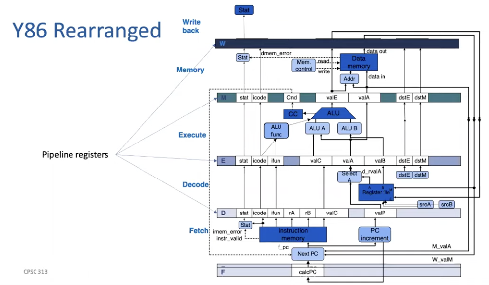	

  - can look at image above
  - we need 
    - `stat`: to see if anything failed (we also need to report at the end)
    - `icode`: need this everywhere if you recall
    - note: actually no longer need `ifunc` because any operation we need to do with the ALU would have been performed already
    - `valA`: for certain instructions, we need to carry this value along
      - ==TODO: which one==
    - pass up `dstE` and `dstM` for use later on
    - new values
      - `cnd` which is the condition code that's produced by the ALU operation
      - `valE` which is the result of the ALU operation
  - another PL question: Which value appears in the pipeline registers for the memory stage and the writeback stage, but might have different values in those two stages?
    - A: `stat` because previously it could have been a read error now it can be a write error

- write back stage

  	

  - we need
    - `stat` and `icode` just like before
    - `valE` because it might get written back into a register
    - `valM` which is what we've read from memory (as opposed to `valA`)
    - `dstE` and `dstM`

- since we might have signals that are coming out of these stages that belongs to different instructions but have the same name - we need a new naming convention

  - `S_signal`: a signal from the `S` stage

  - <u>ex. `D_stat`: the stat signal right out of the decode stage</u>

  - ex. `M_stat`: the stat signal right out of the memory stage

     

-  the thing that we're about to latch onto the register (of the next stage) is denoted with a lower case `s_signal`

  	

  - `m_stat` is the stat signal we're about to latch onto the pipeline register of writeback (so we're just done with memory)

- PL Questions

  	

## Performance 

- terminology

  - Stage:
    - What we used to call “phase”
    - When we talk about pipelines, each piece of the pipeline is a stage.
    - A stage is the unit of computation that the processor performs in a single clock cycle.
  - Pipeline Register:
    - Colloquially: the extra work we incur by pipelining.
    - In reality: a register in the processor that captures the set of signals (values) on which a stage will execute.
    - Each stage has its own pipeline register.
  - Instruction statuses:
    - In-flight: somewhere in the pipeline
    - Retired: instruction has completed execution

- comparison

  - before

    	

  - with pipelining

    	

- some performance definition

  - latency: end to end to complete execution of a single instructions
  - retirement latency: Time between the completion of one instruction and the completion of the next instruction
  - throughput: number of instructions per second (GIPS - giga instructions per second)
    - <u>**use retirement latency**</u>
    - trick: if numbers are given in pico seconds, you can do $10^3 / \text{ retirement latency}$ to get GIPS 

- sequential performance

  	

  - what's the latency?
    $$
    \text{latency} = 20 + 200 + 50 + 50 + 200 + 50 = 570 \text{ ps}
    $$

  - what's the retirement latency?

    - it is the same as above 

  - what is the throughput?
    $$
    \text{throughput} = \dfrac{1 \text{ instruction}}{570 \text{ ps}} \times \dfrac{\text{giga-instruction}}{10^9 \text{ instruction}} \times \dfrac{10^{12} s}{1 \text{ ps}} = 1.75 \text{ GIPS}
    $$

- pipeline performance

  	

  - what's the latency?
    $$
    \text{latency} = 200 * 5 + 20 * 5 = (200 + 20) * 5 = 1100 \text{ ps}
    $$

    - note: **<u>NEED TO WAIT FOR THE LONGEST STAGE (200s) to be done</u>**
    - so you can see that the actual latency for 1 instruction has gone down (due to pipeline registers overhead)

  - what's the retirement latency?
    $$
    \text{retirement latency} = 20 + 200 = 220 \text{ ps}
    $$

    - the data is already fed into the pipeline registers
    - again, we have to <u>**wait for the longest time AND the register latency**</u>
    - note: the first cycle has no benefits - it's like doing the first load of laundry

  - what's the throughput?
    $$
    \text{throughput} = \dfrac{10^3}{220 \text{ ps}} = 4.55 \text{ GIPS}
    $$

    - so we increased latency by 93% but multiplied throughput by a factor of 2.6

- so pipelines

  - enables different parts of the processor to be used concurrently
  - makes it possible for more than one instruction to be in-flight at any one time
  - <u>**increases instruction latency but increases throughput**</u>


## Pipeline (Data) Hazards

- hazards definition: problems that arise in pipelining when information needed by instruction is not available when it needs it

  - if not mitigated, hazards can lead to incorrect results

- types of hazards

  - data hazards: when data dependencies (i.e one instruction reads from a register that another one writes) potentially lead to incorrect behaviour
  - control hazard: when control dependencies (i.e a conditional jump determines the a)address of the next instruction to execute) potentially leading to incorrect behaviour 

- example: data hazards

  - let say we have the following 

    ```assembly
    # assume R[%rax] = 0xCAD
    # assume R[%rbp] = 0x1000
    # assume R[%rbx] = 0x4
    # assume M8[0x1008] = 0x44
    
    mrmovq 8(%rbp), %rax
    addq %rax, %rbx
    ```

  - sequential implementation

    - we read whatever's at `%rbp + 8` and put it into `%rax`
      - so `%rax = 0x44`
    - then we do `%rbx = %rbx + %rax = 0x4 + 0x44 = 0x48`
    - final answer should have `%rbx = 0x48`

  - pipelined implementation

    - first tick

      	

      - only `mrmovq` is in its fetch stage
      - everything is good so far

    - second tick

      	

      - `mrmovq` is in its decode stage and `add` is just starting its fetch stage

    - third tick

      	

      - `mrmovq` is in its execute stage and `add` is in its decode stage (ignore the `jump` part)
      - now noticed that `E_valA = R[%rax] = 0xCAD` for the add part 
        - this is WRONG
        - in the sequential implementation, `R[%rax]` for the `add` instruction would be `0x44`
        - but since the `mrmovq` hasn't been finished executing yet, the `%rax` register still has the old value (`0xCAD`)

    - if we keep going we will see that it produces incorrect result (obviously)

- possible fixes to hazards

  - pure software
  - delaying execution in hardware (called stalling)
  - value forwarding in hardware (addresses data hazards)
  - branch prediction (addresses **some** control hazards)

### Software Fix

- example: see this code

  ```assembly
  addq %rax, %rbx
  subq %rbx, %rcx
  ```

  - (assume that the `addq` enters the pipeline at time $T = 1$, and the `subq` enters the pipeline at time T+1 = 2)
  - q1: During what stage of the subq do we need the value of `%rbx`?
    - We need it (at the beginning of) the `subq`’s Decode (when the `addq` is in the Execute stage) ($T=3$)
  - q2: During what stage would the `addq` normally write its new value into `%rbx`
    - The writeback stage: $T+4 = 5$ (finishes and availble at time 6)

- manual fix: insert `nop`s

  - q3: how many do we need?
    - we basically need enough nop such that by the time we get to `subq` Decode, we have the value loaded in correctly
    - we need at at time 3, but we have it at time 6 (note that it's not 5) - so we need to slow this down 3 steps
    - $(T + 4 + 1) – (3) = 6 – 3 = 3$
  - try it out in the simulator and it works

> PL Example 1
>
> 	
>
> Q: Indicate the line number of the first instruction that could produce incorrect behaviour due to a data hazard?
> A: line 4 because it reads `%rsp` which is supposed to be changed by line 2 (implicitly because `popq` adds 8 to the `%rsp`
>
> Q: How many nops must you insert to mitigate this hazard?
> A: you need 2 `nop`s because there is 1 instruction between (3 - 1) &rightarrow; can also think of it because when line 4 starts, line 2 is in the execute stage - needs 2 more stages before finishing
>
> 
>
> PL Example 2
>
> 	
>
> Q: Indicate the line number of the first instruction that could produce incorrect behaviour due to a data hazard?
> A: line 3 because we're pushing `%r12` to the stack but line 0 is writing to `%r12`
>
> Q: How many nops must you insert to mitigate this hazard?
> A: you'll need 1 `nop` &rightarrow; when line 3 starts, line 2 is in its memory stage - needs 1 more stage to finishing

### Stalling

- again, consider this 

  ```assembly
  ADDQ %rax, %rbx
  ADDQ %rbx, %rcx
  ```

  - we can't execute the 2nd line when we want to because the value wouldn't have been properly propagated yet

- stall: make instruction wait until its data is available

  - make hardware wait for you
  - when the program stall, it allows the instruction that we need to get completed first to proceed while stalling the problem instruction
  - we fill the stages in between with what's called "Bubbles" (basically nops)
  - so instead of the programmer (us) inserting the nops, the hardware/program is inserting these bubbles
  - just like the nops - the program will insert 3 bubbles

- we are still wasting 3 cycles

- performance that accounts for stalling

  - (so far we've described the performance of our processor - latency and throughput, etc these are calculations about the hardware)
    - want the performance of our <u>program</u>
  - we use <u>**cycles per instructions (CPI)**</u> to describe how efficiently a program is executing on a processor
    - when we run a particular program, how many cycles does it take per instruction
  - if we never stalled, what CPI would a program achieve
    - 1 - the best we can do on the y86 &rightarrow; kind of the gold standard
    - real processor are superscalar which means they can retire more than one instruction per cycle and so could achieve < 1 CPI

- example: computing CPI on example above

  - the code actually looks something like

    ```assembly
    irmovq 1, %rax
    irmovq 2, %rbx
    irmovq 3, %rcx
    nop 
    nop 
    nop 
    addq %rax, %rbx
    addq %rbx, %rcx
    halt
    ```

  - so there are 9 instructions

  - if we run in simulator - it takes 16 clock counts

    -  though we only added 3 bubbles
    - but the halt at the ends needs to trickle through the pipeline (so we finish the last instruction)
    - <u>**we're always going to get 4 additional cycles added for the halt**</u> 

  - we only really want to count the cycles it takes for the body though - this is 12?

- some extra stuff

  - for `call` - we will need the stack pointer so if you did any funny business with the `rsp` before calling `call` - you might have to stall
  - I think you always stall 3 cycles since you need to wait for it to finish from execute


> PL Question
>
> 	
>
> Note: `mrmovq` is an answer because it's possible that we expect a previous instruction to write something into the program for us to then use


### Forwarding

- look at this example 

  	

  - the top circle is where we HAVE the answer, bottom circle is where we NEED the answer

    	

    - we have the answer at the end of `addq` execute phase
      - this value is called `e_valE` (it's just coming out of execute and about to be latched onto registers for memory stage)
    - and we need the answer at the end of `subq` decode phase

- implementing forwarding: we'll need some extra wires

  

  - so at the end of the decode stage, we would have read some stuff from the register file (might be wrong stuff), and then we have a logic block `Forward X` the decides whether to send the forwarded value or the value we just read upstream
  - uses the same logic that we decide to stall or not (i.e it keeps track of which registers are currently being changed in the pipelined)
  - pipeline doesn't slow down as all

- why does this work?

  - because we have the value when we need it, we just need to forward it and have some logic to decide if we accept forwarded value or use values coming out of register file
  - this logic has already decided before the ALU even finished whether to take or not
  - this logic won't show up on the simulator - it will simply happen, the correct value gets loaded to the correct place

- some things that won't work

  1. forward `e_valE` into the register file
     - it's too late and we still need to write to the register which takes at least another cycle AND it's writing to the register file out of order
  2. forward `M_valE` to the new logic
     - it's too late, we're still waiting 1 more cycle and it's too late to get it into the execute stage for `subq`
  3. forward `e_valE` to the beginning of the execute stage
     - that's too fast, and there's a loop which you have to be careful about

- forwarding opportunities

  - we can forward FROM anywhere that we have the answer 
  - we only want to forward TO the wire before the execute stage 


## Control Hazards

- what do we do when we need the address of the next instruction

  - i.e unconditional jump

- unconditional jump

  - when do we need the address of the next instruction?

    - at the fetch stage of the next instruction

  - from where do we get it?

    - we get it from `valC` from the actual jump instruction

  - so during the fetch stage of the jump instruction, we take valC, put it into Next PC and it latches the value back into calcPC (the fetch register) so we know what our next instruction will be

    	

    - so pass back `f_valC`

  - so <u>jump does not cause a stall</u>

- call

  - same thing because we will also know the next instruction from `valC`

- ret 

  - is a bit of a problem
  - it needs to go to into memory and read something from the stack, and feed that into the fetch phase 
  - so we don't get the value until the very end of the memory phase
  - no way to prevent a stall on the ret 
  - <u>**whenever you see a ret - you HAVE to stall for 3 cycles**</u>

- conditional jumps

  - two choices: `valC` or `valP` (result of PC increment)

    - these both are readily available for the fetch phase of the next instruction

  - problem is we don't know which to take - we don't figure that out until the end of execute stage 

    	

  - unless we do something clever - we will have to stall (2-stalls?)

  - we can guess which one are likely to be executed &rightarrow; branch prediction

    - we'll just keep going with our prediction
    - if we find out later (at the end of D's execution phase) - we have to figure out what to do

  > PL Question
  >
  > Consider the following y86 program
  >
  > ```assembly
  >   irmovq 0, %rax
  > 	irmovq 15, %rbx
  > 	irmovq 1, %rcx
  > 
  > loop_start:
  > 	rrmovq %rax, %rdi # rdi = rax
  > 	addq %rcx, %rax		# rax += rcx => rax += 1
  > 	subq %rbx, %rdi		# rdi -= rbx (so it's 0 - 15, 1 - 15, 2 - 15, etc)
  > 	jge loop_end
  > 	jmp loop_start
  > loop_end:
  > 	halt
  > ```
  >
  > Q: Assume that we are **doing data forwarding, but not branch prediction**. Considering only the instructions between loop_start and loop_end, in total, for how many cycles will the pipeline stall due to control hazards?
  >
  > A: For every `jge` - we have to stall 2 cycles. The loop will run 16 times and thus as a result - we will stall for 32 cycles
  >
  > 
  >
  > Q: This program will exhibit better CPI if a branch predictor predicts: (Always taken or Never Taken)
  >
  > A: It's better to assume the branch at the break condition branch is never taken (because it's only taken once - at the end), so if we guess, we only guess wrong once 


### Branch Prediction

- branch prediction: 2 predictions for conditional jump

  - always taken (assume `nextPC` is going to be `valC`)
  - never taken (assume `nextPC` is going to be `valP`)
  - point is: <u>**if we guess right, there's no cost, if we guess wrong, we eat 2 stalls**</u> (which is what would happen anyways if we didn't have branch predictions)

- example

  	

  - first one is a loop, second one is jump on error
  - for the loop: most of the time, highly likely that we go around the loop
  - for error: it's unlikely we jump to error

- kinds of jumps that y86 has

  - jump backwards: where you're jumping to a smaller address
    - like the loop jump
  - jump forward: where you're jumping to a larger address
    - like the error jump
  - so the processor picks a "predictor" - i.e take backwards, never take forward &rightarrow; NOT UP TO YOU
    - different implementations of processors will have different predictors

- ==TODO: which strategy does y86 employ==

  - it seems like it's always going to take backwards, never forward

- what happen when you guess wrong: so you just eat the 2 stalls 

  - "pretend they never happened" or dynamically turn them into `nop`
  - simulator doesn't show you all the speculative instructions that it takes

    - once it knows it's wrong, we just turn those into bubbles

- handling jumps

  - (assuming our prediction is never taken)

  - we need to somehow know where to get back to if we predict wrong

  - need some extra wiring

    	

    - by the time we guess wrong, we are at the end of the memory step

  - need to add some wiring and logic to actually make the prediction as well

    	

    - this predictor takes some values, and make the prediction based on the addresses and based on the predictor logic we decide - do the actual prediction
      - i.e figure out if it's a forward or backward jump based on the current address, and then based on the predictor logic make the prediction
    - renamed `calcPC` to `predPC` 

### Pipeline Mis-predictions

- video: https://www.youtube.com/watch?v=tbkb24iG7Y0

- example

  	

  - so we should have taken, but the program predict to not take
  - so we end up executing the 2 red lines ("bad" instructions)
  - however, before these instructions change the external state (that is they actually write any value to `rcx` and `rdx`) - we will know the <u>real</u> answer to the jump instruction
    - so we'll just cancel or squash them 

- in summary:

  - when you predict correctly: you incur no penalty
  - when you predict incorrectly: you eat 2 cycles (no worse than if you'd done no predictions)

- when you know you're wrong, send all the signal to the modifying stages (i.e memory or writeback and tell them to not act on the "bad" instructions)

- note: we do not count instructions we throw away for CPI instructions

> PL Questions
>
> 	
>
> The conditional moves are no problem because the cond is only used within that instruction and nowhere else (actually might cause data hazard (??) not sure but not control hazard)
>
> 	
>
> 	
>
> You need the address to jump 2 for the next instruction - that address is now stored in `rB` instead of the stack pointer - which means that you can get it at the end of the Decode stage
> But the next instruction needs it at the Fetch stage - hence you have to wait 1 cycle still


## Performance 

### Cycle Counting

> Practice
>
> Question 1: assume no forwarding and no branch prediction
>
> 	
>
> 1. counting stalls
>
>    - `subq %rsi, %rdi` = 3 stalls
>    - `jle Done` = 2 stalls
>    - 5 stalls per iteration which runs 6 times = 30
>      - pay attention to the number of iteration
>      - imagine in the end condition was 2 instead &rightarrow; we go into the loop at 0
>        - do the check at `j = 0` (incur stalls)
>        - do the check at `j = 1` (incur stall)
>        - do the check at `j = 2` (incur stall) &rightarrow; exit
>      - so, this means that for end condition of 2, we went into the loop 3 times &rightarrow; likewise, for end condition of 5, we iterate 6 times
> 2. CPI 
>    - instructions 
>      - 3 before the loop
>      - 3 at the top of the loop (runs 6 times) &rightarrow; 18 
>      - 3 at the bottom of the loop (runs 5 times - because the time we exit it doesn't execute) &rightarrow; 15 
>      - 1 for the halt at the end
>      - 37 instructions executed in total
>    - cycles
>      - 1 cycle per instruction &rightarrow; 37 cycles
>      - 4 to load the pipeline  
>      - 30 stalls
>      - in total it's 71 cycles
>    - $CPI = 71 / 37$
>
> Question 2: Same code as above - but with forwarding and no branch prediction
>
> 1. counting stalls 
>    - eliminate all data hazards but we still stall for JLE
>    - so that's 2 stalls for 6 iterations &rightarrow; 12 stalls
> 2. CPI
>    - instructions
>      - still 37 instructions 
>    - cycles
>      - 37 cycles for instructions and 4 to load the pipeline &rightarrow; 41 cycles
>      - then 12 stalls
>      - in total it's 53 stalls
>    - $CPI = 53/37$
>
> Question 3: Add always taken brach prediction
>
> - we guess 5 wrong, 1 right &rightarrow; 10 squashes
> - so total cycle count is 37 for instructions, 4 to load pipeline, and 10 to squash &rightarrow; 51 cycles
> - $CPI = 51/37$
>
> Question 4: Add never taken branch prediction
>
> - now this is a better branch prediction, we only guess wrong once &rightarrow; 2 squash
> - total cycles is $37 + 4 + 2 = 43$
> - $CPI = 43 / 37$

- what is the "best" predictor

  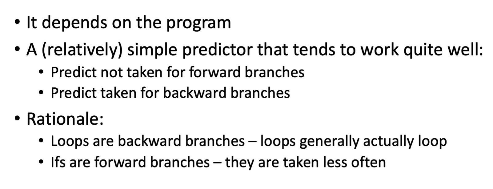	

  

### Pipeline Optimization

- trying to get rid of bubbles

  

  - (there is a sentinel/null number at the end, where you stop if you hit 0)

  - how many bubbles?

    - a stall in `andq %rdi, %rdi` - do this for 5 iterations = 5 stalls
    - `je` done is a control hazard
      - we always take so we'll be wrong 4 times, right 1 time
      - 2 squashed for every iteration so 8 stalls overall
    - in total there are 13 stalls

  - calculating CPI
    $$
    31 \text{ instructions} + 13 \text{ stall/squash} + 4 \text{ to fill pipe} = 48 \text{ cycles}
    \\
    \\
    CPI = \dfrac{48 \text{ cycles} }{31 \text{ instructions}} = 1.5 
    $$

  - what are some ways to reduce the number of bubbles

    - getting rid of data hazard

      - try and fill 1 useful instruction between `mrmovq` and the `andq`

      - we have `addq %rsi, %rbp` that doesn't depend on `%rdi` - now we only should add if we are not done, so might have to do something extra

      - so for 4 of the cycles, we'll do something useful, but we'll do an extra add that we didn't need (last element is 0 though so it's actually alright)

        	

    - getting rid of the branch problem

      - can we try to turn this into a looping branch instead of two branches

      - so if `%rdi` (value read from memory) is not 0 - loop back &rightarrow; change it to `jne loop`, this would require to move the `andq` too

        	

    - new performance 

      - only have 29 instructions now 

      - only have 2 squashes now (only get branch prediction wrong once)

      - still incur the 4 extra stall at the end
        $$
        CPI = \dfrac{29 + 2 + 4 \text{ instructions}}{29} = 1.2 \text{ CPI}
        $$

      - we've improved CPI


### Other Forms of Paralllelism

- Flynn's taxonomy

  	

  - our `y86` sequential is SISD and `y86` is MISD
  - ML algo is SIMD because it's the same instructions on multiple stream of data
  - multicore is MIMD
  - example

- see in class example


# Caching

## Intro

- it's clear to us that most applications need data (either read or write)

  - however, when comparing performance of even DRAM to a processor - RAM is still pre slow 
  - similarly, when we compare performance of your program with the performance of a DISK - that's REALLY slow
  - if we keep having to go to those sources to grab data every time - performance will be bad

- we introduce a cache between our application and our data

  	

  - the cache will be faster 
  - if we can get most of our data most of the time form the cache, the performance will be better
  - to the program, it doesn't care if data is coming from data source or cache 
    - so cache is just hidden with the storage to appear it looks faster

- a read cache HIT (good case)

  	

  - again, program does not know - it just asked from some data and then got it (happens to be quite quick)

- a read cache miss

   

  - so since it doesn't have the data, it has to go and fetch it from data source and then return it 
  - it should save it as well?
  - types of cache misses
    - compulsory
      - on first access to an object, you take a miss; there's little you can do about it
    - capacity: 
      - you are touching more data than can fit in the cache
      - if you made your cache larger, you would have fewer of these misses
    - conflict
      - in most caches, there's a limited number of places in the cache you can put a particular piece of data
      - misses that occur because the particular place (or places) in which a piece of data must go are occupied are called conflict misses
      - (probably something to do with hashes)

- decisions on a cache miss

  - when we go to the actual data source and ask for the data - how much data should the data source really return

    - i.e if you ask for 1 byte, should it really give you 1 byte - why not pre-emptively give you 5 bytes
    - data exhibits what's called locality (ex. if you access the first element of the array, there's a good chance you're gonna access the second element &rightarrow; spacial locality)
    - data source and cache makes this decision together

  - what to do when cache run out of space 

    - gotta kick out some data &rightarrow; eviction policy

  - where to put things in the cache

    - in software, we usually have a lot of flexibility on where to put things, but in hardware, we're often more constrained 

  - when you put things in the cache, how to get them later

  - summary and their names

    	

- block size/line size (how much data should I return)

  - most (persistent) storage devices have native data access and/or transmission size
    - ex. disk block (4 KB)
  - caches also have a native size 
    - i.e Broadwell has 64 byte cache lines
    - implication: data moves in and out of caches in 64-byte chunks
  - block size: the unit in which data is stored in a cache 
    - Broadwell caches: 64 bytes (block size are called cache line size in hardware caches)
    - file system caches: 4 KB
    - object caches: size of the object

## Cache lines and Performance (Caching Reads)

- (cache line is how much you read into the cache when you go to memory)

  - it can ONLY ACCESS MEMORY IN THIS AMOUNT
  - ex. if you need a bit at address `0x1000` - it will access everything from `0x1000 - 0x1007` (if the line size is 8 bits - not realistic)

- Cache line/block size tradeoffs

  - large cache lines can be <u>**good**</u>:
    - if your data exhibit excellent spatial locality
      - another type is temporal locality (how long in time will you access it again)
    - imagine that we read 1 byte and take a miss, BUT we automatically load in an entire kilobyte (KB)!
      - if your application accesses each of those remaining bytes, one at a time,
        then you would have had only 1 miss and 1023 hits!
  - large cache lines can be **<u>bad</u>**:
    - if your data does not exhibit great spatial locality
    - ex. consider the 1 KB cache line and imagine that we only use one byte out of every KB!
      - we consume a lot of cache space and still take a miss on every byte!
      - in this case a smaller cache line size would consume less space and maybe less time to load (read)
      - also your cache would be able to contain more (different) cache lines if they were smaller

- example: let say we have cache line size = 8 bytes

  	

  - we basically divide up memory into 8 byte chunks (this is how it looks to the cache)
  - the cache can only grab data in these "chunks" because of its line size (can't grab half a chunk)

### Organizing The Cache

- cache slots: these are slots that you can store a cache line (i.e 8 bytes of data from memory) into

  	

  - a slot holds data as well as some metadata (not accounted for in the cache line size or cache size)

- direct mapped strategy: a cache line can only be placed in 1 slot 

  	

- deciding where to place a cache line

  - problem: you have a large set of objects that you want to map to a much smaller set of locations

  - answer: <u>**hashing**</u>

    - we typically use actual hashing when we are implementing a cache in
      software (e.g., a file system cache or a database cache)
    - in HW, we use “a poor man’s hash” (because we can only use up to 4 cycles) -- we grab specific bits from the address

  - example: suppose our cache has 4 locations (Red, Green, Blue, Yellow)

    - we place successive memory blocks in these locations in order

      	

    - what do the addresses of the red blocks have in common? 

      - at $i = 3, 4$ (counting from the right), they all share the same bits in their address
      - Red (00), Green (01), Blue (10), Yellow (11)
      - so red always has 0,0 at position 3 and 4, green always as 01 at position 3 and 4, and so on

    - <u>these bits that are similar between the cache lines are called "index" and will be used as our hashing function output</u>

- <u>**From Address to Cache Lines**</u>

  - index

     	

    - index is the place that you will put them into the cache 
    - **the number of bits required for this depends on how many <u>cache lines</u> it can hold**
      - ex. a cache can hold 128 cache lines - so your index can vary from 0 - 127 - you need 7 bits to represent that
      - **formula**: $\text{index bits needed} = \log_2(\text{\# of cache size})$

  - offset

     	

    - it's telling you where within a particular cache line, you can find the address you're looking for (a sub-index if you will)
    - for example, if your cache line is 16 bytes, then addresses from `0x-------0 - 0x-------F` will be in the <u>same</u> cache lines
      - so if you're looking for `0x-------2` - it'll be at offset 2
    - **the number of bits required for this depends on how big your <u>cache line size</u> is**
      - if a cache line is $2^m$ bytes - these bottom $m$ bits will to me where in the cache line you can find a particular address
      - formula: $\text{offset bits needed} = \log_2(\text{cache line size})$

  - tag 

    	

    - i.e "which red block do we currently have in the slot?" (as only 1 of them can be in there)

  > Example 
  >
  > - Our cache has:
  >
  >   - 8-byte cache lines
  >   - 4 slots
  >   - total size: 32 bytes
  >
  > - Calculating bits needed
  >
  >   - offset: $\log_2(\text{line size}) = \log_2 (8) = 3$ 
  >   - index: $\log_2(\text{cache size}) = \log_2(4) = 2$
  >   - tag: the rest so $8 - 3 - 2 = 3$
  >
  > - Address 1: `0xBE = 0b 101 11 110`
  >
  >   - so the index (location within the cache) is `0b11 = 3` 
  >
  >   - within the cacheline itself, the offset is at `0b110 = 6`
  >
  >   - the tag is `0b 101 = 5`
  >
  >      
  >
  >   - (an obviously within those offset - there'll be data from the memory source)
  >
  > - Address 2: `0xFA = 0b 111 11 1010`
  >
  >   - index is `0b11 = 3`
  >   - offset is `0b010 = 2`
  >   - tag is `0b111 = 7`
  >   - so we go to index 3 to try and find it - but we see that the tag (7 vs 5) is not the same - SO THIS IS A CONFLICT
  >   - (currently, our eviction policy is to just overwrite the old, so we update the tag and load new data into the cacheline)
  >
  > - Address 3: `0xCE = 0b 110 01 110`
  >
  >   - index is `0b01 = 1`
  >   - offset is `0b110 = 6`
  >   - tag is `0b110 = 6`
  >   - since this index is empty, we just load data into that cachelin

### Evaluating a Cache

- hits are much better than misses (duh)

- measure the efficiency of a cache in terms of <u>**cache hit rate**</u>
  $$
  \begin{align*}
  \text{cache hit rate} &= \dfrac {\text{\# cache hits}} {\text{\# of cache accesses}} \\
  &= \dfrac {\text{\# cache hits}} {\text{\# of cache hits + \# of cache misses}}
  \end{align*}
  $$

  - ex. I access my cache 1000 times and I get 400 hits &rightarrow; that's 400/1000 = 0.4 hit rate

- average access time

  	

- counting hits

  - if you touch the same item more than once, you get a hit, but there is naother way to get a hit
  - remember that our cache is organized in cache lines (so it loads the entire chunk into memory - if we use anything in there - we count that as a hit as well)
  - ex. say we're using the teeny cache above and we access 8 bytes in order starting from address `0x00`
    - first access is a miss (load in everything from address `0x00 - 0x07`)
    - the next 7 accesses are all hits
    - $\text{hit rate} = 7/8$

## Cache Associativity

- recall: in a direct mapped cache, every bit of data has exactly one place it can be in the cache

- consider: 

  	

  	

  - how large is each array? each long is 8 bytes and so each array is 8192 bytes (8kb)
  - assuming they are allocated contiguously in memory (what happens in C) - what's going to happen when we run the program? every single array access is going to be a cache miss

- problem with direct mapped cache

  - say array $A$ starts at address `0x2000` 

  - where does array B start? add 8KB to A and you get `0x4000`

  - similarly array C starts at `0x6000`

  - implicates for the cache

    - if addresses are 32 bits, how large are the offset, index, and tag 

       

    - notice that 7 + 6 = 13 - makes sense because 8KB requires 13 binary bits

    - looking at the addresses themselves (offsets are crossed out, index bits higlighted)

      

       

      - do notice that for accessing first element and second leement, for all of them, they're in cache line 0 - that is troublesome

      - this is always going to be a problem, if our code is accessing the array in lockstep (i.e `a[i]` then `b[i]` in 1 loop)

         

         

- counting misses

  	

  - we read the whole cache line in for array `a`, access one element and then evicted it, all in the same loop

  - then you have to write to `c` (evict `b`)

    	

- possible solution: fully associative

  - meaning: a cache line can go to ANY slot

    	

  - you will get a hit for every element access after the first one (same for all other arrays) - first one miss, next 7 hits

  - in SOFTWARE - fully associative is OK - but very expensive in HARDWARE (probably because of hashing)

- solution: 2-way set associative 

  - any address can go into 1 of addresses in the cache

    	

  - the 2 slots are called a cache set

  - when you read A and B in - take 2 arrays that gets mapped to the same "place" in the cache but won't conflict because there's 2 spots for them

  - doesn't completely solve our problem because C goes into the same cache set, so we'll have to get rid of either A or B (eviction policy)

  - for now, consider that we evict either one and it's random

  - depending on the eviction policy, we might still do awful

  - program would work a lot better if we had a 4-way associative cache

- associativity and mapping addresses to cache lines

    

  - since we've organized the lines 2 set, there are half as many SETS to choose from

## Eviction Policy

- what happens when the cache fills up

  - cache has a limited capacity.
  - at some point, the application will fill the cache and request another item.
  - caching the new item requires evicting some other item.
    - need eviction policy
    - available decisions here vary between hardware and software

- eviction in hardware

  - in hardware caches, you frequently have only a few choices
    - direct mapped: exactly 1 choice!
    - N-way set associative (2, 4, 8) : N choices
  - it's typically too expensive to build fancy replacement algorithms into HW caches, so <u>we typically use a random replacement policy</u> (randomly get rid of 1)
  - though it is POSSIBLE to implement a better eviction policies (like ones we learn later today)

- eviction in software

  - in a perfect world, we’d like to evict the item that is least valuable
    - problem is we don't really know what that is
  - practically all policies tries to simulate this 
    - LRU: Least-Recently-Used – find the item that has been unused the longest and get rid of that
    - LFU: Least-Frequently-Used – find the item that has been used least frequently and get rid of that
    - clock: used in virtual memory systems to approximate LRU

### Replacement Policies

- an ideal eviction policy: Belady's Algorithm

  - always evict the item that we use farthest in the future

  - the algorithm is perfect - but you need COMPLETE KNOWLEDGE of the future - not realistic

  - so we have to try and approximate it

    > Example: Assume we have 2 slots in our cache and that it's fully associative, and we access cache blocks in the following order
    >
    >  
    >
    > - first: compulsory misses (first time seeing data)
    >
    >   - put A in the cache
    > - second: hit 
    > - third: compulsory miss
    >
    >   - put C in the cache
    > - fourth: hit
    > - fifth: hit
    > - sixth: compulsory miss (first time seeing B)
    >
    >   - we look in the future, we see that we're going to access A before we'll access C before
    >   - throw out C
    >   - (you only have to look few steps forward until you see A, that's enough to know to evict C &rightarrow; though this is only because the cache is size 2)
    > - last: you can evict whatever
    > - hit rate: 8/12

- random note: when something is both a capacity miss and a compulsory miss (i.e it's the first time you're seeing it but now you have to evict something) &rightarrow; that is a compulsory miss

- <u>**Least Recently Used (LRU)**</u>

  - choose the element that hasn't been used the longset in the past

  - example: same assumption as above

    	

    - when we first get to B, we replace A because in the "recent past" - we've used C, then A, so A is the farthest away from the past
    - note: this is a different replacement decision from Belady

- <u>**Least Frequently Used (LFU)**</u> 

  - keep track of how many times each item is used and replace the one with the smallest frequency count

  - example

    	

    - when we get to B, C has only been used twice while A been used 3 times, we replace C
    - when we get to C at the end, A has count of 5 and B has count of 4, replace B

  - keeping the count is kinda expensive (i.e if you access A 100 million times, you need to represent that in bits somehow) &rightarrow; implementing this in hardware is hard

- there is no perfect policy

  	

  - that is to say, you can orchestrate a access pattern that fucks everything up

### More Cache Replacement Policies

- when is LRU terrible

  - when the access pattern is just about larger than the cache 

    	

    - basically make it so that as soon as you evict something, you access it again

  - if you could have used Belady's algo

    - when we get to C the first time: we would evict B instead of A 
    - when we get to B: we'll get a miss, best thing to do here is to kick out the object you just touched (A)

- Most-Recently-Used (MRU)

  - that's what was described above
  - ideal when iterating over an array that is too large for the cache
  - (not necessarily good for other)

- FIFO (first in first out)

  - evict the item that was loaded into the cache earliest

    	

    - here, A has been here the longest, kick it out

  - next

    	

    - C has been in the cache the longest at this point, evict C

- there is no perfect policy

  - LRU (frequently just fine)
  - LFU (sometimes better)
  - MRU (when you detect the right pattern)
  - for anything but Belady, we can construct an adversarial workload that can be pretty devastating

> PL Question
>
>  
>
> Kinda tricky but my trick is that you only have to have 1 case where FIFO hits and LRU miss, then everything after can just be the same element
>
> First, let's do `F, J, C, F` - here, we used F again, so F is no longer the least recently used - it's `J`	
>
> Then, add a new element to the cache `H` - for FIFO, `F` gets evicted, but for LRU, `J` gets evicted
>
> Add something to cause LRU to miss, so call `J`, we've just evicted this, so LRU will get a miss but FIFO it'll still be there so it's a hit (so far it's `F, J, C, F, H, J`)
>
> And the rest can just be all `J`s (it'll be all hits for both) - so LRU will just have 1 less hit than FIFO
>
> `F,J,C,F,H,J,J,J,J,J`

## Speed Up

- sometimes we also want to compare different cache architectures or determine how a change might influence performance

  - we often use <u>speedup</u> to describe how much a change improves (or harms) performance

- Amdahl's Law: it was originally designed to quantify the opportunities and benefits of parallelism (but can be used for other things - in our case, caching)

  - visually 

     

    - $\alpha$ is the <u>proportion you can speed up</u>
    - $k$ is the factor we can make it faster

  - describing $T_\text{new}$ 
    $$
    \begin{align*}
    T_\text{new} &= T_\text{old} (1 - \alpha) + T_\text{old}\left(\dfrac \alpha k \right) \\
    &= T_\text{old} \left(1- \alpha + \dfrac \alpha k \right)
    \end{align*}
    $$

  - speedup
    $$
    \begin{align*}
    \text{speedup} &= \dfrac {T_\text{old}}{T_\text{new}} \\
    &= \dfrac{T_\text{old}}{(1 - \alpha + \frac \alpha k)\cdot T_\text{old}} \\
    &= \dfrac{1}{\left(1 - \alpha + \dfrac \alpha k \right)}
    \end{align*}
    $$

  - more formally: overall speed up is a function of both the amount you improve some part of the system ($k$) and the fraction of time you spend in that part of the system $(\alpha)$

    > Example
    >
    > 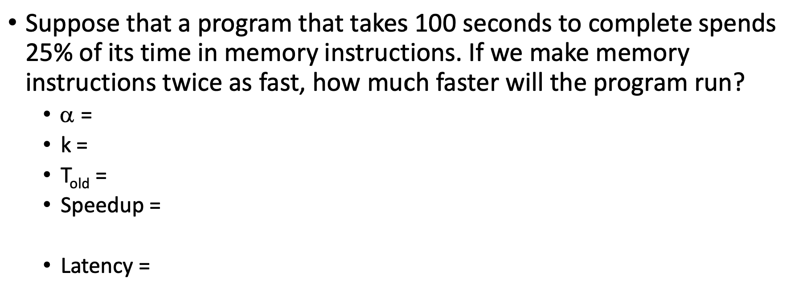 
    >
    > $\alpha = 25\%$ because that's the portion we can speed up
    >
    > $k = 2$ because we can make it twice as fast
    >
    > $T_\text{old} = 100 \text{s}$ 
    > $\text{Speedup} = 1 / (1 - 0.25 + 0.25/2) = 1.14$
    >
    > $T_\text{new} = 100((1 - 0.25)+ 0.25/2) = 87.5 \text{s}$ 

## Cache Writes

- caching also applies to write 

- a write cache hit

  	

  - program says here's an item write to this address

  - this means that the cache has a line (that's associated with that address)

    - so we put the new VALUE into that offset in the cache

    - (this is called dirty data - it's been updated but hasn't been written to the data source...later)

      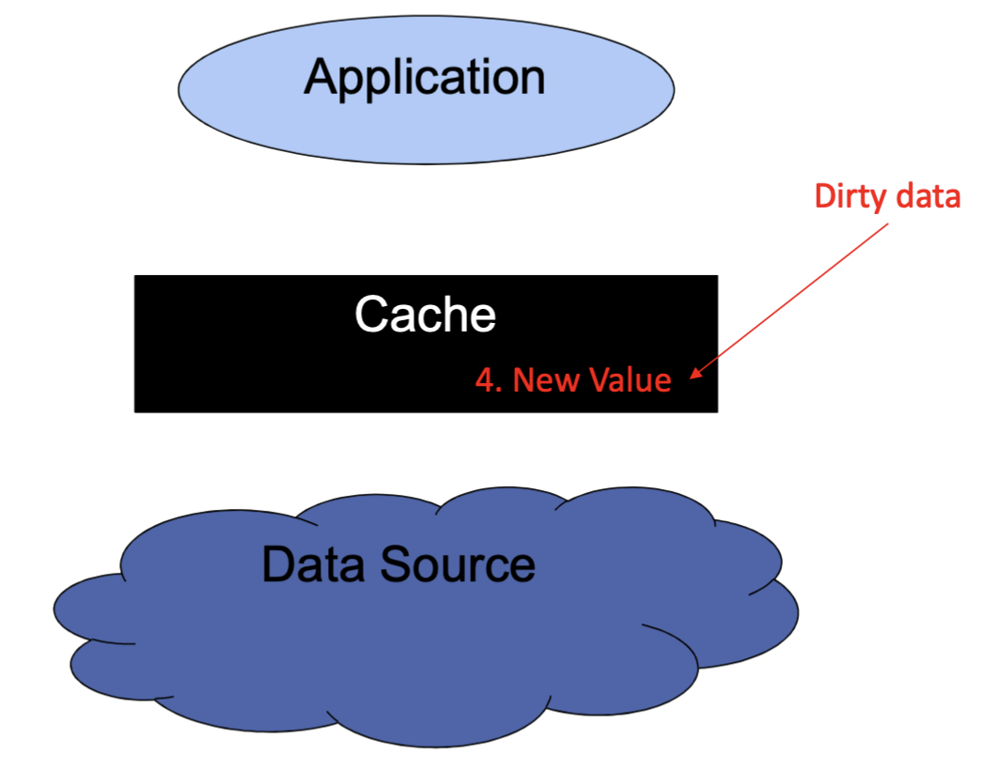	

  - we should write that dirty data to the data source - there are policies that tell us when to do that

    - writeback: after some time, we will write the dirty data into the data source

      	

    - this could be something like using a timer, or only write back when the cache line is getting evicted (i.e before the change will be lost)

    - writethrough: start writing back right away

         

  - write policy trade off

    - advantage of writeback cache (= disadvantage of write through)
      - faster (because we don't have to do any writing at that moment)
      - good for write coalescing - allows us to update the same item (or multiple items in a cache line) many times before writing it back to the source
    - advantage for write through (= disadvantage of write back)
      - no window of vulnerability (at no point are we in risk of losing our changes)
      - typically easier to implement

- write cache miss

  	

  - with write allocate

     

    - we are loading the data from memory into the cache THEN we are updating it

  - without write allocate

     

    - doesn't change the cache at all

  - write-allocation trade off

    - advantage of write-allocate (= disadvantage of no-write-allocate)
      - faster when you are modifying multiple values in a cache line (because it'll be in the cache for you to update)
      - matches the read behaviour
    - advantage of no-write-allocate (= disadvantage of write-allocate)
      - avoids clustering the cache with write-only data
      - avoids consuming a lot of cache space for random writes

- summary so far:

  - when do writes become visible below the cache (to memory)?
    - writeback: some time later after we write into the cache
    - writethrough: immediately upon writing to a cache
  - when we take a miss, do we automatically allocate a slot in the cache to the missed cache line?
    - write allocate: yes
    - no write allocate: no

  > Case 1: Data was read into the cache already
  >
  > 1a) It's a writeback cache
  >
  >  
  >
  > So we just write to the `0x1000` index in the cache - not the data source (yet)
  >
  > Note: we need to maintain a bit in the cache metadata to indicate that the data is dirty (and must be written back)
  >
  > 1b) It's a writethrough cache
  >
  >  
  >
  > The 2 writes can actually happen in parallel 
  >
  > 
  >
  > Case 2: A Cache Miss
  >
  > 2a) No Write Allocate
  >
  >  
  >
  > We just write directly to the data source
  > If your application is just writing data and never reading it back and it's not even making consecutive writes to the same cache line - this sort of architecture makes sense
  >
  > 2b) Write Allocate
  >
  >  
  >
  > First we load the data into the cache. Now notice that we made changes to the data in the cache only - you CAN implement a policy where changes happen in both - you can mix and match the writeback decisions

- miss-handling taxonomy

   

  - writeback + write allocate combination is common because the assumption when you have a writeback cache is that the DATA IN THE CACHE IS VALUABLE and you're going to use it again so even if you take a miss, it's worth taking up a cache line for it
  - writeback + no write allocate
    - so we take a write miss, we write directly into the data source
    - next time we take a write miss, we write directly into the data source again
    - this just kinda looks like a write through operation
  - write through / write allocate 
    - we take a write miss, we read it from the data source, allocate a line in the cache
    - then you update it in the cache
    - AND since you're writethrough, you have to update in the data source as well
    - (the previous 2 steps can be switch with each other)
  - caches with big blocks (and slow storage) are almost always Writeback and Write Allocate
    - file system caches
    - virtual memory caches

## Stride Access Patterns

- recall: locality - spatial and temporal

  - when we read an array sequentially - the data we access is physically close together (spatial locality) and we are accessing it at approximately the same time (temporal locality) &rightarrow; good cache behaviour
  - what happens when we change that?

- building intuition (1a)

  - image I have an array that fits in the L1 cache
  - and say that I read through the array many many times, reading a single byte on each acces
  - what would the latency be of each access?
    - it's <u>roughly</u> whatever the latency of the L1 cache
    - you might take misses on the <u>first</u> time through the array, but if the cacheline is of size N, we take one miss to N-1 hits
    - example: N = 64
      - 1 miss and 63 hits
      - that's a miss rate of 1.6%
      - AND on every subsequent iteration, all accesses are hits

- building intuition (1c)

  - same set up as before, but image that instead of reading every byte, I read every 8th byte &rightarrow; what would the latency be now?
    - now you only access the arrays 8 times
    - first iterations, you take a bit more misses (i.e if cacheline is 64, instead of taking 1 miss and then 63 hits, you get 1 miss and 7 hits)
    - but since the array still fits in the cache &rightarrow; all subsequent array access are hits
    - so the performance is still roughly about the latency of the L1 cache
  - (above, that's called strided access - the <u>**stride**</u> is the number of bytes between an accesses)

- building intuition (2a)

  - image you have a huge array - larger than the cache
  - if I access every byte - what will my latency be?
    - <u>close to the latency of the cache</u> 
      - you no longer get the benefit of subsequent access staying in the cache - so there'll be a cost every time you're accessing the array
      - every iteration that you're accessing the array, you take 1 miss and then `size(cache_line) - 1` hits
    - example: let's say a miss is 5x slower than a hit
      - 32-byte cacheline: (5 + 31) / 32 = 1.13 the cost of a hit
      - 64-byte cacheline: (5 + 63) / 64 = 1.06 the cost of a hit
      - 128-byte cacheline: (5+127)/128 = 1.03 the cost of a hit
    - the larger the cache line, the closer to the hit time purely sequential access

- building intuition (2c)

  - now let's say that the L1 is 4KB and I access one byte out of every 4KB, what will be the latency of each access
    - miss upon miss upon miss - always missing 
    - so the latency is approximately the latency of the data source (or the lower level cache)

- strided patterns occur when we 

  - pack structures in an array and access only a particular field in the structure
  - in matrix computations
  - other scientific computations 

- strided access patterns can also be used to reveal characteristics of your memory hierarchy

- performance pattern

  - size of the array (and the cache) on the x axis, then the latency on the y axis

  - workload: read every byte of the array many times

    	

  - workload: read every $N$-th byte, where $N$ is the size of an L1 cache (dark blue circles)

       

### From Arrays to Strided Access

- recall

  - cache lines take advantage of spatial locality &rightarrow; moves data into caches in units larger than a single access
  - this is effective when we're accessing more than one data item per line
    - point: <u>we want to lay out data so we read all of the data in each line</u>
    - ex. utilize cache better when we're iterating over an array rather than a linked list
  - (note: even if we're accessing an array - we might not be accessing a byte as a time - so be careful)

- example: consider this code 

   

  - we have an array of <u>objects</u> (person struct) and we're accessing every object (not byte)
  - doing some math, we know that the struct 72 bytes in size
  - so we are jumping ahead 72 bytes every time 
    - depending on the size of our cacheline, performance might be good or bad
  - the line size is 64 bytes - so we get 0 hits

- stride: distance between elements accessed consecutively in a program

  - note: distance can be expressed as elements or in bytes (i.e 1 element and stride of 8 bytes might mean the same thing)
  - as stride increases, hit rate decreases

> <u>**Example: Strided Access in Real Life**</u>
>
> <u>Set Up</u>
>
> - the data: a stream of time stamped data
>
>   - 100 trees monitored with some sensores
>
>   - each sensor produces one double value (8 bytes) every 5 minutes
>
>   - we have 1 year's worth of data
>
>   - stored in order it is received (i.e clustered by time)
>
>      
>
>     - so we have `[tree1, tree2, ... at time 0], [tree1, tree2, ... at time 1], ...` 
>     - `[tree1, tree2, ... at time x]` is 800 bytes long
>
> - two ecological studies
>
>   - Linh analyzes all the data for a particular tree 
>   - Aaron analyzes all the data for 9:00 - 10:00 AM every morning
>
> <u>Linh's Experiment</u>
>
> - so Linh wants `[tree0 at time 0], [tree0 at time 1], [tree0 at time 2]` and so on
>
> - visually (look at the red arrows)
>
>    
>
> - the distance between the arrows (and thus the access) is 800 bytes &rightarrow; she was a 800-byte stride
>
> <u>Aaron's Experiment</u>
>
> - he's trying to access `[all tree at time 0 on day 1], [all tree at time 0 on day 2]`
>
> - visually 
>
>     
>
>   - the amount of data that he's trying to read for every day is 9600 byte
>     - (because that's how many bytes stored for an hour's worth of data)
>   - the distance from day 1 to day 2 is 230,400-byte
>
> - so he has a 230,400-byte stride
>
>   - but note that he's reading ALL of the next 9600 bytes every time he access
>
> <u>Comparison</u>
>
> - who reads more data
>   - Linh
>     - she reads 8 bytes every for every 5 minute interval
>     - $8 \times 12 = 96 \text{ byte / hour}$
>     - $96 \times 24 = 2304 \text{ byte / day}$
>     - $2304 \times 365 = 840,960 \text{ byte in total}$ 
>   - Aaron
>     - reads 9600 bytes per day (1 hour's worth of data)
>     - $9600 \times 364 = 3,504,000 \text{ bytes in total}$
>   - so Aaron reads way more
> - who reads data at a faster rate 
>   - actually Aaron 
>   - Aaron reads large chunks continuously, while Linh read 8-bytes at a time scattered all over memory
>   - so Aaron's pattern produces better cache behaviour 

- 2D arrays

  - Row Major Form (this is how it is in C)

     

    - so it just takes the rows, and stack it next to each other

  - Column Major Form 

     

    - take the columns, transpose them sideways, then put them next to each other
    - (this would be beneficial for Lin - as she only needs `all_time_tree_0`)

- determining cache parameters empirically 

  - consider 

     

    - if you're doing this multiple time (i.e go through the array multiple times) - you're getting strong temporal locality

  - spacing out the accesses

     

     

  - as the array gets bigger that they no longer fit in the cache, you no longer get temporal locality

    	

    - the bumps is when we're "blowing" our cache, so we start seeing latency of cache below
    - so L1 is about 32K
    - so L2 is about 4M

## Cache Coherency Protocols

- recall we talked about multicores processors

   

  - can also have entirely separate processors that share memory 

- let's assume all caches are write-back - what problems can arise when we have caches in the presence of multiple processors (or cores)?

  - two cores/processors might access same data - could result in two copies of the same cache line in two different caches
  - Core 1 might wish to access data that is dirty in Core 2's cache
  - Processor 2 might wish to read data that is dirty in a cache on Processor 1
  - <u>**point**</u>: if hardware doesn't do anything to avoid it, cores/processors can see incorrect data

- example

  - Core 1 reads X (assume write-allocate policy)

     

    - so data gets written to L2 and L1 cache

  - Core 1 writes X

     

    - since it's a writeback cache, it only writes to the L1 cache

  - Core 2 reads X

     

    - since the L2 cache is shared, Core 2 can just read from the L2 cache - but it will get the WRONG data (`0x1234` as opposed to `0xCAFE`)

  - same problem if we're on separate core

  - this is called a <u>**incoherent cache**</u> &rightarrow; we want processor to prevent this

- <u>**cache coherence**</u>

  - it's the hardware's job to make sure that the programs cannot see such inconsistencies
  - 2 part of a solution
    - use hardware to ensure that loads from all cores will return the value of the latest store to that memory location 
      - (actually get the value that was last written &rightarrow; will have performance implications)
    - use cache metadata to track the state of cached data
  - two major approaches to address this problem
    - snoopy caches
    - directory based coherence

### Snoopy Caches

- assumption: we have some bus that all the caches can see

  - if you see something goes across the bus, you can update your information
  - or you can send messages across that bus that other cores can pay attention too

- invalidation protocol with snooping

  - invalidation: if a core writes to a data item, all other copies of this data item in other caches are <u>**invalidated**</u>
  - snooping: all cores continuously snoop (monitor) the bus connecting the cores

- example

  - have Core 1 read X and Core 2 read X

    	

  - when Core 1 write X, it's going to send an invalidation message across the bus

    	

  - it's the responsibility of the 2nd core to take that message, invalidate that cache line and evict it

  - we will need to make some improvements to the metadata to support this


### MSI

- enhancing cache metadata

  - when we have caches  from multiple cores and we have a bus - we need to extend our valid bit to a set of states

  - cache operations can

    - change state
    - send invalidate requests
    - request cache lines in a particular state

  - a minimal set of states (MSI model)

    - <u>**(assumes a write-back cache)**</u>
    - M: cache line is modified (i.e dirty)
    - S: cache line is shared; appears in multiple caches
    - I: cache line is invalid (i.e no longer contains valid data)

- deriving the state diagram for MSI

  - you start in the invalid state

    	

  - you then do a read - the data is not dirty, so we'll put it in the shared state

     

    - because at this point the cache line is considered okay to be shared
    - (local read means your cache is doing the read, remote read would mean some other cache is doing the read)

  - if you keep doing reads you stay in your current state 

    	

  - when you write that data 

    - write-back cache so you write only to the cache 

    - data is now dirty or MODIFIED

    - go to M state

       

  - you do some more read and write &rightarrow; stay there

    	

  - if you were in invalidate (so at the beginning again) and you had a write miss, you'd have to go to memory, load it into the cache THEN write it (which then makes it dirty) &rightarrow; go to the modified stage

    	

  - when you evict (you're in a modified stage), you're moving back to an invalidate stage and we're writing that dirty data back to the actual memory source

     

    - you can do the same from the shared stage (but no need to write back)

  - now if your cache is in the modified stage and you see someone send a message that they're doing something with a line that you currently have (i.e remote R/W)

    - you must evict the current line you have in your cache 

    - there's 2 reason for this

      - in case of a remote read: you want to write back so that the remote cache can get the most up to date data
      - in case of a remote write: your data is now going to be stale after the remote cache edits, need to evict

    - in both cases: we go back to invalid state

       	

  - similarly, if you were in the shared stage and you see a remote R/W

    - remote read: don't have to do anything, since the data is shared (i.e not dirty) - the remote cache can just read from the memory source &rightarrow; stay at shared

    - remote write: you'll have to evict since the data you currently have will now be stale &rightarrow; go to invalid

       


### MESI

- some things to note:

  - different caches (i.e., L1 on core 1 and L2 on core 2) can be in different states
  - whenever we talk about a state, it is the state for a specific cache line
    - the state of cache line `0xffff00` is unrelated to the state for the cache line `0xffff40`
  - in MSI, some expensive operations is happening
    - stuff in purple - when we send messages across the bus that takes up bandwidth and we're sending big messages (cachelines)
    - this get expensive if, for example, I am the only one who has something cached
      - if that data is not shared, you are still executing a large number of costly cache invalidations
      - for good parallel code, we're touching VERY different data, caches ideally should be disjoint
        - but when you read, you always go to a shared states, even if no one uses it
  - so we add a new state to support this &rightarrow; E 
    - exclusive state (meaning you're the ONLY one to have this data)

- deriving the state diagram

  - first, a legend

     

  - start in Invalid state (as always)

     

    - so if you're reading a file that's been read by someone else, still go to Shared as usual
    - but, if you're the FIRST/ONLY one to read this &rightarrow; go to the Exclusive state

  - once you're in the Exclusive state 

     

    - there's a remote read
      - since someone else is also reading that data, the data is now shared &rightarrow; go to Share state
    - there's a local read
      - you're still the only person with that data &rightarrow; stay in Exclusive

  - if you're in Invalid and there's a write miss

     

    - you load data into the cache, then write into the cache &rightarrow; so you're in Modified
      - send potential invalidate in case other people have that line - tell them to evict

  - local write from Shared and Exclusive 

     

    - in both cases, you're modifying and making the data dirty &rightarrow; go to Modified
    - but if you're in shared, someone else might potentially have this data as well, so you should send an invalidate message to get them to evict

  - remote R/W from Modified

     

    - remote write from Modified: 
      - someone wrote to the same line, your data is now stale &rightarrow; go back to Invalid
      - TODO: why do we need a writeback here
    - remote read from Modified: 
      - someone is reading this line and want the most up to date data 
      - we need to write that data back into memory source so remote cache can get it
      - now the data is shared &rightarrow; shared state

# File Systems

## File System APIs

- processor privilege levels 

  - modern hardware has multiple privilege levels
  - diff software can run with diff privileges
  - hardware usually have at least 2 modes of operations (privilege levels)
    - user mode: how all "regular software" runs
    - kernel mode or supervisor mode: how the OS runs 
  - the mode in which a piece of software is running deteremines
    - what instruction may be executed
      - i.e program shouldn't be able to `halt` the processor
    - what memory locations may be accessed (enforced through translations)
    - whether the program can directly interface with devices
      - i.e if we can access the disk and scribble dat all over it

- systems calls

  - ex. but your program may want to read data from the disk &rightarrow; it can ASK the OS to do it for it (system calls)
  - definition: when a program wants to do something that it cannot do in user mode, it needs to ask the kernel to perform the activity on its behalf
    - they are ways for a program to explicitly request the OS to do something

- POSIX File System API: file system APIs are implemented as library functions (in `libc`) that invoke system call

  - `open`: take a pathname (name of a file) and returns a file descriptor (`fd`) which you will use to access that file
    - `fd` is just an integer - and somehow this integer magically represent a file (more on this later)
  - `close`: takes an `fd` and frees up all the OS and library resources that's been allocated to it
  - `read`: read data from the file referenced by `fd` into a user-specified buffer
  - `write`: takes data from a buffer and writes it to the file referenced by `fd`

- example: copy program in pseudo code

   

- `int open(const char *path, int oflag, int mode)`

  - `path`: path name of file you wish to open
  - `oflag`: flag values that tell you things such as 
    - how you want to access the file: `O_RDONLY` (read only), `O_WRONLY`, `O_RDWR`
    - what do do if file does or does not exist: `O_CREATE`, `O_EXCL`
      - `O_CREATE` means to create it
      - `O_EXCL` means only create it if no one else is doing it at the same time (resolve race condition)
    - how file should behave with respect to OS caching: `O_SYNC`, `O_DIRECT`
  - `mode`: if the file does not exist and you create it, what should its access mode be set to (who's allowed to read/write it)
  - return value: a file descriptor `fd`
    - non-negative integer on success
    - `-1` on error
  - ex. `open("myfile, O_CREAT, 0600")`

- digression: file system modes

  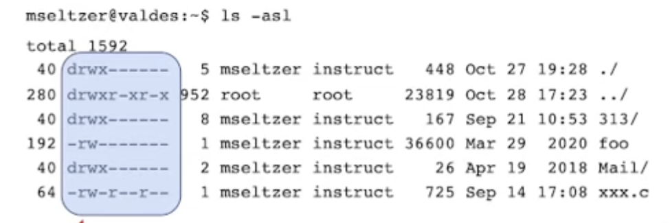 

  - these strings represent who can do what 

  - they are 10 characters

     

    - the type tells you what kind of file it is
      - `-` means regular file (ex. `foo` above is just a regular file)
      - `d` means it's a directory
      - `l` means it's a symbolic link
    - `owner` group tells you the different permissions that is allowed for the <u>owner</u> (person created it)
      - we have 3 possible permissions, `r` (read), `w` (write) and `x` (execute)
      - ex. for `foo` (4th row) - owner is allowed to read and write
      - note: for a file, execute means to run, but for a folder - you need to be able to execute to go into it and traverse files inside
      - ex. for `./` (first row) - no one aside from the owner is allowed to execute the directory, meaning no one can go inside
      - same goes for `group` and `world`
    - we typically specify permission using 3 octal digits corresponding to the permissions 
      - read only for a entity (i.e owner) is 4 (because it's `0b100`) 
        - read and write is 6
      - ex. `mode = 600`
        - owner = 6 - that means they can do everything
        - group = 0 - the group cannot do anything
        - world = 0 - the world cannot do anything

- `int close(int fd)`

  - `fd`: file descriptor to be closed
  - return value: 0 on success, -1 on error
  - example: `int ret = close(fd)`

- `ssize_t read(int fd, void *buf, size_t nbyte)`

  - `fd`: file descriptor for the file you want to read from 

  - `buf`: buffer into which the bytes read are placed

  - `nbyte`: the number of bytes to read

  - return value: a `ssize_t(a signed long)`

    - on success: the number of bytes read
    - on end-of-file: 0
    - on failure: -1

  - example

    ```c
    char buf[4096]
    ssize_t bytes_read = read(fd, buf, 4096)
    ```

- `ssize_t write(int fd, const void *buf, size_t nbyte)`

  - `fd`: file descriptor for the file you want to read from 

  - `buf`: buffer where we're writing from

  - `nbyte`: the number of bytes to write

  - return value: a `ssize_t(a signed long)`

    - on success: the number of bytes written
    - on failure: -1

  - example

    ```C
    ssize_t bytes_written = write(fd, buf, 4096);
    // or
    write(1, "This will be output to standard out\n", 36);
    ```

- note: unix and linux file system implement byte stream model

  - file system keeps track of the pointer/index/offset that you're writing and reading from
  - i.e if you write 20 bytes, the next time you write, you will start writing from the 21st byte
  - (resets when you close)

## Disk Intro

- disk vs memory

  - memory is communicated through the IO bridge

  - disk is communicated through the IO bus

     

- modern disk drive

   	

  - has platters within the disk

  - platter looks kinda like DVD and you can write data to the top and the bottom of the platters

    	

  - there are tracks on the platter and the platters spin

  - if the data is laid out contiguously on the tracks - we can read it while the disk is spinning

  - can divide up the tracks more into sectors

     

    - can read multiple sectors if they're in the same track

  - note: there's a difference between disk sectors and track sectors (most of the time I'm pretty sure they're talking about track sectors)

    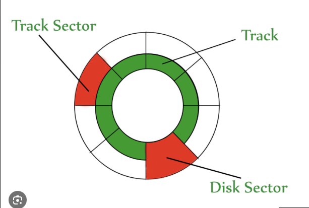	

  - if they're on different tracks, need to understand how to read and write disk

- disk heads

  - there's a big arm that has a read head or a write head

     

    - move the disk head until we get to the correct tracks 
    - so you have to move the arm to the right place (seek time), and wait for the disk to spin around to the correct place (rotation time) &rightarrow; slow 
    - if you're reading the entirety of a track, you only pay the seek time (because you can just get all the data up - figure out order later)

- disk sector numbering

  - start at top (or bottom), outer most track then start labelling, then you to the NEXT level (still on the outermost layer), then next layer

    	

    - so we want to layer the data like so, layer to layer in a sense if we've used up an entire track
    - a track stacked across platters are called cylinders (i.e outer most ring across first platter, second platter and third platter) - that is the fastest read you can get

## Files

- a stream of bytes

  - reading and writing proceeds from the current offset

     

  - read and write share the same offset

  - offset indicates the next location from which to read or to which to write

- each open file needs an offset for reading and writing &rightarrow; thus file descriptor must allow us to find:

  - the file’s data
  - the file’s metadata (e.g., how large the file is, who can access the file, etc)
  - the file offset
  - file data and metadata is persistent
    - persistent means it stays after you close or shut off the cojputer
    - offset resets when you close the file &rightarrow; lives in the OS memory
  - (more on this later)

- data can only be read from a disk one block/sector at a time

   

  - reading a byte requires that we retrieve a block from the disk
  - Logical Block Number (LBN)

    - $\text{LBN} = \text{offset}/ \text{block size}$ = block number, but ...
      - **<u>this block number is relative to the start of this file</u>**
    - the file can be viewed as a sequence of blocks
    - <u>**from the logical block number we have to be able to figure out where the block lives on disk**</u>
      - this mapping needs to be persistent
      - (more on this way later) 

## File Descriptors

- recall

  - if you and I are both allowed to read a file, should we be able to share the file's data?
    - Yes! If the permissions are set accordingly, you and I should both be able to see that data
  - if two processes are reading (writing) the same file, should they be using a file offset
    - No! The offset resets when you open the file
  - if the process opens the same file twice, should it have one or two file descriptors?
    - Two! Because when you open again, you're saying it's a brand new interaction with the file
    - In the same vein, they WILL NOT share an offset
  - if two threads are using the same file descriptor, should they be using the same file offset?
    - Yes! Because we've only opened the file once and threads share a lot of data from within the same process
  - if one process (the parent) creates another process (a child), should the child inherit the parent's file descriptors?
    - Yes! Because a child is a copy of a parent, that means the file descriptors are shared (also file are only opened once)
    - since they share a file descriptor, they'll share the same offset as well

- Per-process data structure

  - we know: 
    - when a process issues the `open` system call, the return is a small int called a file descriptor
    - when a process start up, it will already have 3 open file descriptors
      - standard input: `fd = 0 (STDIN_FILENO)`
        - default stream for data input
      - standard output: `fd = 1 (STDOUT_FILENO)`
      - standard error: `fd = 2 (STDERR_FILENO)`
  - so what DS do we need to retain for each process
    - each process needs to have its own file descriptor table

- (File) Descriptor Table

  - a per-process DS

  - file descriptors returned by `open` correspond to indices in this table

    - ex. if a process calls open and gets `fd=3` - then the file is represented by the 4th entry (bc 0-index) in the table

  - table is mostly going to contain a pointer to other structures

  - can we store the current file offset in this table?

     

    - when we call fork, it copies the descriptor table
    - the two offsets are supposed to mirror each other - however, if we make a change to the offset in the parent process, this will not be reflected in the child table (because value was copied by value)

- where to store offsets

  - an offset corresponds to a call to `open`
  - we need a data structure corresponding to each `open`
  - <u>**the (`open`) file table: shared by all processes**</u>
    - maintains the file position (i.e offset in the file)
    - keeps a reference count (for when we have two `fd`s referencing the same open file object)
    - keeps a reference to an object that represents the actual file

- in-memory objects representing files

  - Vnode (virtual node): in-memory representation of a file
  - Vnode talbe: collection of all vnodes, shared among all processes
    - contains a copy of the file's meta-data
    - including a way to locate the file's block on disk (more later)

- Scenario 1: Single Process

   

  - single process so we have single file descriptor table
  - different entries in the table point to different entries in the (global) open file table
  - and the open file table entries point to some in memory objects
  - (2nd thing in the open file table should point to something but she didn't add it)

- Scenario 2: P1 and P2 read the same file

   

  - they called separate `open`, so they have different entries in the open file table (each have their own offset)
  - but the open file table entries point to the same object (because they are, after all, reading the same object)

- Scenario 3: P1 opens the same file twice

    

  - calls open twice, so gets 2 entries in the open file table
    - (so separate offset)
  - again, the entries in open file table  refer to the same file
  - process will not combine the two open calls 

- Scenario 4: Two threads in P1 that share an FD

   

  - you've only called `open` once so only get 1 entry in the open file table
    - this means that the two threads are sharing an offset

- Scenario 5: Parent and Child have the same FD

   

  - (by calling `fork`)
  - child copied the parent's File Descriptor table
    - and so also copied the parent's pointer to the open file table 
    - so they are pointing to the same FD (share an offset)
  - notice that there's 2 things pointing at the open file table entry - so it has a ref count of 2
  - aside: `fork` - this is a to create a new process 
    - `fork` returns twice, returns in the parent process, and return in the child process, both of them continue FROM AFTER where the fork is turned

- Scenario 6: Another way to get a refcount of 2

   

   

  - you get another file descriptor allocated (still within the same offset), put it's pointing to the same entry in the Open File table

  - (use this to support pipes?)

  - aside: `dup`

    - gives you a copy of an FD entry and they both point to the same object on the OF table

    - use case: `ls > xxx.txt`  I don't want my output of `ls` to go to my terminal, but `xxx.txt` instead

    - implementing redirects

       

      - the `dup2` line points `STDOUT_FILENO` to point as your sink instead (i.e `xxx.txt` above)
      - so when you exec `ls`, it'll print to the txt file instead

- `exec` and some variations

   

  - after you call fork and you want to diverge, you can call exec to run some other program, in this program rather than something before

  - destroys everything from previous process (memory, registers) EXCEPT for the FD table

  - then start at the beginning

  - variation

     


## `fs` Overview

- what each function must do

    

  - open
    - need to somehow map to file metadata 
      - after doing that, you need to save the metdata to the disk
      - to do that, it needs to find location of the file metdata
    - second thing is it has to deal with file descriptors (like what fd to assign to what, offset, etc)
      - deal with file descriptor table
  - close
    - close also deals with file descriptor table
      - update and remove things related to the file you're close from the file descriptor 
  - write/read
    - go to file descriptor table and get fd
    - access the vnode
      - which will get them to the in-memory represtnation of the file
    - figure out how offset correspond to block
      - map: file offset to disk block 

- in reality, the mapping from offset to disk block is part of the file metadata

   

  - we call this metadata that contains this mapping infomation the inode

- parts of file system

   

  - MAYBE: rewatch https://www.youtube.com/watch?v=XGTevZNTBGs


## Representing Files on Disk

- file system design goals and constraint

  - long lived and robust
    - many files created, deleted, extended and truncated over time
    - performance should not degrade with time (at least not too much)
  - general purpose: should support
    - different file sizes: big, small or sparse (see aside)
    - different access patterns: sequential and random
  - performance dictated by storage media hardware (rotating disk or SSD)
    - seeking to a block can be much slower than transferring all of its data
    - **where** blocks are on the disk can really matter

- aside: sparse files

  - some files are not continuous streams of data
    - maybe it's a set of different objects, placed at specific offsets
    - there can be large gaps between these objects
  - implementation consideration &rightarrow; ex. write one byte at offset 0 and another at offset $2^{30} - 1$.
    - File’s size is $2^{30}$ bytes
    - but, storing that data requires only 2 bytes worth of disk blocks
    - allocating $2^{30}$ bytes worth of blocks would waste valuable disk space

- layers of abstraction

   

  - we've seen how to go from offset to LBN 
  - we will discuss going from LBN to PBN soon

- basic data structures and terminology

  - super block
    - metadata for the entire file system
    - stored at a specific disk locations (i.e block #0) and is replicated multiple time on the disk
  - Inode
    - on-disk meta-data that describes a file
    - stores: mapping to disk block # (i.e LBN &rightarrow; PBN) and some other meta-data (like permissions and things like that)
    - does not have a symbolic, human-readable name
    - note: inode do not store file name, they only have a number &rightarrow; known as an inode number or index node number
      - file name is stored separately in a directory entry that maps the file name to the inode number
      - this separation exists so that multiple file names can refer to the same same on disk
      - this inode number is called <u>**Inumber**</u>

- some questions to ask when designing our LBN &rightarrow; PBN mapping

  - What would the map from LBN to PBN look like?
  - Does this handle small and large files well?
  - How about sparse files?
  - How well does it handle sequential and random access?

- <u>**Strategy 1 : Single-Extent-Based Allocation**</u>

  - extent

    - definition: variable-sized contiguous collection of disk blocks
    - use: one extent per file; stores all of a file’s data

  - LBN to PBN

    - simple and small, store following things

    1. Block number of extent’s first block
    2. Total number of blocks in the extent 
    3. Or just the size of the file since we can divide to get the number of blocks

  - every file occupy contiguous block on the disk

     

    - you store the block number of the START of this file, and by using its length, you can find out where it ends
    - ex. for picture above, the file `count` starts at physical block number 0 and goes until 1, and file `mail` starts at PBN 19 and goes until 24

  - handles small files and large files well

  - sparse files:

    - garbage performance &rightarrow;  because it'll allocate all the blocks even for the sparse stuff in the middle

  - sequential access 

    - will be great &rightarrow; read everything in a row

  - random access:

    - arbitrary bad, but can't do much better than this &rightarrow; the files are as close together as they can be already

  - <u>**note**</u>: causes external fragmentation

     

    - an extent that we assigned are variable-sized, and they are created and deleted randomly
    - over time, large, continuous free space becomes scarce
    - leaving gaps in between (but these gaps might be useless if our file doesn't fit)
    - point: disk appears "full" for some files before it's actually really is full

- <u>**Strategy 2: Block Based allocation **</u>

  - Blocks
    - fixed size units of allocation &rightarrow; removes external fragmentation
    - file might require many blocks
  - LBN to PBN map
    - every LBN needs a corresponding PBN now
    - this will result in Inodes for large files being very large (fix talked about later)
    - (so it's just like a 1-to-1 mapping between LBN and PBN)
  - pros
    - no external fragmentation
    - matches UNIX API (i.e files start out empty)
    - easy to extend/truncate
    - handle sparse files well (will just allocate blocks for the "real" data)
  - cons
    - not optimized for sequential access &rightarrow; each block might be at a different location on disk
    - might not be optimized for random access for large files either (more soon)

- effects of block size 

  - pros of big blocks

    - better sequential access performance 
      - though they need to be big enough to basically offset the seek time 
    - smaller inode block maps (since bigger block size means less blocks)

  - cons of big blocks

    - more internal fragmentation

      	

      - last block of a file might not be full
      - pretty problematic for small files (i.e the file themselves only take up half a block)

Quiz 4 stuff stops here

## Why Fixed-Size Blocks

- from what we've seen so far - we might think that Extent Based allocation might be better &rightarrow; but in reality most file systems use block-based allocation

- current problems we know with block-based allocation

   

- things we didn't consider

  - in POSIX, you can create files by just writing byte to them &rightarrow; files grow dynamically

    - extent-based not meant for this

  - some files are sparse (have holes in them)

     

    - extent based will allocate space for the empty parts too

- key insights

  - we can allocate individual blocks &rightarrow; but we can still **try to place them near each other, or contiguously** to get performance of extents but with the flexibility of fixed-size blocks
  - we can decouple the idea of how we allocate blocks from where we place them on the disk
  - key questions
    - how do we structure metadata to represent fixed-block allocation efficiently (next lecture)
    - how do we manage the disk to facilitate good layout (next, next lecture)

## File Index

- our goal today is to design an index that maps from logical block numbers (LBN) to physical block numbers (PBN)
- notes
  - some of the file-index representation uses pointers &rightarrow; size of disk address determines how many disk addresses you can pack into a block
    - ex. if you have a 4 kB block and 4-byte disk addresses, a block can hold 1024 disk addresses
  - given the type of index representation - you can compute the maximum file size that can be represented
  - the index itself must reside on persistent storage (i.e the inode table is on disk as well)

### Flat Index

- overview: we just have an array of pointers that points to our data block

   

  - (this is also known as direct blocks)
  - <u>**note**</u>: the index **is** the inode in those case - so the entirety of the inode is the index array (means that the inode entry is very big for big files)
    - see example for a better understanding
    - this means that we need 2 reads to read anything, 1st to read the address of data block from inode/index, the 2nd to actually read the data at that address
  - assumptions
    - index is a <u>fixed size array</u> (if not we'd have fragmentation problems like we had with extents)
    - the index consumes some number of disk blocks (so it also lives on disk)
    - growing the index is not possible

- pros

  - <u>can</u> represent sparse files (not exactly well - but you can)
  - sequential and random access are efficient (all take 2 reads)

- cons:

  - either we have to allocate really big index table or we have to impose unreasonable constraints on file size 
    - i.e the index table size grows linearly with the file size 
  - small and large files consume exactly the same amount of index space

> <u>Example: Flat Index</u>
>
> File system parameters
>
> - 16-byte blocks
> - 2-byte block numbers
> - inode: 64 index entries
>   - 64 entries where each entries is 2 bytes &rightarrow; 128 bytes for the entire table &rightarrow; which is 8 blocks
>
> Example of sparse file with 3 blocks
>
> - LBN 2 is at PBN 123
> - LBN 6 is at PBN 456
> - LBN 31 is at PBN 789
>
> Draw this file’s meta data : use 0 to indicate a block is missing
>
> <u>Solution</u>
>
>  
>
> So you can see that we have a bunch of entries in between that are empty/null/invalid &rightarrow; wasteful

### Multi-level Index Tree

- overview: inode points to indirect blocks that points to actual data blocks

   

  - (so it'd take at least 3 read, one read to get the address of indirect block, one read to get address of data block, and one to actually read the data - that is if it's 1 level)

  - if data is big, we need more indirect blocks (more overhead)

     

    - depending on the size of the file, we can create a tree of appropriate height

- pros

  - can represent sparse files (well)
  - sequential and random access are easy
  - can grow easily

- cons

  - even for small files, we have to perform at least 3 IOs &rightarrow; we have to read the inode, each of the index levels involved, and the data block (total of 2 + number of index levels involved IOs)
  - the file size determines how deep the tree is &rightarrow; more complicated to navigate the data structure

> <u>Example: Multi-level Index Tree</u>
>
> File system parameters
>
> - 16-byte blocks
> - 2-byte block numbers
> - inode: 1 double-indirect block at 129
>   - a block is 16-byte long, an address is 2-byte &rightarrow; a block/pointer table can hold 8 addresses
>
> Example of sparse file with 3 blocks
>
> - LBN 2 is at PBN 123
> - LBN 6 is at PBN 456
> - LBN 31 is at PBN 789
>
> Draw this file’s meta data : use 0 to indicate a block is missing
>
>  
>
> (so here a sparse file took up 3 blocks instead of full 8 blocks like flat-index)

### Hybrid Index

- overview: we have a set amount of direct pointers, set amount of indirect pointers, and set amount of double-indirect pointers

   

  - so very small files can just take up the direct block pointers, and the indirect block pointers will point to nothing
  - assumption:
    - the index table is a small, fixed-size array &rightarrow; small enough so it can be <u>**stored directly in the inode**</u>
    - most entries are direct pointers (point directly to data block)
    - few entries are indirect, double indirect or triple indirect

- pros: 

  - small index table
  - efficient for small files (only use the direct pointers)
  - files can grow large if needed
  - support sparse files
  - good for both random and sequential access

- cons:

  - more complicated to map from LBN to PBN

> <u>Example: Hybrid Index</u>
>
> File system parameters
>
> - 16-byte blocks
> - 2-byte block numbers
> - inode: 4 direct, 1 indirect, and 1 double-indirect blocks
>
> Example of sparse file with 3 blocks
>
> - LBN 2 is at PBN 123
> - LBN 6 is at PBN 456 and indirect block is at 125
> - LBN 31 is at PBN 789, double indirect block is at 129, indirect at 345
>
> Draw this file’s meta data : use 0 to indicate a block is missing
>
>  
>
> see that LBN 2 can just live in the direct pointer, while the bigger LBN lives in the indirect or double-indirect


## Metadata Calls 

- file system's metadata (system wide metadata)

  - (this data is stored on a special block called a superblock)

  - there are some POSIX calls to examine a (mounted) system

    - `int statfs(const char *path, struct statfs * bf);`
    - `int fstatfs(int fd, struct statfs *buf)`

  - they return (in the passed structure) metadata about the file system in which the object represented by path (`fd`) appears

    - `statfs` takes a file name
    - `fstafs` takes a `fd` for an opened file

  - the `statfs` struct

     

    - `f_bsize` is NOT the actual block size

    - this is <u>**information about the file system**</u> 

  - `statfs` works well if file system is mounted, but if you just have a disk - how does the OS figure out how to interpret it?

    - file system usually begins with a single sector that contains information (metadata) about the file system
    - we call the structure in this block a <u>superblock</u>
    - many file systems will replicate the superblock many times in different places in the file system

  - example: ext2 metadata

     

    - kinda of a superset of `statfs` (has all the info that's in `statfs`)

- examining a file's metadata

  - API calls

    - `int stat(const char *restrict path, struct stat *restrict buf)`
    - `int fstat(int fd, struct stat *buf)`

  - returns (in the passed) structure the metadata for a file

    - `stat` lets you access a file by name while `fstat` takes a fd

  - `stat` structure

     

    - `dev_t` identifies actual device this file is on

  - `st_size` vs `st_blocks` - why do we need both

    1. sparse files

       - files can have holes in them

       - example 

          

       - this file claims to be of size 1GB + 2 - but need way less blocks

    2. what if the last block isn't full

       - example

          

       - you will have to allocate a full block for this

       - but without the size, you won't know how many bytes within that block is valid

    3. you also might have to store metadata about the file - which won't impact the size, but will take up more bocks

- (she then runs through some example)

  - `stat` report the file size in 512 bytes units (while `ls` does it in kb)
    - `st_blocks` is often in 512 bytes unit
  - for the `sparse` file they actually only allocated 2 blocks for the start and the end, everything in the between is not allocated
  - https://www.youtube.com/watch?v=u4uYk22EcZo around the 8 minute mark

- reading directories

  - in modern FS, we implement directories (folders) as structured files - that's simply imposed structure on top of the byte stream abstraction that files provide

  - library calls to read directories

    - `DIR *opendir(const char *name)`
    - `struct dirent *readdir(DIR *dirp)`

  - `opendir` opens a directory, returning a handle on which you can call `readdir` to return each directory entry 

  - the directory entry structure (`struct dirent`)

     


## FS Naming

- problem: given a name like `Users/wolf/midterm-answers.org`, we want to be able to 

  - figure out its inode number
  - read its inode and find all its blocks and data

- what is a directory?

  - it is a collection of file systems objects (files, directories, etc)

- breaking down paths

   

  - (we are traversing forward, from root)
  - so go into root, look for the folder Users, within Users, look for wolf

- hierarchical naming: generalized tree structure

  - **directories are regular files with a special format**
    - they contain metdata, like any other file (which is stored in the inode)
    - the metadata includes a field that specify that the file is of type "directory"
  - a <u>directory entry</u> is a mapping from name to inode number (i.e a collection of name/value pairs)
    - user programs can read directories like they read files
    - though only OS can write directories
  - pros
    - makes name local to a directory (different folders can both have the file `sample.txt` and they may refer to different files)
    - we can reuse our implementation we already have for files
  - cons
    - look is iterative (potentially expensive) operation

- directories and pathnames

  - directories can contain names of other directories (called <u>subdirectories</u>)
  - a file is named:
    - <u>absolute pathname</u> &rightarrow; sequence of directory-entry names, starting at the root (`"/"`)
    - <u>relative pathname</u> &rightarrow; sequence of directory-entry names, starting anywhere in the file system (usually the current folder you're in)

- directory implementation

  - again, directories are just special files (so it's just a block of bytes like files)

  - contents of directories are `struct_dirent` 

    - this is the directory entry struct
    - has to have: **name** and **inode number** (of the subdirectory)
      - the type field is optional
    - ex. as you will see later, a directory is just a chunk of bytes, and then you can decode a list of `struct_dirent` from those chunks of bytes - these structs will contain the inode of the subdirectories or files within this current directory

  - `struct_dirent` details

    - they are specific to the file system

    - below are 2 possibilities on the MaxOS system

       

      - note: `dname` not necessarily 0-terminated OR 255 long (need to use the length field)
  
- the root directory

  - the root directory is the only time will so the same inode number for `.` and `..`

> Quick Example: Traversing a pathname
>
>  
>
> - explanation
>   - each horizontal row here is a disk block - i.e there's some bytes in there that represents something
>   - the inode section of the diagram is the inode tables
>     - these blocks contain all the inodes
>     - since each block fits 8 inode &rightarrow; the first block (block 100) stores inodes 0 - 7
>     - you can use the inode number to index this, each entry is an <u>inode block</u> (kind of like a struct) &rightarrow; the number is the disk address of the block that the inode is referring to
>   - the data section
>     - each data block contains the contents of a file or directory
>     - i.e block 201 is content of a file while block 203 is the content of a directory
>     - each box in a directory block is a directory entry (a name/inode number pair)
>       - ex. in block 203, `libc.a`'s inode is number 55
> - exercise: ist all the blocks, in order, that you need to read to open `/usr/lib/libc.a`
>   - we know that the root inode is 2
>     - we go to the first inode block (block 100) and access index 2 of that block 
>     - this gives us block number 200
>   - so we go to block 200, this is a directory
>     - now we look for `usr`
>     - find it, its inode number is 16
>     - (side note: we're currently in the root directory, you can see that block 200 is the only block where `.` and `..` have the same inode number)
>   - go back to the inode blocks, need to access inode 16
>     - since each block fit 8 inodes, we'll need to go the 3rd inode block (block 102)
>     - we see that index 16 (the `usr` directory) is at block 204
>   - go to block 204, this is a directory
>     - find `lib` &rightarrow; inode is 9
>   - go back to inode blocks, see that file associated with inode 9 is located at block 203
>   - go to block 203
>     - look for `libc.a` &rightarrow; inode 55
>   - (now the inode blocks don't show inode 55 in the picture because it's cut off, but we can do `55 // 8 = 6` so it'll be at inode block #6 (so block 106) and within that block it'll be the `55 % 8 = 7`th (last) inode of that block)

- hard links: 

  - you're basically creating a new directory entry that points to an inode that already exists (and thus an existing directory entry already points to it)

     

    - so multiple names "point to" the same file on disk (bit like pointers in a program) 
    - in most FS, you can't create hard link to a directory

  - inode's are reference counted (see `ls -l`)

    - reference count = link count = number of directory links to a file 
    - (i.e the number of directory entries that contains this particular inumber)

  - when you remove a file (i.e `rm foo`)

    - you're actually removing the name foo and decrementing the link count to the inode it references
    - the object (file/directory) that the inode describes is removed when its link count goes to 0 

  - questions

    - what's the link count of a directory that's empty?
      - answer is **2** because `.` reference itself and the parent of this current directory also points to this directory (so technically counting `..`) 
    - what's the link count of a directory that has 3 subdirectory
      - still has 2 from above
      - then each of the child directory has to reference it also - so there's an additional 3
      - so there's 5 total

- softlinks

  - it basically creates a new file (new inode) that stores the target pathname as a string
    - so when you go into the file, it basically says "go somewhere else instead", and the OS understand to go there
    - the OS will continue form the current directory unless the pathname within the symbolic link is an absolute name
  - removing a symbolic link
    - just removes the file basically &rightarrow; does nothing to the target file
  - removing the file a symbolic link points to
    - does nothing to the link &rightarrow; it just now points to a non-existent file (like dangling pointer)

- question: given a disk block, how can you tell if it's a directory or a file

  - before going to that disk block, you need to check the inode (stored in another section of the disk called the inode table) &rightarrow; the <u>inode will tell you if it's a file or a directory</u>
  


## Case Study

### v6 

- system set up

  - the disk is divided up into 512-byte blocks

    - block 0: boot block
    - block 1: superblock
    - block 2 up to `num_inodes/16 + 1`: stores inodes (there 16 inodes per block)
    - rest of the disk contains file data

  - layout diagram

     

- file system metadata: `struct_filsys` (superblock)

  - created when you create the file system

  - and read when you mount the file system

     

- free space management

  - this is how an operating system or file system tracks and manages unused disk space
  - we have a bunch of free blocks
  - (this is easier to understand via an example)

  > Example: Free Space Management
  >
  > Assume we store block numbers in groups of 3 instead of 100 (which v6 does) and that we have the following initial state
  >
  >  
  >
  > - so the super block is telling us that we have 2 free blocks, 10 is the first one and 11 is the next one
  >   - (12 is not free based on `s_nfree`)
  >   - 11 is actually free
  > - block 10 is not "actually free", it's another head &rightarrow; it says it has 3 free block
  >   - the next is 13, 14, 16
  >   - we can see that 14 is actually free 
  > - block 13 is another head &rightarrow; says it has 3 blocks
  >   - 17 is free
  >
  > 
  >
  > <u>Example: Actually allocating/deallocating blocks</u>
  >
  > - allocate block 11
  >
  >    
  >
  >   - update the number of free items, and update data in block 11
  >
  > - allocate block 10
  >
  >   - kinda complicated - since 10 itself is not "actually free"
  >
  >   - step 1, copy data currently in block 10 into our superblock
  >
  >      
  >
  >   - step 2, put data into block 10
  >
  >      
  >
  > - allocate block 16
  >
  >   - allocating normally and put data in it, update `s_nfree` and mark 16 as not free
  >
  >      
  >
  > - de-allocate 12
  >
  >   - put 12 into the superblock (in place where 16 was)
  >
  >      
  >
  > - de allocate 15
  >
  >   - you don't have enough space in the superblock to put 15
  >
  >   - so we copy superblock into block 15
  >
  >       
  >
  >   - and point super block to block 15
  >
  >      

- per-file metadata (inode)

   

  - purpose: used to keep the metadata about a file or a directory (things like file size, timestamp, ownership, etc)

  - persistency: **<u>stored on disk</u>** so they are persistent

  - <u>**file structure/index**</u> 

    - for small files (8 or fewer blocks)

      - you have all direct pointers &rightarrow; the field `i_addr` all contains addresses of data blocks (instead of addresses of other blocks)

      - max size: $512 \times 8 = 4 \text{ KB}$ (since each block is 512 bytes)

        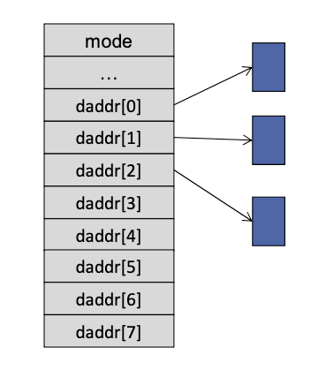 

    - for larger files

      - first seven entries contain addresses of indirect blocks 
        - addresses are 2 bytes, so $512/2$ or 256 disk addresses per block
        - so one indirect block can access $256 \text{ address} \times 512 \text{ bytes} = 128 \text{ KB}$
        - max size: 7 entries in `i_addr` so $128 \times 7 = 896 \text{ KB}$
      - `i_addr[7]` contains a double indirect block 
        - (doesn't always have to be used - only have to be for huge files)
        - a double indirect reaches $256 \times 256 \times 512 = 32 \text{ MB}$
        - max size (including indirects): $896 \text{ KB} + 32 \text{ MB}$

- per-file metadata (vnode)

   

  - hey are representations of on-disk inodes but loaded into the system's main memory (RAM)
  - purpose:  used by the operating system to manage files and directories more efficiently since accessing RAM is much faster than accessing disk storage
  - persistency: **not persistent** since it's stored in memory
  - might contain additional information not found in the on-disk inode

- directory entries

  - same hierarchical directory structure (same thing with the `.` and `..`)

  - however, directory entries are 16 bytes (fixed size!)

     

    - 2 bytes of inode number
    - 14 bytes (right padded) of name

  - a directory entry with `inode = 0` is unused

  - example: always the same size and is padded very nicely

     

### ext2

- overview: disk is divided into blocks (block size is specified when creating the FS)

  - superblock: 1024 bytes located at byte 1024 from beginning of the volume
    - contents similar to v6
    - in ext2, this structure is called `struct ext2_super_block`
  - the disk is divided into block groups (to try and place file data close toegether)
    - can almost think of each block group as its own FS
    - after the superblock, we have a block group descriptor table 

- block group

  - ext2 organizes the storage space into several block groups, which help in managing space more efficiently and improving performance by localizing related data
  - contains
    - copy of superblock
    - block descriptor table copy 
    - data block bitmap (1 block)
    - inode bitmap (1 block)
    - inode table (contains number of entries that are allowed per group)
    - data block (rest of the block group)

- free space management: bitmaps

  - what are bitmaps
    - collection of bits where each bit corresponds to one object and the value of the bit indicates if the object is in use or available/free (0 means it is available)
  - number of entries in bitmap are limited by size of the block 
    - ex. if we have 512-byte blocks (not realistic) &rightarrow; that's $512 \text{ bytes} \times 8 \text{ bits/byte} = 4096 \text{ bits}$

- example: how large are block groups &rightarrow; assume (unrealistically) 512-byte block size and 64 bytes inodes

  - we can store 4096 bits &rightarrow; meaning 4096 inodes &rightarrow; that's $4096 \times 64 \text{ bytes} \times \dfrac{1 \text{ block}}{512\text{ bytes}} = 512 \text{ blocks on disk}$
  - similarly, we can have 4096 data blocks and each block is 512 bytes so we can store $512 \times 4096 = 2 \text{ MB}$ of data in a block group

- note: block group can be smaller than maximum possible

  - the metadata in the block descriptor table tells you the actual size of the group
  - all block groups are the same size
    - in practice, all block groups in an ext2 filesystem are the same size except possibly the last one

- per file metadata (on-disk)

   

  - you can note that it uses the standard hybrid structure that we've been talking about

     

- it also has per-file metadata that stored in memory but it's probably not that important

- directory entries

  - uses hierarchical directory structure (with `.` and `..`)

  - directory contains a collection of directory entry structs

     

  - directory entries are 4-byte aligned

    - add padding to enforce this
    - no guarantee of null byte at the end of name

  - question: why is the `rec_len` so big - also why do we actually need `rec_len`

    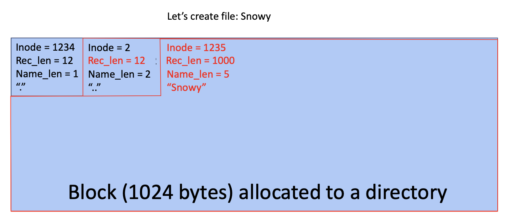 

    - if "Snowy" is the last entry in the directory block, the `rec_len` may be set to extend to the end of the block, effectively using up the remaining space

  - question: so a directory need to take up a block?

    - yes, in ext2
    - apparently same with v6, but there's no padding in the directory entry, they just leave the end as unused data (since block size are fixed)

# Virtual Memory

## Process Isolation

- consider the following trivial programs

   

  - strange phenomena in GDB

     

    - we've set the breakpoint at main
    - notice that both `hello` and `goodbye` tells you that their respective breakpoints are at the same address (`0x400430`)
    - they also claim that their argument is in the same place

- so why don't these programs affect each other? even if we run them in parallel

  - program run in different processes
  - each process has its own address space
  - address spaces provide process isolation
  - <u>**process isolation**</u>
    - anything one procress odes should not affect what another process does, unless the processes agree (i.e there's a communication channel)
    - each process behaves as if it controls the entire machine's resources

### Achieving Process Isolation

- so we know that 

  - programs run in different processes

  - each process has its own address space

  - address spaces provide process isolation

    - anything one process does should not affect what another process does (unless there's communication)
    - each process behaves as if it controls the entire machine's resources

  - the address space illusion

     

    - (note that their address range is also the same &rightarrow; this is why Margo's code say that their addresses are the same)

- making the illusion possible

  - physical addresses (PA)

    - refer to the specific locations in memory (DRAM)

  - virtual addresses (VA)

    - these are addresses that the program uses
    - hardware and software collaborate to <u>map VA &rightarrow; PA</u>
    - a machine can have less physical memory than the size of the virtual address space (more on this later)
      - it's ok if we have $\text{ VA > PA or  PA > VA}$
      - in the case that we have VA > PA and program try to take up the entire VA space, if it's well behaving (i.e it's not using all the memory at once), we can swap the pages in and out of memory as we move across the program

  - mechanism: there's something in the hardware called the Memory Management Unit (MMU)

     

    - example:

      - first, process 2 wants VA `0x1000`

         

      - second, process 1 also wants VA `0x1000` (looking to steal process 2's data)

         

        - you can see they have different physical memory address
        - so MMU is taking the process somehow as a parameter to map it to different places

- <u>VM: A Hardware/Software Partnership</u>

  - we need to use the hardware because invoking the OS on every address access would be too slow
  - hardware
    - i.e the MMU
    - provides a fast mechanism to map a VA to PA 
  - software
    - sets up the mappings (table) that the hardware uses
    - manages the allocation of physical memory
    - implement policies about how memory is shared

- system calls that manipulates address space

   

  - example

    - you call `fork` &rightarrow; you get a new address space (the values within that address space is identical to the parent's address space BUT they are at different physical locations)

       

    - then you call `execve` &rightarrow; it deletes the old content from the newly created address space and puts some new stuff in there

       


## Aside: Making Processes Wait

- recall baby shell exercise

  - you noticed that parent and child thread outputs got intermingled
    - shell program is the parent and the output might not output in the correct order
  - perhaps you added a `dowait` to fix (or not)
  - anyways, today we'll talk about `waitpid`

- wait and friends: 

  - handy system calls that let process wait for another process (typically parent wait for child)
  - `pid wait (int *stat_loc)`
    - calling process waits until child process terminates - returns the `pid` of the terminated process
    - upon return, `stat_lock` parameter contains info about the terminated process
    - (parent process wait until one of the child process terminates, then return control back to the parent process, `stat_lock` contains the status code of the terminated process)
  - `pid_t waitpid (pid_t pids, int *stat_loc, int options)`
    - `pid` indicates which process to wait (doesn't have to be child)
    - `stat_loc` as above
    - `options`: allows either waiting for a child to terminate or checking for termination without warning (WNOHANG)

- two use of `waitpid`

  - without any flag values in the option parameter, `waitpid` is a blocking system call

    - means that it stops the current process from doing any further work until something happens
    - in this case, the something else is the specified process terminates

  - if option specifies `WNOHANG`

    - check if a process has exited, if it hasn't, returned immediately
    - this is a non-blocking call

  - compare and contrast

     

    - when the event on which we're waiting hasn't happened &rightarrow; use blocking
    - when the event almost always has happened (i.e it's rapid) &rightarrow; use polling
      - because process of sleeping and waking takes some time

  - trade-offs

    - blocking avoids wasted work (constantly asking)
    - blocking sometimes suffers from atomicity problems
      - you check that event hasn't happened
      - if the event happen within the time I check, and the time I issue the sleep - it will never wake
      - `waitpid` is written to avoid this
    - polling can be more responsive 
      - it takes you longer to block than the time it takes for the event on which you are waiting to complete, polling might be better
      - often refer to polling as busy-waiting (we keep the processor busy while we wait) &rightarrow; in general, you should avoid busy-waiting

## Protected Control Transfer 

### Transferring Control to the Operating System

- what is special about the OS 

  - OS provides a layer that applications interact with instead of directly communicating with the hardware

     

  - the OS is still just software - it's just trusted more than regular applications

  - when you boot your computer, it sets up protection boundary so that OS will have more privlelges/authority, so that certain instructions can only OS run and regular applications can't

- protection boundaries

  - modern hardware has multiple privilege levels or modes
  - different software can run with different privileges
  - processor hardware has at least two different modes of operation
    - user mode: how all "regular programs" run
    - kernel/supervisor mode: how the OS runs
  - the mode in which the software runs determine
    - what instructions may be executed
    - how addresses are translated (i.e `halt` instruction shouldn't be allowed by user application)
    - what memory locations may be accessed 

- <u>VA &rightarrow; PA Mapping Constraints</u>

  - we want OS to do many things that normal applications shouldn't (i.e interact with devices, read/write any process's memory, etc)

    - so the OS needs to have access to things that normal processes don't
    - our mapping information has to distinguish between mapping user processes and the OS

  - also recall that different parts of address space support different operations

    - read only text/data: cannot be modified 
      - so: mapping should disallow writes to some part of memory
    - data should not be executed
      - so: mapping should disallow execution in some parts of memory

  - **putting it all together**

    - we ask the hardware to map a triple of 

      - virtual address
      - type of access (read, write, execute)
      - privilege level

      to a physical address

    - and the hardware will either
      - return a physical address
      - fault
        - i.e when VA is not valid (no mapping), type of access not allowed (writing to read-only memory), process doesn't have privilege level 
        - when the hardware faults &rightarrow; the OS takes over 

- how to change privilege level

  - the easy part is going from privilege &rightarrow; non-privilege, you can just flip a bit or something like this
  - hard part is going from non-privilege &rightarrow; privilege
    - you can't flip the bit back, because that would mean that you can just flip between privilege and non-privilege in any process
    - solution: fundamental mechanism that transfers control from less privileged to more privileged is called a <u>trap</u> (see trap section)

- breaking out of infinite loops

  - if the user program has an infinite loop and is running forever, thus never giving back control to the OS &rightarrow; this a huge problem

  - solution: processors have timers

    - when the timer runs out, it generates an interrupt (which hand controls back to the OS and it can kill the process)

    - how long to make a  the timer

       

### Traps

- we want to be able to transfer control from an application to the operations system (and back)

- three different kind of control transfers

  - we can invoke OS explicitly via a system call
    - application might want the OS to do something on its behalf
  - OS can be invoked implicitly via an exception (aka software interrupt)
    - application unintentionally does something that requires OS assistance (does not always have to be an error)
    - i.e divide by zero or bad memory reference
  - the OS can be invoked asynchronously via (hardware) interrupts
    - interrupts can happen at any point (it's the device that wants attention)
    - such as a timer, IO device, etc 

- trap handling (abstract)

  - each type of trap is assigned a number (below is just an example)

    - 1 = system call
    - 2 = timer interrupt
    - 3 = disk interrupt
    - 4 = interprocessor interrupt

  - on startup, OS sets up a table, indexed by the trap number, that contains the address of the code to be executed whenever that trap happens

  - these pieces of code are called "trap handlers"

    	

- x86 Trap Handling

  - interrupt descriptor registers (IDT): plays the role of trap handler table
    - contains special objects called gates
    - gates provide access from lower privileged segments to higher privileged segments
      - when low-privilege segment invokes a gate, it automatically raises the CPL (current privilege level) to the higher level
      - when returning from a gate, the CPL drops to its original level 
  - first 32 gates reserved for hardware defined traps
  - remaining entries available to software using the INT (interrupt) instruction

- x86 System Calls

  - there are multiple ways to handle system calls and diff OS use different ways (below are all assembly instructions)
  - old Linus systems use a single designated INT instruction (triggers a software interrupt) 
    - INT instruction makes the processor behaves as if there was a trap
    - the OS only allowed to have 1 handler to handle this INT instruction
    - (this INT instruction was used to implement a system call)
  - modern Linus systems use a SYSENTER/SYSEXIT calls
    - sometimes it uses SYSCALL/SYSRET instead

## How VM Works

- goal: need to map  from triples to physical address

  - i.e `(VA, access, priv) => PA | FAULT`
  - physical addresses are not necessarily contiguous or ascending
  - also we would like to avoid fragmentation 

- bad idea: store mapping for every byte in the virtual address space 

  - problems
    - the mapping table would be very very big 
    - also doesn't work well with the cache mechanism
      - since our cache operates with cache lines anyways, we should just utilize that (don't have to store every address map)
    - again, same with file systems
      - basically, mapping every byte individually is not practical because file systems and caches don't even use mappings that fine-grained

- better idea: page-mapping

  - <u>**divide both virtual address space and physical memory into blocks of equal size called "pages"**</u>

  - each page in the virtual space would correspond to a page in the physical space, and there would be a single mapping for each page rather than each byte

    > Example: Dividing the bits in an address: x86-32
    >
    > In x86
    >
    > - pages are 4 KB = $2^{12} \text{ B}$
    >
    > - so we need 12 bits to represent 4 KB
    >
    > - an address in this system is 32 bits long 
    >
    >   - it's divided into: a 20-bit virtual page number (VPN) and a 12-bit offset
    >   - the virtual page number is used to identify a page, while the offset specifies the exact byte within that 4KB page
    >   - (VPN is kinda like the tag in the cache, and the offset is like the offset)
    >
    > - the MMU translates the virtual page number into a 20-bit physical page number (PPN) which corresponds to the actual location in memory
    >
    >    

- size of the virtual address space (VAS) and the amount of physical memory (DRAM)

  - modern computers have a very large virtual address space 

    - ex. a 64-bit VAS can theoretically address up to $2^{64}$ different addresses

  - it's common for the physical memory (DRAM) of a machine to be much smaller than the 64-bit VAS

  - <u>**this is not a problem**</u>

    - modern implementation of chips don't use the 64 bit virtual address space for addressing memory

  - because, practically speaking

    - individual processes running on a computer don't use the entire available address space
    - and can run a process without needing all of its pages in memory at once

  - example: x86-64

     

    - the architecture decided that the virtual address space will only by 48 bits long (because we don't need all 64)
    - 12 bits are used as the page offset. This is because $2^{12} = 4096$, which is the size of each memory page in bytes. The page offset is used to locate the exact byte within a page
    - 16 bits are unused. These are not needed for the current addressing scheme and may be reserved for future expansion or other features
    - 36 bits are used as the virtual page number (VPN). This number identifies each page in the virtual address space

  - note: having less physical memory than the maximum virtual address does not cause any problems

    - if a system has, for example, 16 GB of physical memory, the processor doesn't need to use all 48 bits to address this memory. It only needs enough bits to address 16 GB
    - so for 16 GB of memory - you just need $34 \text{ bits}$ so that's what they'll use

### MMU 

- in the simple case, MMU uses a special kind of cache for the most common "translations" from virtual to physical addresses to speed up the process of finding the physical memory &rightarrow; this cache is known as the <u>TLB</u>

- Translation Lookaside Buffers (TLB): the simplest form of MMU is basically just a cache of translations (and
  permissions and protections)

  - code portion of our process

     

    - so this page is where all your code is for the program is stored
    - has R/X permissions means that it can be read and execute
    - (we can't modify because you can't modify code while the program is running)

  - stack of our process

    

    - (we're just inferring here - there's no way to tell)
    - has read/write (R/W) permissions, as variables within the stack need to be both read from and written to during program execution
    - another thing is in typical process memory layout, the stack is located at a high memory address and grows downward &rightarrow; the virtual page numbers often reflect this by being higher than those used for other segments such as the heap or code sections

  - the heap of our process

     

  - read only portion

      

  - finally, the OS 

     

- example: translating a virtual address `0x000000010003F74`

  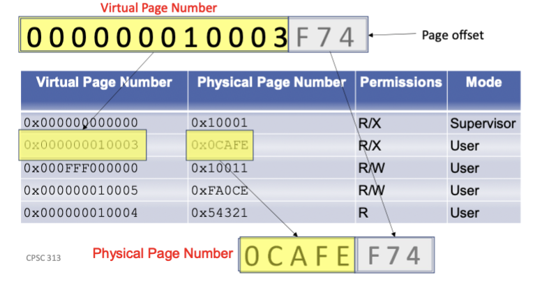 

  - page offset is 3 bytes long because pages are still 4KB which are 12 bits
  - note: remember to APPEND THE OFFSET at the end of the physical page

- clarification: MMU vs TLB vs page tables 

  - page table is mapping of all VPN to PPN (the tree shit &rightarrow; see below)
  - TLB is just a cache of this page table
  - the MMU is the logic box that's checking if VPN is in the TLB (cache), if it's not, go check in the page table, if it's valid within the page table, bring it into memory and the TLB, if not, trap


### Page Tables

- recall: how we represent address space

   

  - we can break up the address space into "logical blocks" called pages
    - so here we've split up the address space into 4K chunks and assign each of them a page number (VPN)
    - start at the bottom
  - max address is `0xFFFF` so we have a 16 bit address space
    - cut it up into 16 pages (0 - F)
    - this means that it's a 4 bit page number &rightarrow; leaving 12 bits for the page offset (so 4KB page size)

- recall: mappings

  - we're input Virtual Address, the kind of access we want to do (read or write), and the privilege level
  - we want to translate that triple to a physical address of possibly a fault
  - the particular fault for this case would be an <u>exception</u>

- page tables: mapping data structure

  - the TLB is simply a cache of the mappings

  - the page table is the data structure that holds all the mappings

     

    - can think of it as a big array &rightarrow; it's <u>**indexed by virtual page number (VPN)**</u>
    - here, since we only have 16 pages (toy example) - the table only have to have 16 entries
    - a row in the the table is called a Page Table Entry (PTE)
      - a PTE contains the physical address, as well as the access (what are you allowed to do with the data at this address), and who's allowed to use it 
    - note: page vs page table
      - **Page**: A page is indeed a chunk of data, but to be precise, it's a fixed-length contiguous block that exists conceptually in virtual memory. When a page is actively being used, it is mapped to a chunk of physical memory (also of a fixed length), known as a <u>page frame</u>. So, while a page corresponds to virtual memory, its physical manifestation is in a page frame in physical memory.
      - **Page Table Entry**: Each entry in a page table does indeed correspond to a virtual page and contains the physical address of the page frame in physical memory where that page is located. It provides the mapping necessary for the system's memory management unit (MMU) to translate virtual addresses to physical addresses.
        - additional note: a lot of the page table entries will be invalid (for unused VPN address) &rightarrow; how we represent this invalidity is up to the OS and the system (in x86 we have a used bit or something like that)

  - example

     

    - what virtual address are we accessing? **we're trying to access memory location `0xFEED` (because it was 0 + 0xFEED)**
    - what is the VPN to translate?
      - we know that in our example, pages are 4KB and page number take 4 bits 
      - so `0xF` is the page we're referencing
    - what is the corresponding TPE?
      - the TPE at `0xF` is `(0x24680, Read/Write, U)`
      - (see table above)
    - do we have proper permissions?
      - yeah we're trying to read and that's allowed (the privilege is good too)
    - what is the PA for the data
      - the PA is `0x24680EED`
      - note: <u>**need to glue the offset at the end as well**</u>

- Page Table Entries (PTE) - can be one of three states

  1. invalid: there is no mapping
     - Exception: Segfault (usually kill the process)
  2. valid and memory-resident
     - permission dictate if the access is allowed
     - execution proceeds as normal
  3. valid but not memory-resident
     - (the page hasn't been read into memory just yet)
     - permissions still dictate if the access is allowed
     - the page we want to access is not yet in memory; the OS must make it memory resident 
       - could require reading the page from disk 
       - could require creating a page full of 0s (when we allocate memory in our process that already belonged to that process)

### Handling Memory Faults

- recall: trap handling - interrupt

   

  - when we get interrupt, we dispatch the interrupt handler table and we execute the operating system

- recall: trap handling - TLB fault (exception)

   

  - the process load a memory that's not in the TLB
  - generate a trap, trap turns over control to OS given the particular trap number (in this case a TLB fault)
  - OS goes to the right trap handling 

- steps:

  - TLB does not have an entry for VPN 
  - traps into the OS
    - OS looks up entry (the faulty address) in <u>page table</u>
      1. entry is invalid: kill process (report segfault)
      2. entry is valid and in-memory (present): enter PTE information into the TLB
      3. entry is valid but not present: read page in from disk and reflect physical number in the PTE, then do one of
         1. restart the instruction (will generate TLB fault again, but fall into case 2)
         2. load PTE into TLB, restart instruction (won't trap anymore)

- example: software fault handling

  - let say we have and say that you're in the trap handler

     

  - first thing to do is interpret PTE to determine if virtual address is valid

    - TODID: how can we get the PTE if we don't know if the virtual address is valid &rightarrow; where would it be in memory NEED BETTER UNDERSTANDING OF THIS CASE???

      - os takes care of it and tell you if it is valid or not 

    - we can have a magic number that indicate whether this virtual address is present or not

    - then we'll also have a right bit that indicates whether the page is present or not

      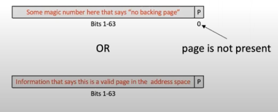 

      - if there's no page - segfault

  - if it is valid &rightarrow; ask if it is present 

    - use the present bit

    - if it is present &rightarrow; check access permission

    - if not present &rightarrow; info in PTE will tell you where to find this page (create or grab from disk)

       

  - if it's not present and you have to create a page 
  
    - need to go find a free page
    - place page contents into page (either write 0s in it or grab it from disk)
  
  - now you have a valid page &rightarrow; restart the instruction

### Example: x86 Virtual Memory

- Intel x86 set up

  - 4 KB pages
  - 48 bit address (virtual) space
  - how many entries would we need in our page table 
    - $48 \text{ (bits in address space)} -  12 \text{ bits (per 4 KB pages)} = 36 \text{ bits}$
    - $36 \text{ bits} = 2^{36} = 64 \text{ G} \text{{ pages}}$ (A LOT)
    - we need 1 PTE per page &rightarrow; if each PTE is 8 bytes long, that's 512 GB per page table
    - EXTREMELY UNREALSTIC
  - observation:

    - most processes won't use all or even most of their address space
    - many only use a few pages! consider the hello program
      - consumes only 1 page for each text, data, stack
      - but: also needs virutal address space for
        - shared libraryes (code, and data)
      - still: total number of pages is measured in a "a few hundred"
    - so: page tables are sparse (most entries are empty)

- how to represent sparse address space

  - requirements
    - need to be simple to work in hardware
    - efficient for small address space and works for large address space
  - insight
    - sounds a bit like what we did to represent files (support small and big and sparse) &rightarrow; we were able to ignore chunks of logical block number space by having NULL values for indirect block addresses
  - additional considerations for hardware
    - computing things is relatively slower and more expensive
    - using bit values directly is good, cheap and simple &rightarrow; i.e dividing by a power of 2 is easy (directly uses/get rid of the bit)
  - implementation
    - we're essentially going to use a multi-level index &rightarrow; but we're going to choose the size of those indexes to match the hardware
    - in particular
      - all blocks in the tree match our virtual memory page size (4 KB)
      - we use specific bits in an address to index into each level of the tree

- from file index to page tables

   

  - (the x86 has 4-levels of pages tables - so there will be L2 page tables and L3 page tables, etc)

  - all page tables are indexed by bits in the virtual address

  - PTEs are 8 bytes (64 bit addresses)

  - x86 address translation

     

    - offset will be used to append later

    - last 16 bits is unused 

    - each table requires 9 bits to index (and remember we have 4 level page table &rightarrow; $4 \times 9 = 36$)

    - so divide them up and you get

       

    - in more details

       
      (this is just 1 path through the tree - this is the path to get to our particular address we're interested in)

- closer look at PTE

  - levels 1, 2 and 3

     

    - if P = 0, that says that the page table is not in memory (DRAM); the OS is free to use the rest of the entry in whatever way it wants (properly either tell you its invalid or the actual disk address)

       

  - level 4

     

    - actually contains the address of the PAGES themselves (before it was address of the page TABLES)

- Q: For each level page table, how much memory is reachable?

  - L4 (the last level) &rightarrow; points to an actual physical page in memory
    - each entry references a single page (4KB in size)
    - there are 512 entries in a page table
    - a whole L4 page table: $512 \times 4 \text{ KB} = 2 \text{ MB}$

  - L3
    - each entry references an entire L4 page table &rightarrow; so each entry themselves can reach 2 MB of memory
    - there are 512 entries
    - a whole L3 page table: $512 \times 2 \text{ MB} = 1 \text{ GB}$

  - L2
    - each entry reference an entire L3 page table
    - a whole L2 page table: $512 \times 1 \text{ GB} = 512 \text{ GB}$

  - L1:
    - each entry reference an entire L2 page table
    - a whole L1 page table: $512 \times 512 \text{ GB} = 256 \text{ TB}$
    - (the L1 should have access to the entire address space - which is 48 bits on the x64, which also turns out to be 256 TB)


### Page Faults and Segfaults

- <u>Page Fault (standard)</u>: occurs when process tries to access data that isn't in physical memory
  - the process gets to keep running 
  - the OS interprets the PTE and locates page on disk and brings it into memory
  - (also places it into TLB afterwards)
- <u>Page Fault with write bit 0</u>: when a process attempts to write to a read-only page (indicated by a write-bit of 0)
  - handling of this situation depends on the cases &rightarrow; the OS gets to jump in and determine
  - case 1: the process is only allowed to read the page (for instance, a shared library)

    - the operating system terminates the process
  - case 2: the page is shared with another process
    - this happens when the `fork()` call creates a child process
      - it doesn't actually create a copy of the data (pages) of the parent process right away
      - it instead let both parent and child reference this page and mark it as read-only to maintain consistency across the sharing processes
    - when one of the process wants to write the shared pages &rightarrow; this is when it creates a private copy for the writing process (this is called Copy-on-Write or COW)
    - once it's created the copy, both the parent and child's write bits are set to 1 (since they have separate pages now, no longer need to be read-only)
  - case 3: the page is known to contain garbage
    - this happens when a new page is added to the heap after `malloc()` 
      - or when a new page is needed for the stack
    - new page is considered to contain "garbage" because it might be leftover data from somewhere else
      - the OS needs to clear this page before letting anyone use it (with 0s or some default values)
      - but this clearing process might happen lazily - only when the page is first accessed &rightarrow; resulting in a page fault
    - TODO:  how do you "allocate" a page
  - TODO: how do we determine the different cases
- <u>Segmentation Fault</u>: happens when a process tries to access memory it's not allowed to (i.e an unallocated or protected area)
  - system generally responds by terminating the process, as this is often indicative of a serious program error

> Example: Counting Page Faults
>
> <u>Caching Version</u>
> Q: Let's say you have a 4KB cache with 64-byte cache lines. Given an 8192 byte array, if you access every 4th byte in the array just once, what will your hit rate be?
>
> <u>VM Version</u> (converting above question to a VM equivalent)
> Q: Assume a 1024-byte virtual page size. Let's say that you have an 8192 byte array and none of its data is in memory, if you access every 4th byte in the array just once, how many page faults will you experience?
>
> A: Since pages are 1024 bytes and the array is 8192 bytes &rightarrow; you'll need exactly 8 pages and you will take a page fault for each one

- <u>**address translation flow chart**</u>

   


## Clock Page Replacement 

- on a busy system, it's possible that the memory is full of valuable pages (i.e the TLB fills up)

  - when that happens, what to do when we need a new page? can we do caching?
  - we can't exactly use the replacement algorithm or strategy seen in caching because
    - the OS does not see every access to a page
    - most accesses are handled by the MMU (so we don't have time to update the counts or timestamps)
    - <u>so the hardware has to help us make a good decision</u>

- what does the hardware provide

  - access bit per PTE (sometimes called used bit)
  - dirty bit per PTE 

- given this, we want to come up with an algorithm that would

  - do approximately LRU (which is an approximation of Belady's)
  - take advantage of the info hardware provides 
  - make sure there's a lot of clean pages available - so we don't get stuck always doing a write-back before a read

- recall LRU

  - trying to evict the page that hasn't been used for the longest time
  - since we have a lot of main memory pages, maybe it's OK to just pick something that hasn't been used in a long (not necessarily longest) time
  - we can use the <u>use bit</u> 
    - idea is if periodically, you clear these use bits (mark them as unused) and you wait a while, you can look at the use bits again to see which has been recently used (since you've cleared them)

- introducing clock

   

  - at any given point, a hand point to a phsyical page, when you need to allocat ea new page, you look at the page that the hand is pointing to (and its used bit)
  - if the use bit is 0 (it hasn't been used) &rightarrow; say TY and kick it out
  - if the use bit is set (someone has touched it since last time I've looked at it)  &rightarrow; flip the use bit back to 0 and advance the clock hands
  - so as the clock hands move around, we're either finding pages or we're clearing used bits
    - if the page we just cleared the use bits for is heavily used, it'll be set again very quickly so next time we look at it it'll be marked again

- example

   

  - try to access page 1, so we mark it 

     

  - try to access page 3, so we mark it

     

  - try to access page 1 again, so we mark it again

  - say we want page 55, there's no translation for that, OS need to find a page (to either load in 55 or create an empty one)

    - clock hand is currently pointing at 1, but it's marked as used, so we clear it

    - advance clock hands &rightarrow; 2 doesn't have a used bit set, get rid of it, and bring in 55

       

      (also set it used bit)

  - note: if a page is dirty, before evicting, you need to write it back 

    - there are some fancy shit that has 2 hands where the 2nd hand is ahead of the first hand and it looks for dirty pages and write that back

- two-handed clock

   

  - note for in class
    - when you need to evict something, you move the write hand first, and you write back 1 thing
    - remember as you're traversing over other in used entries with replacement hand, set the used bit to 0

