# Quiz 0 

- some things to note
  - `xorq`  an element with itself always give 0 (you can do this instead of `irmovq` if you want to clear the register)
    - note that it will set the condition code so might not be what you want
  - `andq` an element with itself is always itself (you can use this to check for the register's content and set the condition code for jump)

## Corrections

### Question 1: Interpreting Little Endian Values

- part 1

  	

  - since it's little endian, you read the value backwards from right to left 
  - also since it's a `uint32_t` (4 bytes) - we only read 4 bytes
  - note that the ordering of the individual bytes themselves stay the same (i.e it's `56 58` and not `65 85`)

- part 2

  	

  - note: endianness does not matter here as string is an array of chars/bytes
  - the string that starts at `0xa34c` in bytes is `0x 79 58 56 00`
  - translates into ascii and you get `yXV \0` <u>but we do not print the null character at the end</u>

### Question 2: Interpreting Big Endian Values

- same thing as above but just big endian

  	

  - again, don't include the null character at the end

### Question 3: Understanding sign extension

- question

  	

  - so you are upcasting which in C requires <u>**signed extension**</u>
  - since `e` in binary is `0b1110` so when extend, it'll be all `f`s at the front
    - in fact, starting from `0xA` will have leading 1s

### Question 4: Bit Shifting

- question

  	

  - shifting 16 bits is the same as shifting by <u>4 hex digits</u>
  - `0x3c` in full is `0x 00 00 00 3c`
  - so we remove the first 4 hex digits (which were all 0s anyways) and add 0s to the end
    - becomes `0x 00 3c 00 00` 

### Question 5: Bit Manipulation

- this one was a bit of a tricky one - there are some things to note

  - the bit position is 0-indexed starting from the very right (i.e the rightmost bit is index 0)
  - the only answer that will work for this is ones that will make every other bit but the bit in question into 0 and only leave the star bit as the deciding bit between 0 and non zero values
  - we'll indicate the position in question with a star `*` and the other positions with an `X` as they can be both 0s or 1s
  - the breakdown of this question is kinda complicated, but you can do some of these in your head &rightarrow; I'll only go over the correct answers

- question

  	

  - `b = 0b XXXXXXXX XXXXXXXX XXXXXXX* XXXXXXXX`
  - `((b << 7) & 0x8000)`
    - `b << 7`: `0b XXXXXXXX XXXXXXXX *XXXXXXX XXXXXXXX`
    - `0x8000`: `0b 00000000 00000000 10000000 00000000`
    - `((b << 7) & 0x8000)`: `0b 00000000 00000000 *0000000 00000000` 
    - so if the star bit is "on" - we get a non zero value, if not we get a zero value
  - `((b & 0x100) / 256)`
    - `0x100`: 	`0b 00000000 00000000 00000001 00000000`
    - `b & 0x100`: `0b 00000000 00000000 0000000* 00000000`
    - just the and itself would have worked but `/ 256` is the same as right shifting by $\log_2 (256) = 8$ bits which just brings the star bit to the very end (index 0)
  - `((b * 16) & 0x1000)`
    - `b * 16` is the same as left shifting by $\log_2 (16) = 4$ bits
    - `b * 16`: `0b XXXXXXXX XXXXXXXX XXX*XXXX XXXX0000`
    - `0x1000: 0b 00000000 00000000 00010000 00000000`
    - `((b * 16) & 0x1000)`: `0b 00000000 00000000 000*0000 00000000`

### Question 6: Passing by Value and Reference

- question: Consider the following program:

  ```c
  void f1(int16_t *arg) {
  	*arg = 1107;
  }
  void f2(int64_t arg) {
  	arg = 3402;
  }
  
  int main(int argc, char *argv[]) {
  	// Suppress compiler warnings
  	(void) argc;
  	(void) argv;
  
  	int16_t ckiuc  = 13;
  	int64_t avyvyl  = 88;
  	f1(&ckiuc);
  	f2(avyvyl);
  	printf("Line A: %hi\n", ckiuc);
  	printf("Line B: %ll\n", avyvyl);
  }
  ```

- part 1

  	

  - the function `f1` actually changes the number by dereferencing it 

- part 2

  	

  - the function `f2` doesn't actually change anything (something about arguments being passed by pointer so you've really just changed the pointer)

### Question 7: Truncate a String

- question

  	

  ```C
  char str[] = "Hello CPSC 313 students.";
  // what are the correct values for x and y so that it prints "Hello CPSC "
  str[x] = y;
  printf("%s", str);
  return 0;
  ```

  	

  - you want to cut off the string at index 10, so you need to place a terminating string at index 11
  - the answer for `y` is technically correct but they wanted explicitly `'\0'` (with the quotes)

### Question 8: C Types

- question

  	

  - first: you cast it as a `uint8_t` pointer now
  - second: you address a pointer so it becomes a pointer to a pointer
  - third: you cast it to a `short` pointer, then dereference it, so it'll be a `short`
  - fourth: it's a double pointer so first dereference you get pointer to `int64_t`, dereference that again and you get the `int64_t` itself

### Question 9: Variable-sized Structures

- question

  	

- part 1

  	

  - `nbytes` is 4 bytes long (4-aligned)
  - `array` is 55 bytes long (1-aligned)
  - since the whole struct needs to be 4 aligned, we need to round 59 to 60

- part 2

  	

  - basically we don't allocate array of max size anymore, but only allocate size of `nbytes`
  - `nbytes` is still 4 bytes long
  - `array` is now 36 bytes long 
  - so in total it's 40 because it's already 4 aligned

- part 3

  	

  - first one: you cast `structPtr` to a `unit8_t` so any operation done on it will move by 1 byte only, then you add it by the size of the struct, so it'll move it by 40 bytes - which is correct
  - second one: `structPtr` is already a `struct*` so adding 40 to it will move it `40 * 40` bytes
  - third one: same problem as above it'll just move it by `36 * 40` bytes instead

### Question 10: C Printfs

- question

  	

  - first: `%p` prints the pointer address, in this case we get the address of `p`, then dereference it, which gets us the value of `p` - the value of `p` is the address of the string `0x19a40`
  - second: printing the value of `p` again &rightarrow; same above
  - third: `%c` prints a character, we're deref `p` so we're accessing the string - the first char is `b`
  - fourth: we deref `p`, get the address of that (so `p` again), then deref it again, so just basically the same as deref `p` &rightarrow; same as above

### Question 11: Pointer Figure Question

- question

  	

  - `x` points to an array - so `x` itself holds the start address of the array - which is `0x674c`
  - when you increment `x`, you move it by 8 bytes (assuming ints are 8 bytes), so now it's pointing to the second element of the array
    - you deref `z` three times and it's the same as deref `x` which is `0x8a` now

### Question 12: C Pointer Operations

- question

  	

  - only interesting one here is `*eep` since it's not a pointer, you're trying to access memory address 50 which may be invalid


# Quiz 1

## In Class Assignment

### In Class 3

- I3.1: y86 Address of Next Instruction

  - variation 1

    	

    - `addq` is 2 bytes long so you just add that
    - result is `0x1407`

  - variation 2

    	

    - there's not enough information to tell us whether we will jump or not &rightarrow; if we do jump, the address is whatever `valC` is, if not, the address is `0x1b8d + 9`
    - so the answer is 0 (because we don't know)

- I3.2: y86 Address Instruction after Jump instructions

  - variation 1

    	

    - jump to taken so we just go to the instruction after the jump (so `0x1ff + 9`)
    - answer is `0x208`

  - variation 2

    	

    - jump is taken so you jump to `0x3846`

- I3.3: y86 Register File Read/Write

  - question

    	

    - these instructions manipulate the stack pointer `%rsp` which is only implied and not specified
    - `jxx` would also count here since it could potentially set the PC with value that's NOT just `valP`

- I3.4: y86 Sources of Register Updates

  	

  - answer is from the ALU and from data memory
  - if another option was "From the register file" - this would also be WRONG
    - because even values from register values are passed through the ALU - we just add 0 to it so it's basically ALU output by the time it gets written into registerse

- I3.5: y86 ALU for Other Instructions

  - part 1

    	

    - `call/ret` and `pushq/popq` works with the stack so they increment and decrement by 8
    - `mrmovq/rmmovq` feeds the values through and add 0 to it

  - part 2

    	

    - no, only `opq` should set the condition codes

  - part 3

    	

- I3.6: y86 Instructions Memory Read/Write

  - question

    	

    - `popq/ret` both reads from the stack (which is in memory)
    - note: if they didn't have the notes saying "excluding the bytes representing the instructions" then all instructions require a read from memory to fetch the instruction itself

### In Class 4

- I4.1: y86 Buffer Overflow: Getting Started

  	

  ```assembly
  # Function that simply loops forever
  .pos	0x1000
  exploit:
  	nop
  	jmp exploit
  ```

  - we just make it jump back to the start forver
  - the `nop` is to make the jumping a bit more obvious

- I4.2: Reading y86 code for the Buffer Overflow Attack

   

  ```assembly
  # This function DOES WHAT?
  # Input %rdi
  # Input %rsi
  # Output 0
  
  # THIS IS ALL PART OF THE DRIVER PROGRAM
  # Initialize the stack
  irmovq  0x5000, %rsp
  
  # Driver program to test mystery
  # Note that we pass parameters to functions
  # in registers %rdi and %rsi (in order)
  irmovq  a, %rdi 	# a is the first parameter
  irmovq  b, %rsi		# b is the second parameter
  call copy 			# mystery(int[2] a, int[2] b)
  halt
  
  a:      .quad 0xDEADBEEF
          .quad 0
  
  b:      .quad 0
          .quad 0
  # END OF DRIVER PROGRAM
  
  .pos 0x2000
  mystery:
  	irmovq	8, %r10					# put 8 into r10 (will likely be an index incrementer)
  loop:
  	mrmovq	0(%rdi), %rax		# put a[i] (dereference) into rax -> rax = *rdi
  	rmmovq	%rax, 0(%rsi)		# move rax into address of rsi -> *rsi = rax (copy value of  an index in a into the same index at b)
  	andq	%rax, %rax				# it does nothing to rax -> BUT IT SETS THE CONDITION CODE
  	je	done								# basically, if rax = a[i] == 0 then we're done
  
  	addq	%r10, %rdi				# increment the index -> rdi++ or rdi += 8
  	addq	%r10, %rsi				# increment the index -> rsi++ or rsi += 8
  	jmp	loop								# jump
  done:
  	ret
  ```

- I4.3. Writing the Exploit

  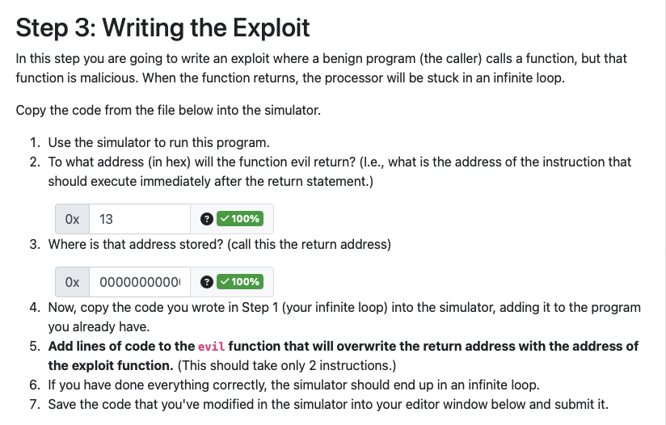	

  ```assembly
  # Attack 1: A benign caller invokes a function
  # who is malicious; upon return the processor
  # will be in an infinite loop.
  
  # Initialize the stack
  	irmovq	0x2000, %rsp
  
  main:
  	call evil	# call function
  	halt		# If we return
  			# successfully, halt
  
  # Return address is just above the stack pointer:
  evil:
          # WRITE YOUR CODE HERE
      irmovq    exploit, %rax
      rmmovq    %rax, 0(%rsp) 
  	ret
  
  # Place the code you wrote in Step 1 here
  
  # We put this here so you can observe the contents
  # of the stack (why is this at 0x1FF0 and not 0x2000?)
  .pos 0x1FF0
  .quad 0x0
  .quad 0x0
  
  .pos	0x1000
  exploit:
  	nop
  	jmp exploit
  ```

  - the stack pointer was pointing at the return address for the caller, and we've overwritten that

### In Class 5

- refer to the `ic5_logic_blocks.c` file

### In Class 6

- refer to the notes


## Corrections

### Question 1: Using and changing the PC

- part 1

  	

  - `call` is the only instruction that uses the PC in a different way as it pushes the PC onto the stack

- part 2

  	

  - `jmp/jxx` is correct because we set the PC value using what's specified in the instruction (i.e `valC`)
  - in the same vein, `call` also sets the PC using the function address specified in the instruction

### Question 2: Jump conditions and condition codes

- part 1 

  	

  	

  - you were supposed to fill in the "Branch Taken?" part yourself - but it is pretty simple logic

### Question 3: y86 Condition Codes: Affected Instructions

- part 1

  	

  - easy option here but overall nstructions that depend on the values of the condition codes are conditional instructions: conditional jump instructions (`jl, jlt, je, jne, jg, jge`) and condition move instructions (`cmovl, cmovlt, cmove, cmovne, cmovg, cmovge`)

### Question 4: Instructions and registers

- part 1

  	

  - only `popq` changes > 1 registers value (it changes the destination register `rA` as well as `%rsp` since we increment the stack pointer)
  - wrong:
    - `pushq` changes the stack pointer `%rsp` only
    - `call` does change `%rsp` (because we push return address to the stack) as well as PC but PC is said to not be included so it only technically changes 1 

- part 2

  	

  - `cmovxxx` is a register to register move, so it needs to read from the source register to write to the desintation register
  - `call` needs to write the return address to the stack, so it reads the stack pointer `%rsp` to decrement

- part 3

  	

  - this question is asking which instructions require you to **explicitly specify** a register
    - so `call` there's an implicit register which is `%rsp` but that doesn't count
  - `rmmovq` you have to specify `rA` and `rB`
  - `pushq` you have to specify a source register `rA`

### Question 5: ISA Basics

- part 1

  	

  - `opcodes` here refers to `icode` (so doesn't include the `ifunc`) of which there are 12 (0 to 11)

    	

### Question 6: y86 Calling Conventions

- part 1

  	

  - basically anything that's a "scratch" register or a "caller-saved" register
  - most options here are callee-saved

### Question 7: y86 Register Usage

- part 1

  	

  - basically the callee-saved registers

### Question 8: Parameter Passing

- part 1

  	

  - in order registers used to pass parameters are: `%rdi, %rsi, %rdx, %rcx, %r8, %r9`
  - but we only have 4 args so we can only use `%rdi, %rsi, %rdx, %rcx` and only 2 of those are here
  - note: if we had `%rsp` or `%rbp` - that would also be one we consider a callee-saved register

### Question 9: Interpreting execution notation

- part 1

  	

  - firstly, process of elimination 
    - since return address is stored in `rA` - `rA` would have to take on the value of `PC + size(instruction) = PC + 10` (because `call` is 10 bytes long)
    - we know proper notation to store something into a register is `R[ra] <- val` so anything that doesn't have this is eliminated (1, 3, 4, 6)
  - now we only have 2 and 5
    - 2 makes the most sense since we want to read start from D so D has to go within `M[]` clause
  - note: `M8[addr]` means read 8 bytes starting from `addr`

### Question 10: Understanding y86 Programs

- part 1

  	

  ```assembly
  	irmovq	0x5000, %rsp	# initialize the stack
  	irmovq	4, %rbp				# rbp = 4
  	irmovq	1, %rbx				# rbx = 1
  	irmovq	8, %r13				# r13 = 8 (increment size?)
  	xorq	%r14, %r14			# clean out r14?? -> r14 will be the pointer 
  	xorq	%r12, %r12			# clean out r12??
  loop:
  	rrmovq	%rbx, %rdi		# rdi = rbx
  	subq	%rbp, %rdi			# rdi = rdi - rbp
  	irmovq 1, %rax				# rax = 1
  
  	jg done								# if (rdi - rbp) > 0 => if rdi > rbp then done
  	subq	%rax, %rbp			# rbp -= 1 (since rax = 1 right now) 
  	# this portion above is an insanely complicated way to traverse the list
  	# we do (rdi - rbp) every time where rbp is shrinking by 1 each time
  	#		since rdi < rbp at the start, we go until rdi > rbp basically 
  	#		overall, we will run *the loop* (the actual work) %rbp time
  
  	mrmovq	A(%r14), %rdi		# rdi = A[r14]
  	call	check						# call check which returns rax = max(A[r14], 5)
  	addq	%rax, %r12			# r12 += rax
  	addq	%r13, %r14			# r14 += r13 += 8 => increment the pointer
  	jmp	loop							# loop
  done:					
  	rrmovq	%r12, %rax		# result = r12, return result
  	halt
  
  check:
  	irmovq	5, %rax
  	MAXQ	%rdi, %rax
  	
  	# this is my own code to represent the max function
  	rrmovq  %rax, %r8   # r8 = rax
    subq    %rdi, %r8   # rax - rdi
    cmovl   %rdi, %rax   # rax = rdi if rax - rdi < 0 
  
  	ret
  
  .pos 0x2000
  A:
  	.quad 8
  	.quad 2
  	.quad 2
  	.quad 10
  ```

  - basically, the code is traversing through the array `A` and adding `max(A[i], 5)` to `res` and returning that

    ```python
    res = 0
    for i in range(length): # length is rbp
      res += max(A[i], 5)
    return res
    ```

  - part 1

    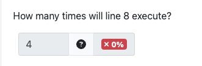	

    - at the start, `rbp = 4` and `rdi = 1` and we're doing `rdi - rbp`  everytime
      - first iteration: $1 - 4 = -3 $
      - second iteration: $1 - 3 = -2$
      - third iteration: $1 - 2 = -1 $
      - fourth iteration: $1 - 1 = 0$
      - fifth iteration: $1 - 2 = 0$
      - so basically, the content of the loop itself only run 4 times (and thus `rbp = number of elements we want to read`) but the loop condition check runs 5 times, the last time it will succeed and we will jump to `done`
      - correct answer is <u>**5**</u>

  - part 2

    	

    - look at the python code above, we'll get $\max(8,5) + \max(2,5) +\max(2, 5) + \max(8, 10) = 28$

  - part 3

    	

    - then we're basically just summing up the array 
    - $8 + 2 + 2 + 10 = 24$ so <u**>smaller**</u> 

  - this bitch was hard as fuck


### Question 11: Stack Smash

- part 1

  	

  ```assembly
  .pos ????                    			# Intentionally left out
  
             irmovq 0x5000, %rsp			# Initialize the stack pointer
  main:      irmovq 0x48, %rax
             subq %rax, %rsp			# Make space for an array of 9 8-byte quantities
             rrmovq %rsp, %rdx			# Initialize the array pointer
             irmovq 0x18, %rax
             subq %rax, %rsp			# Make space for another local variable of 24 bytes.
             irmovq $___, %rdi			# Select the index. VALUE SUPPLIED BELOW.
             irmovq $___, %rsi			# Select k. VALUE SUPPLIED BELOW.
             call arrayincr
             irmovq 0x60, %rax			# ASSUME the address of this instruction is 300.
             addq %rax, %rsp         
  
  arrayincr: irmovq 8, %r8			# constant 8
             mulq %rdi, %rsi			# compute index*k
             mulq %r8, %rdi			# compute the offset to array[index]
             addq %rdi, %rdx			# compute array + offset
             mrmovq 0(%rdx), %rcx			# Load value at address %rdx
             addq %rsi, %rcx			# compute array[index] + index*k
             rmmovq %rcx, 0(%rdx)			# store updated value back into array[index]
             ret
  
  
  
  .pos 1500
  evilfun:   # Goal is to force a ret from arrayincr into this function
             nop
             jmp evilfun
  ```

  - basically, the program first initialize an array on the stack &rightarrow; array pointer is in `%rdx`

  - then `arrayincr` will access that and based on `i` and `k` we will modify the array

  - diagram

    	

  - what we want to do is override the return address (that's current 300) - we want to make it 1500

  - the usual assumption is that with a positive index, we will index `arr` on the stack, however, with a negative index, we can access local var and beyond to get to the return address

    - so we go down 24 bytes to get the beginning of the return address, but remember that we write to memory (upwards) - so we need to go down an additional 8 bytes to the end of the return address
    - since the indices are multiplied by 8 &rightarrow; this means that `i = -4`

  - now we need to actually make that value that's currently 300 to 1500 we have
    $$
    \begin{align*}
    \text{arr[i]} &= \text{arr[i]} + (\text{i} \times k) \\
    \underbrace{1500}_{\text{new addr}} &= 300 + (-4k) \\
    4k &= -1200 \\
    k &= -300
    \end{align*}
    $$

  - so the final answer is `%rdi = -4, rsi = -300` 

### Question 12: Iterating through an array

- part 1

  	

  ```assembly
  addarray: xorq   %rax, %rax
  	  			irmovq 8, %r9
            rrmovq %r8, %r11
  	  			mulq   %r9, %r11
  loop:     OPCODE1 %r11, %r11
            INSTRUCTION1
            INSTRUCTION2
            rrmovq %r11, %rsi
  	  			addq   %rdi, %rsi
  	  			mrmovq 0(%rsi), %rdx
  	  			rrmovq %rdx, %r10
  	  			OPCODE2  %rcx, %r10
            INSTRUCTION3
  	  			addq   %rdx, %rax
            jmp    loop
  end:      ret
  ```

  	

  - `OPCODE1`: 
    - since it's a operation between `%r11` and itself, this is a very common pattern to AND a register with itself so that the value within the register itself remains the same, but it'll set the ALU flag
  - `INSTRUCTION1`: 
    - it stands to reason that after setting the ALU flag, we would want to jump somewhere - and since it's at the beginning of the loop, makes sense that it would want to jump to the end
    - what kind conditional jump we do needs additional context (see below for instruction 2)
  - `INSTRUCTION2`: 
    - so the very first iteration in the loop, `%r11 = number elements * 8 = size of array`
    - and later on in the code, we actually basically try to read from `start_address + r11`
    - so if `start_address = 0` and `r11 = 32` (total size), we would try to read from `M[32]` which is actually invalid because that's past the space we've allocated
      - at this point it's important to realize that we're going to be accessing the array backwards
    - so it makes sense that we want to decrease `r11` by 8 each time (even on the first iteration so we don't go out of bounds)
      - `r9` has 8
    - so the solution is `subq r9, r11`
  - `OPCODE2`: 
    - we know that `%r10 = %rdx = element accessed at m[%rsi]`
    - from the question, we only want to add this element to `%rax` only if it's larger than a threshold 
    - so we we basically want to compare `r10 > rcx => r10 - rcx > 0` so we want to do `subq`
  - `INSTRUCTION3`:
    - from the formula above, if `r10 - rcx < 0` meaning `r10 < rcx`, we don't want to add - so we return to the beginning of the loop early 
    - hence we use `jle`
    - if we don't jump early, we'll end up adding the element to the solution `rax`

# Quiz 2

## In Class Assignment

### In Class 7

- I7.1: Pipeline Efficacy

  		

  - I suppose it's because we won't "feel" the overhead of the pipeline registers so much

- I7.2: Pipelining Benefits

  	

  1. many instructions can be in the pipeline at once (in flight)
  2. not true, we can only fetch 1 instruction at a time, but we can do it more often now instead of waiting for the entire cycle
  3. not true, we can do multi-core stuff as well
  4. this is just true
  5. yes, we are allowing all the different stages and parts of the processor to be used at all time
  6. this is also just true

- I7.3: Sequential Latency

   

  - you incur the register delay time once at the beginning
    $$
    \text{latency } = 10 + 50 + 65 +40 +55 = 220 \text{ ps} 
    $$

- I7.4: Pipelined Latency

   

  -  you incur the pipeline latency at every stage AND you incur the maximum stage delays every time
    $$
    \text{latency } = (7 \times 4) + (4 \times 75) = 325 \text{ ps}
    $$

- I7.5: Sequential Retire

  	

  - since it's sequential, you need to go through all the stages from the beginning, so it's $11 + 70 + 60 +45+ 50+75 + 65= 376$

- I7.6: Pipelined Retire

  	

  - since it's pipelined, by the time the first instruction finishes, the second instruction would have been in the last stage - so it only has to incur the cost of 1 stage AND the cost of the register delay (which is the maximum of all the cost - in this case 65)
  - so the answer is $65 + 7 = 72$

- I7.7: Sequential Throughput

  	

  - so you need first to calculate the retirement latency 

  - trick: if you are given numbers in $\text{ps}$, just do $10^3 / \text{retire latency (ps)}$
    $$
    \begin{align*}
    \text{retirement latency} &= 8 + 75 + 65 + 50 + 60 + 40 + 70 = 368 \text{ ps} \\
    \text{throughput} &= \dfrac{10^3}{368 \text{ ps}} = 2.71 \text{ GIPS}
    \end{align*}
    $$

- I7.8: Pipelined Throughput

  	

  - same thing as above just that the retirement latency calculation is different
    $$
    \begin{align*}
    \text{retirement latency} &= 5 + 65 = 70 \\
    \text{throughput} &= \dfrac{10^3}{70 \text{ ps}} = 14.29 \text{ GIPS}
    \end{align*}
    $$

### In Class 8

- version 1

  	

  - line 6 is trying to read `%r12` that line 4 writes to
  - since there's already 1 instruction between them you need 2 bops

- variation 2

  	

  - line 2 tries to read from `%rsp` that line 0 <u>implicitly</u> writes to
  - you'll need 2 `nop`s between them

### In Class 9

- I9.1: ALU Forwarding

  	

  - A: you don't have to stall at all - because 3 nops have already occurred. By the time that we get to the second `addq`, the register would have been updated correctly already

- I9.2 ALU Forwarding (Pt 2)

  - variation 1

    	

    - note that this question says that we're forwarding to the Decode register (the register BEFORE the decode) stage - NOT the same as what we do in class

    - diagram 

      	

    - so you can see that we can forward it correctly with no stall if there are <u>2 instruction between them</u>

  - variation 2

    	

    - note: now we are forwarding to between the decode and execute phase (so just before the execute phase) - like what we did in class 

    - diagram

      	

    - so as you can see - need 2 instruction between them

- 9.3: MEM Forwarding

  - variation 1

    	

    - here the value we need won't be available until after the memory phase

    - however, `addq` comes straight after with no instructions in between - there is no way to do this, you NEED a stall

    - diagram

      	

  - variation 2

    	

    - as we know, if you put 3 `nop` between instructions, the value we need will get populated into the registers correctly 
    - so we need no forwarding

  - variation 3

    	

    - diagram

      	

    - so we have `valM` (what we need) as soon as we're done with Memory stage and that lines up nicely with where we need it 

    - note: `m_valM` is the value that is about to go into the W stage - it's also the first time that we actually have `valM`

    - so we want to forward `m_valM`

- I9.4: Memory Forwarding (Pt2)

  - very similar to 9.2, the difference is that we don't have the value until the end of the memory stage 
  - but the question already dictates which signal we're forwarding so we don't really have to worry about that

### In Class 10

- 10.1: Counting Stall/Quash cycles in y86

  - variation 1

    	

    - note the prediction logic that's baked in - this changes between question BE CAREFUL

    - so we always jump (but in this case we should because `-11 / -10 != 0`)

    - so no squashes for guessing wrong

    - within the inner function, we incur 1 stall for line 14 

      	

      - we need the info 1 cycle before we actually have it, so we need to stall

  - variation 2

    	

    - this is not exactly clear but this is a "skip forward" type of conditional

      - i.e if it satisfy some condition, do line 5 - 9 in **addition** to line 12 to 14; if not, then just skip and do line 12 to 14 only

    - prediction

      - we predict: don't jump
      - actually: don't jump
      - so we guess correctly - don't incur any squash cycles

    - line 14 can possibly be problematic but since we have forwarding, there's no stall needed

      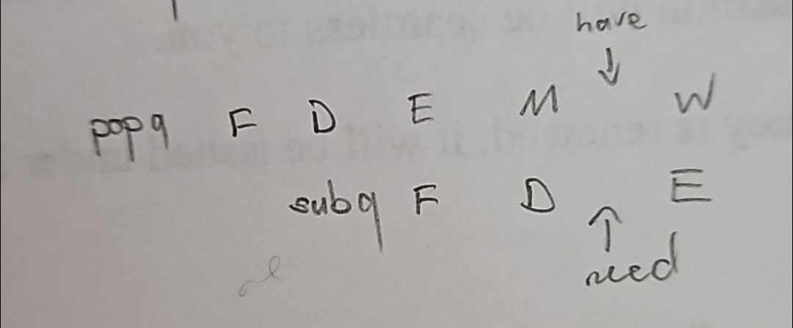	

      - we can just forward `m_valM`

  - variation 3

    	

    - prediction: 
      - predict: don't jump
      - actual: don't jump
      - so don't incur any squash cycle
    - interesting is line 12 to 15
      - line 14 and and 13 is problematic - we will need 1 stall
      - line 15 and line 12 can possibly be problematic too - but because we already have that stall from line 14 and 13, this one can execute no problem

  - do more practice with this

  

## Practice Quiz

### R2.2: Pipeline Instruction Processing

- variation 1

  	

  - diagram

    	

  - so when we need the the data - the first instruction is <u>**in its memory stage**</u>

  - note: even though the diagram show that we are "after" the memory stage, in actuality we're still in the memory stage

- variation 2

  	

  - diagram

    	

  - so we're in the writeback stage for `irmovq`

### R2.3: Pipeline Stage Destination

- variation 1

  	

  - diagram

    	

  - so when first instruction is in the memory stage, the second instruction is in the execute stage &rightarrow; thus the question is asking about the 2nd instruction

  - however, the 2nd instruction does not store `valE` into register (it stores `valM` instead) - so the answer is None

  - note: if the question asked for `dstM` - the 2nd instruction's `dstM` is `%rsi`

- variation 2

  	

  - this is now asking about the memory stage &rightarrow; it's referencing the 1st instruction
  - for the first instruction, we're storing `valM` to `%rbx` - thus `dstM` is `rbx`

- variation 3

  	

  - use the same diagram as variation 1
  - but the decode stage here is referencing some third instruction - which we don't know about
    - (by the time the first instruction reaches memory stage, 2nd instruction reached execute stage which means it has PASSED the decode stage)
  - since there is insufficient info - we say NONE

  

### R2.4: What will valA be assigned?

- reference sheet

  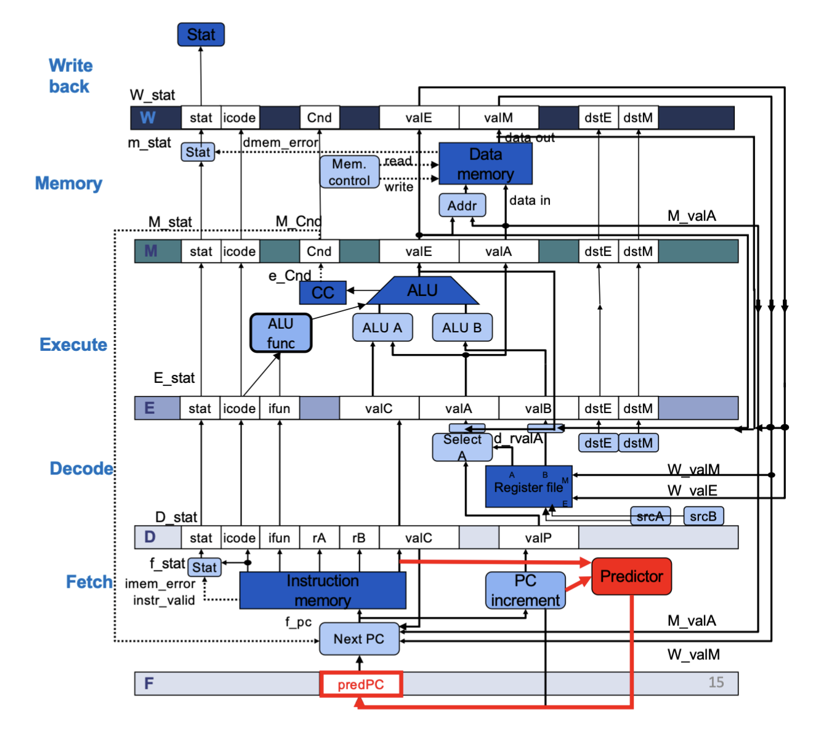	

- variation 1

  	

  - for `pop/ret` - we need the old stack pointer (`%rsp`) AND the new stack pointer (`%rsp + 8`)
    - in the sequential implementation, `R[%rsp] = valB` and `R[%rsp] + 8 = valE` &rightarrow; we read from memory using `valB` and then put `valE` as the new `%rsp`
    - this is no longer the case in pipelined implementation
    - you can see that `valB` doesn't get passed up to the memory stage, but `valA` does 
  - so now, `valA`  and `valB` both intially take on `R[%rsp]`
    - `valB` gets added with 8 to become `valE` (the same)
    - `valA` has a wire which bypasses the ALU and pass it up to the Memory stage - we use this to read from memory i.e `valM = M8[valA]`
  - so the answer here is `R[%rsp]`

- variation 2

  	

  - for `pushq` we actually only need the new stack pointer (`%rsp - 8`)
    - so `valB` still takes `%rsp`
  - but now, we have a value that we're trying to push into the stack (`rA` or `%rbx` in this case) - we make this `valA`
    - this gets bypassed through the ALU (since we use ALU for the -8) and gets written to memory
  - so the answer is `R[%rbx]`

  ​	

### R2.5: Finding Forwarding Opportunities

- variation 1

  	

  - diagram 

    	

  - so we have the data (`valE`) way earlier than we need it

  - we can just pass it up until the 3rd instruction needs it &rightarrow; we can pass it down from the memory stage

  - so the answer is `M_valE`

- variation 2

  	

  - diagram

    	

  - again, we can hold it for a bit

  - so the answer is `W_valM`

### R2.6: Finding Forwarding Opportunities From Memory

- basically, for this question, we don't have the answer until after the memory phase (that is we need to forward `m_valM` at the earliest)

- variation 1

  	

  - diagram

    	

  - there is no way to make this work without stalling, you simply get the answer too late compared to when you need it

### R2.7: Finding Forwarding Opportunities From Memory

- variation 1

  	

  - note: this one forwards the info into the <u>pipeline registers of the Decode stage</u> (so before the decode stage)

  - diagram

    	

    - top is where you have to forward, bottom is when you need

  - so you need 3 instructions between them

### R2.8: Finding Forwarding Opportunities From Memory

- again, the first value we can send is `m_valM`

- but this time, we are forward to between Decode and Execute

- variation 1

  	

  - diagram

    	

  - so you can just straight up forward `m_valM`

### R2.9: Pipeline Instruction Processing - Nops

- question

  	

- part 1

  	

  - they came immediately after one another so you need the full 3 nops

- part 2

  	

  - this one is unrelated to the last one
  - since there is already 1 instruction between them - you need 2 nops

- part 3

  	

  - this one is kinda related to part 2 since it occurs right after line 2
  - since part 2 we already incurred 2 nops, the registers will be populated correctly by the time we get to line 5
  - so no nops needed

## Lab 4

### L4.1: Convert from units of time to seconds

- question

  	

  - dumb question
  - there are $10^3 \text{ ms}$ in a second

### L4.2: Compute latencies of pipelined and sequential processors

- question

  	

  - for the sequential latency, you only incur the register latency once (at the start)

  - for the pipelined latency, you incur the register latency at every stage
    $$
    \begin{align*}
    \text{seq latency} &= 18 + 4(130)= 538 \text{ ps} \\
    \text{pipe latency} &= (18 + 140) \times 4 = 592\text{ ps}
    \end{align*}
    $$

### L4.3: Compute number of ps to retire an instruction

- this question is about **retirement latency** 

  - for sequential it's the same as latency
  - for pipelined it's the `time for the longest stage + register latency`

- variation 1

  	

  - same as latency
    $$
    \text{retirement latency} = 21 + (4 \times 180)  = 741 \text{ ps}
    $$

- variation 2

  	

  - it's just the time for the longest stage (including register latency) basically
    $$
    \text{retirement latency} = (160 + 20) = 180 \text{ ps}
    $$

### L4.4: Compute throughput of pipelined and sequential processors

- compute the retirement latency and use that to calculate throughput 

  - if the number is given in picosecond, you can just do $10^3 / \text{retirement latency}$

- question

  	

  - sequential 
    $$
    \begin{align*}
    \text{retirement latency} &= 9 + (4 \times 100 ) = 409 \text{ ps} \\
    \text{throughput} &= \dfrac{10^3}{409} = 2.44 \text{ GIPS}
    \end{align*}
    $$

  - pipelined
    $$
    \begin{align*}
    \text{retirement latency} &= 100 + 9 = 109 \text{ ps} \\
    \text{throughput} &= \dfrac{10^3}{109} = 9.17 \text{ GIPS}
    \end{align*}
    $$

### L4.5: Analyzing Pipeline Behaviour 

- overall question

  	

  ```assembly
  	main:
  	1:	irmovq  stack, %rsp
  	2:	irmovq  b, %rdi
  	3:	irmovq  f, %rsi
  	4:	call swap
  	5:	halt
  
  	swap:
  	6:	mrmovq  0(%rdi), %r10
  	7:	mrmovq  0(%rsi), %r11
  	8:	rmmovq  %r10, 0(%rsi)
  	9:	rmmovq  %r11, 0(%rdi)
  	10:	ret
  
  	.pos 0x1000
  	data:
  	a:      .quad 0xCAFE
  	b:      .quad 0xFACE
  	c:      .quad 0xFEED
  	d:      .quad 0xDECAF
  	e:      .quad 0xBAD
  	f:      .quad 0xBEAD
  	g:      .quad 0xACE
  	h:      .quad 0xFADE
  
  	.pos 0x2000
  		.quad 0
  		.quad 0
  		.quad 0
  		.quad 0
  		.quad 0
  		.quad 0
  	stack:
  ```

- part 1

  	

  - you just run it in the simulator
  - point is: clock cycles are different in sequential vs pipelined
    - 1 clock cycle in a sequential means you retire 1 instruction (all 5 phases)
    - in pipelined: you execute a phase &rightarrow; you can think of it as executing 1/5 of an instruction 5 times

- part 2

  	

  - `ret` will require stalling &rightarrow; but it has to be machine implemented stalling (i.e we can't add nops manually to make it work)
  - this is because within the `ret` itself, it has to stall for 3 cycles so that it can get the address out of memory and feed it back into the PC

- part 3 and 4

  	

  - you can just run it

- part 5

  	

  - first - which lines do we have to stall on if we just did stalling
    - on line 4: we need to stall for 1 cycle we mess with the stack pointer on line 1 and we need that for `call`
      - due to this stall, it means that line 6 no longer has to stall
      - also means that line 7 no longer has to stall (they both have 3 instructions between them now)
    - on line 8: we need to stall for 2 cycles because 8 uses `%r10` which is modified in line 6
      - due to these stalls, we don't have to stall for line 9 anymore which uses `%r11` which line 7 modifes
  - after data forwarding
    - line 4: we can forward new `%rsp` value to `call`
      - not really what the question is asking but we also don't have to stall on line 6 and 7 any more BECAUSE OF DATA FORWARDING - not because of stalling (because we don't stall anymore)
    - line 8: we can also forward the dat from line 6 

### L4.6: Pipelining and Inlining 

- question

   

  ```assembly
  main:
  irmovq  stack, %rsp
  irmovq  b, %rdi
  irmovq  f, %rsi
  call swap
  halt
  
  swap:
  mrmovq  0(%rdi), %r10
  mrmovq  0(%rsi), %r11
  rmmovq  %r10, 0(%rsi)
  rmmovq  %r11, 0(%rdi)
  ret
  
  .pos 0x1000
  data:
  a:      .quad 0xCAFE
  b:      .quad 0xFACE
  c:      .quad 0xFEED
  d:      .quad 0xDECAF
  e:      .quad 0xBAD
  f:      .quad 0xBEAD
  g:      .quad 0xACE
  h:      .quad 0xFADE
  
  .pos 0x2000
    .quad 0
    .quad 0
    .quad 0
    .quad 0
    .quad 0
    .quad 0
  stack:
  ```

  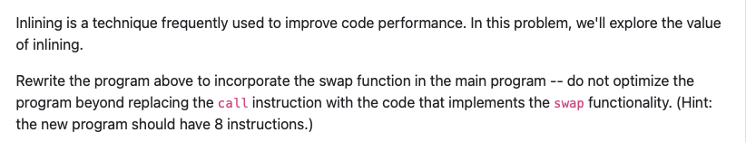	

- part 1

  	

  - you can run this in the simulator

  - but the explanation for it is that at the beginning `%rdi = 0`  

  - by the time we get to `mrmovq 0(%rdi), %r10` - we're actually reading from `M[0]` instead of `M[b]` if it was loaded correctly

  - what's in memory at address 0 happens to the the instruction code for the first `irmovq` instruction

    	

    hence we load in `0x2030f430` into `r10`

- part 2

  	

  - inlined code

    ```assembly
    main:
    irmovq  stack, %rsp
    irmovq  b, %rdi
    irmovq  f, %rsi
    
    mrmovq  0(%rdi), %r10
    mrmovq  0(%rsi), %r11
    rmmovq  %r10, 0(%rsi)
    rmmovq  %r11, 0(%rdi)
    
    halt
    ```

  - we don't need to `call` anymore - so we don't need to the stack anymore

- part 3 and 4

  	

  - need 2 nops before `mrmovq  0(%rdi), %r10` so `%rdi` gets loaded correctly

  - need 2 nops before `rmmovq  %r10, 0(%rsi)` so `%r10` gets loaded correctly

  - code

    ```assembly
    main:
    irmovq  stack, %rsp
    irmovq  b, %rdi
    irmovq  f, %rsi
    nop 
    nop
    mrmovq  0(%rdi), %r10
    mrmovq  0(%rsi), %r11
    nop
    nop
    rmmovq  %r10, 0(%rsi)
    rmmovq  %r11, 0(%rdi)
    
    halt
    ```

    	

- part 5

  	

  - for the first 2 - there are 11 instructions overall, so we need to do it in 11 clock cycles, and eat 4 additional cycles at the end

### L4.7: Sequential v Pipelined Performance

- overall question

  	

- clock cycles

  - variation 1

    	

    - because we count clock cycles kinda differently between pipeline and sequential implementations
    - in the best case (and excluding the additional cycles at the end) - sequential and pipeline will have equal number of clock cycles (1 per instruction)
    - however, if we have any kind of data or control hazards - we might need to stall so the pipelined instruction is likely to take more cycles

  - variation 2 

    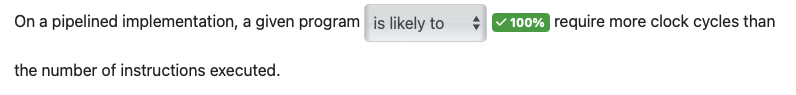	

    - again, if there are hazards, we will require more cycles than just the instructions executed (due to stalls)

  - variation 3

    	

    - if you have more stages - you are more likely to get a data hazard - thus taking more cycles 
    - note: <u>data hazards only affect cycle count - not cycle time</u>

- cycle time

  - variation 1

    	

    - <u>general idea: longer pipeline LIKELY to have shorter cycle time</u>
    - this is because if you're doing the same work and you have more stages, it's likely that you're breaking the work up more evenly, so your maximum register delay could potentially be smaller - thus decreasing the overall cycle time

- other

  - variation 1

     

    -  there's no reason to invent pipelined implementation if it's not going to be faster
    - but there are some cases - maybe when there's 1 instruction or something that they take the same 

  - variation 2

     

    - this will never happen - you literally need the same number of clock cycles as instructions in the sequential implementation

### L4.8: Pipelined Behavior

- overall question

  	

  - we are supposed to ignore the the 4 halts at the end

- variation 1

   

  - data forwarding and branch prediction DOES NOT solve all stalls (i.e memory reads, ret and wrong jumps) - so there may be cases where we stall and thus programs will execute for more clock cycles than there are instructions
  - since we don't actually know if there will be hazards or not - we say NONE

- variation 2

  	

  - the answer is NONE
  - PIPE- might return incorrect due to either control or data hazards
    - some data hazards can be solved with data forwarding (but not all)
    - control hazards may or may not be solved by branch prediction
  - without knowing precisely what the program is doing, you can't know whether data forwarding alone will be helpful

- variation 3

    

  - we know that there are some kind of hazards because PIPE returns incorrect result
  - data forwarding may or may not solve this issue
    - if it does solve it, then cycle count = instruction retired
    - if it doesn't, then cycle count > instruction retired
  - so since we don't know what kind of hazards, we say none

  

## Corrections

### Question 1: Moving Pointers in C

- question

  	

  -  `astruct` is 16 bytes in size
    - 1 byte for `f1`, 7 byte for padding, 8 byte for `f2` (because it's a pointer) 
    - so `as[2]` would be 32 bytes from the original address
  - first option
    - `ptr` is now `uint8_t` pointer 
    - adding 2 to `ptr` will only move it 2 bytes
  - second option
    - the `ptr` is a `astruct` pointer
    - adding to `ptr` will move it 32 bytes as needed
  - third option
    - the `ptr` is a `uint8_t` pointer
    - so simply adding 2 to the `ptr` will only move it 2 bytes
    - but we actually add `2 * sizeof(struct astruct) = 32` to it
    - so we move down 32 bytes as needed
  - last:
    - the `ptr` is a `astruct` pointer
    - we actually add `2 * sizeof(struct astruct) = 32` to it
    - so we move down `32 * 32 = 1024` bytes

- important thing to note about this question is pointer arithmetic

  - incrementing pointers will move it by the size of the type it is pointing to (i.e the pointer type)
  - ex. `uint16* ptr` - incrementing this will move `ptr` by 2 bytes
  - ex. `uint64* ptr` - incrementing this will move `ptr` by 8 bytes

### Question 2: Assembling Instructions into Memory

- question

  	

  - just need to make sure you count the address properly
  - fill out all the address column first
  - then count to where you should start
    - note that first box on every row is address the row start address, and count from there

### Question 3: Decoding instructions from memory

- question

  		

- part 1

  	

  - at `0xe0` the first byte is `50` which is an `mrmovq`
  - the next byte specify the reigsters, `a = %r10` and `c = %r12`
  - the next 8 bytes if to specify the offset - remember that this is little endian
    - so it's `0xf488`

- part 2 and 3

  	

  - same kind of thing

### Question 4: 

- question

  	

  - at the writeback stage, we are writing into registers
  - we want to update the stack pointer (we decremented it so its `valE`) so need to write to `%rsp`
  - we want to put the popped value from memory (which is `valM`) into its destination `rA`

### Question 5: Pipeline Stage Signals

- question

  	

  - when the first instruction is in the execute stage, the second instruction is in the decode stage &rightarrow; so this question is referring to the second instruction
  - for the second instruction, `valC` is the offset given which is `0x500`

### Question 6: What will e_valE be assigned?

- question

  	

  - when you `call`, you are pushing the return address to the stack, so you are modifying the stack pointer `%rsp`
  - also in `call`, `%rsp` is fed in as both `valA` and `valB`
  - so as you are pushing something to the stack, you decrement it, hence `valB - 8`

### Question 7: Counting Off Stages

- part 1

  	

  - you can run this in the simulator
  - but you also know that in the naive implementation, if we're starting fresh, the first instruction gets retired after 5 cycles (so on the 6)
    - so the 2nd instruction gets retired on 7 cycle
    - third instruction gets retired after 8 cycle
  - obviously the fourth one would be on its final stage (Writeback)
  - and since we don't have any stalling, the next instructions would just be one stage behind the instruction before

- part 2

  	

  - identify data hazard: line 4 and line 3 because line 4 reads `%r10` and line 3 writes to it
  - same idea for the first 3 as above since there's no hazard, there're all retired
  - since we're stalling, that means that line 4 is currently in its decode stage and waiting for line 3 to get retired fully
  - line 5 would be in fetch, and the following would be unstarted

- random attempt

  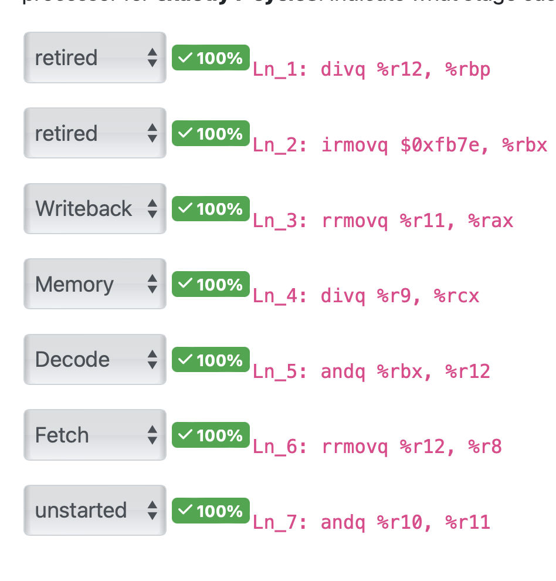  

  - TODO: picture from phone

### Question 8: From Forwarding Signals to Code

- question

  	

  - so this is basically the opposite of all the practice we've done so far, we want to write some instruction set that causes the data forwarding

- part 1

  	

  - for that signal forwarding to happen, so it would look something like	

  - first hint is that we need `valM` &rightarrow; we must use `mrmovq` to cause some kind of data hazard

  - from the diagram, we can see that for it to forward in the way we want it to, the second instruction must be 2 stages behind &rightarrow; add 2 `nops` in between

  - the answer above actually works, I just messed up the order of `rA` and `rB` in the `mrmovq` (`valM` is written to `rA`, not `rB`)

    ```assembly
    mrmovq 0(%rsp), %rax 			# rA = %rax, rB = %rsp
    nop
    nop
    andq %rax, %rax						# cause data hazard and correct forwarding
    ```

- part 2

  	

  - there is many way to cause this, but we were given very limited choices of instructions

  - for this data forwarding to happen, the 2 instructions have to be back to back

    	

  - `popq` modifies the stack pointer as `valE` (i.e `e_valE = %rsp + 8`)

  - so the next instruction needs to use `%rsp` in its ALU operation as well

    - `popq` also takes `%rsp` as both its `valA` and `valB`, so this again would work

### Question 9: Pipeline Instruction Processing - Stalls - No Forwarding

- question

  	

  - the fourth line reads from `%rbp` which 3rd line writes too


# Next Quiz + Midterm

## In Class Assignment

### In Class 11

- I11.1: y86 Pipeline Branch Prediction Choices

  **Assume a pipelined implementation with no forwarding and a branch prediction algorithm that predicts always taken.**	

  ```assembly
  1:	
  2:		irmovq	1, %rax
  3:		irmovq	14, %rbx
  4:		irmovq	1, %rcx
  5:	
  6:	loop_start:
  7:		rrmovq	%rax, %rdi			# rdi = rax
  8:		addq	%rcx, %rax				# rax += 1 
  9:		rrmovq	%rbx, %rbp			# rbp = rbx
  10:		subq	%rdi, %rbp				# rbp - rdi => rbx - i 
  11:		jg	loop_start					# if rbp - rdi > 0, keep going
  12:	
  13:	loop_end:
  14:		xorq   %r9, %r10
  15:		rrmovq   %r12, %r9
  16:		divq   %r11, %r13
  17:		subq   %r8, %r11
  18:		addq   %r12, %r10
  19:		rrmovq   %r11, %rsi
  ```

  - first, figure out how many time the loop body runs (there's no top or bottom of loop in this case, just top)

    - change the end condition `rbx` to 2
    - first iteration: `rbx - rdi = 2 - 1 = 1`, jump to `loop_start` - `rax` becomes 2
    - second iteration: `rbx - rdi = 2 - 2 = 0`, continue to `loop_end`
    - so with `rbx = 2`, we ran 2 times, so in the real case we should <u>run 14 times</u>

  - part 1

    	

    - line 7: data hazard on `%rax` (happens once only) &rightarrow; 1 stall
    - line 8: data hazard on `rcx` (happens only once) &rightarrow; 1 stall (due to the fact that we already added a stall before line 7)
    - line 10: data hazard on both `%rbp` (3 stalls) and `%rdi` (1 stall)
      - we take the bigger of the two so we incur 3 stalls (also solve the other one) &rightarrow; we do this for 14 iterations &rightarrow; $3 \times 14 = 42 \text{ stalls}$
    - line 19: data hazard on `%r11` &rightarrow; 2 stalls
    - overall: 46 stalls

  - part 2:

    - since we always take, we are wrong once at the end
    - thus we incur 2 squashes

- I11.2: Processor Performance - computing CPI

  	

  - let's first compute all the extra cycles we need 
    $$
    \left(2 \text{ stalls (for branch)} \times \dfrac{11}{100} \times \dfrac{34}{100} \right) + \left (1 \text{ stalls (for mem read)} \times \dfrac 8 {100}  \right) = 0.1548
    $$

    - note: data hazards that cannot be avoided by forwarding are <u>memory reads</u>
    - so this is the extra instruction per cycle

  - if we had a perfect pipeline with no hazard, we'd have CPI = 1, so finally
    $$
    \text{total CPI} = 1 + 0.1548 = 1.15
    $$

### In Class 12

- I12.1: Simulator

  - part 1

    	

    - pipelined register is the only correct answer here
    - this is because the simulator was written in a single-thread manner - if you run on a pipelined processor, you would unlock some form of parallelism
    - however, the code cannot automatically take advantage of a hyper-thread or multi-processor architecture

  - part 2

    	

    - yes
    - if we were running all the processors written by students, we can dedicate a single core to each of them and achieve parallelism that way

- I12.2: GPUs

  	

  - SIMD is the answer 
  - GPU is applying the same set of instructions (single instruction steam) to each element of an image (multiple data stream)

- I12.3: Matrix Operations

  - part 1

    	

    - SIMD
    - since you are applying the same operation it's single instruction
    - since you are applying the operation to multiple registers it's multiple data stream

  - part 2

    	

    - MIMD
    - now you have multiple cores which have multiple instruction set (because they're different transformations) - so now it's multiple instruction 
    - same reasoning for the data stream part

- I12.4: Kernel Build

  	

  - the answer is everything but "How many stages does the processor on the machine have"
    - because that does not really matter
    - any performance gain by making 1 processor faster (more stages) will be dwarfed by parallelising it across multiple slower processors

- I12.5: Web Service Architecture

  - part 1

    	

    - there's multiple cores so it's MI
    - the service is doing a lot of things so it will need a lot of different data hence MD

  - part 2

     

    - it's always cheaper and more beneficial to scale horizontally (get more machines)

## Sauce

- question 5

  	

  1. false: `pushq` DOES NOT set the condition code - but this new implementation WILL
  2. true: in `pushq` you only use `%rsp` and `%rA` - here you need `%r8` as well to inc/dec the stack pointer
  3. true: it decrements the stack pointer as necessary
  4. true: it will write to the stack pointer after it decrements (correct)

- question 6

   

  - the simulator is pretty smart we could have just gone `irmovq mlf, %rax`
    - so `%rB = %rax` and `offset/dest = mlf`

- question 7

   	

  ```assembly
  structIter:
  	rrmovq %rdi, %rbp
  	irmovq data, %rbx
  
  loop:
  	mrmovq 0(%rbx), %rax
  	# ...
  	# your own code
  	# ...
  	jmp loop
  	
  done: 
  	ret
  	
  data:
  	# values here
  	# ...
  	0 # sentinel value
  ```

  - options (the constructed solution is NOT correct):

    	

  - my solution

    ```assembly
    structIter:
    	rrmovq %rdi, %rbp						# rbp = size(struct)
    	irmovq data, %rbx
    
    loop:
    	mrmovq 0(%rbx), %rax
    	# my stuff starts
    	addq %rax, %rax 						# does %rax * 2 (would stay 0 if it was sentinel)
    	je done 										# check if %rax is sentinel or not - if yes, done
    	rrmovq %rbx, %rdi						# set up parameter for helper
    	call helper									# call helper
    	addq %rbp, %rbx							# structPtr += 1 (since %rbp is the struct size)
    	# my stuff ends
    	jmp loop
    	
    done: 
    	ret
    	
    data:
    	# values here
    	# ...
    	0 # sentinel value
    ```

    - basically the line 6 is accessing the int that is at address `%rbx` - if this is zero (the sentinel node), we will jump to done 
      - need to add `%rax` to itself to set the condition codes
    - then we set up the parameter for `helper()` then call it 
    - I THINK the push/pop stuff with `%rbx` is a trick and we don't actually have to that - because `%rbx` is a caller saved registers so its value is guaranteed to stay the same after the function returns

- question 9

  	

  -  this question is half missing so it's a bit difficult to understand

  - answer key:

    	

  - basically, since the stack pointer and return address is involved

    - `valA` will have to be `valP` and `valB` has to be the `%rsp` stack pointer
    - this means that `R[%rbx]` <u>has to get forwarded before it goes into the logic block `selectA`</u> which will pick `valA` to be `valP`

  - the end will have to be the Predictor because there's no way to go from `L` to `Q` (no wires avaialble)

    - and Predictor will forward this value to predPC anyways because it's not a conditional jump

- question 10

   

  1. this is correct an a fact - there are no stalling and the cycle count is different where 1 cycle is 1 instruction executed &rightarrow; this will get you CPI of 1
  2. false: pipelined registers almost always have better throughput - that's the whole point
  3. false: our pipelined implementation is single-threaded  - so we can have multiple instructions from 1 thread in flight at the same time
  4. false: in our case, pipelined implementation will at best achieve CPI of 1 

- question 11

   

  - after adding, `%r13 = big positive number` so we <u>should not jump</u> 
    - but the predictor predicts jump 
    - though this is lowkey irrelevant
  - we go to `skip` (wrongfully) - but the instruction itself doesn't use any registers that past instructions wrote to (even if it did, there's data forwarding so it would require a memory read)


## Corrections

### Question 1: Designing a Pipeline

- question 

  	

  - part 1
    - we only have 5 stages but there are 6 phases &rightarrow; we will have to combine some
    - we're only able to combine consecutive phases &rightarrow; we want to combine the 2 smallest consecutive phases, in this case 271 and 351 ps (first 2)
    - combine them and you get $623 \text{ ps}$ and then add $20\text{ ps}$ and get $643 \text{ ps}$ total
    - (unfortunate typo here for me)
  - part 2
    - since the time is given ps, we can just do $10^3 / t$
    - $10^3 / 643 \approx 1.56 \text{ GIPS}$

### Question 3: Why Parallelism?

- overall point

  - clock speed has stopped getting any faster 10 years ago &rightarrow; we cannot speed up the clock speed
  - however, transitors have consistently gotten smaller so we're able to fit more of them on the chip
    - say a core takes up 10 billion transistors, if transistors get smaller and we can now fit 20 billion transistors on the chip, it makes sense to make 2 cores instead
    - basically, we have more transistors than we know what to do with so we make more cores to utilize parallelism

- question

   

  1. False - clock speed has stopped growing
  2. True - chip transistors have continued to grow since they get smaller and we can fit more of them in the chip AND since we can fit more of them in a chip, we want to make more cores with them 
  3. True - it's cheaper to scale horizontally than vertically 
  4. False - (while this. is true - this is not a reason **for** parallelism)
  5. True - basically the 2nd statement, since transistors get smaller, we have more room (to fit more transistors) to make more cores

### Question 4: Calling Conventions

- question:

   

  - translate into C, it should look something like

    ```C
    int func(int size, int* arr) {
        int sum = 0;
        while(size != 0 && *arr < 13) 
        {
            sum += *arr;
            size--;
            arr++;
        }
        return sum;
    }
    ```

  - or in Python

    ```python
    def func(size, arr):
      sum = 0
      for i in range(len(arr)):
        if arr[i] >= 13:
          break
        sum += arr
      return sum
    ```

- part 1

   

  - you just add everything and you get 26

- part 2

   

  - you are supposed to add the first 5 elements but `arr[2] >= 13` so we break there
  - only get to add up the first 2 elements which is 4

- part 3

   

  - add up the first 4 elements (none of which are >= 13) so normal summation
  - add it up and you get 21

### Question 5: Pipeline Stalls with a different pipeline

- question

   

- part 1

    

  - since this is a stalling pipeline, you need to wait for the previous one to fully finish

  1. need to wait for line 2 to fully finish while 3 is in fetch &rightarrow; 4 stalls
  2. need to wait for line 5 to fully finish while 6 is in fetch &rightarrow; 4 stalls 
  3. <u>you actually need to wait for line 8 to fully finish</u> (because `%r10`)
     - note: also remember to count the stalls you've already taken

- part 2

   

  1. line 3's $D_2$ stage has to match up with line 2's $E$ stage (because we need `%rdi` as `valB` in line 3)

      

     - note that we also need `%rdi` as `valA` but it so happens that `valB` stage came first

  2. line 6's $D_1$ stage has to match up with line 2's $M$ stage (because we need `%rdx` as `valB` in line 6)

      

- part 3

   

  - now, it's true that a failed read CAN forward the illegal data to subsequent instructions

  - however, the question also states that once the illegal instruction finishes, the program ends 

  - diagram

     

### Question 6: y86 Pipeline Branch Prediction Choices

- question

   

  - the key thing to note here is that the first time into the loop, you possibly incur less stalls, but as the loop iterates you incur more stalls

- part 1

   

   

### Question 7: New Semantics, Old Processor?

- question 

   

  - `new1`
    - we need to perform both an addition and a multiplication in a single instruction, which requires changes to the ALU or an additional ALU
    - so the answer is `Execute`
  - `new2`
    - we need to be able to extract a second constant from instruction memory
    - so the answer is `Fetch`
    - (note: later, we will need more ALU functionality to both multiply and add in a single instruction &rightarrow; but question ask for the earliest modification)

# Quiz 3

## In Class Assignment 

### In Class 13

- it's a weird interactive thing - try it out if you want to do it again

### In Class 14: Calculating Cache Parameters

- I14.1: How big is the cache?

  	

  - note: the 28 bits wide memory address thing is a red-herring
  - the fact that there are 8 index bits implies that there are $2^8$ <u>cache slots</u>
  - so we have $256 \text{ slots} \times 4 \text{ bytes/slots} = 1024 \text{ bytes} = 1 \text{ kb}$

- I14.2: How many bits in the tag?

  	

  - first we need to figure out the number of bits required for the index and the offset
    - offset: cache lines are 64 bytes long &rightarrow; $\log_2(64) = 6$
    - index: we need to first know how many slots are in the cache
      - number of slots: $(8 \times 1024) \text{ bytes} / 64 \text{ bytes per slot} = 128 \text{ slots}$
      - there for we need $\log_2(128) = 7$ bits for the index
  - so now we have 28 bits per address total, 6 is going to the offset, 7 going to the index, so tag is 15 bits long

- I14.3: How many cache lines?

  	

  - ordering of these questions are a little weird
  - the total size of the cache is $64 \times 1024 = 65536 \text{ bytes}$
  - and since we have $64 \text{ bytes/slots}$, the number of slots is $65536 / 64 = 1024 \text{ slots}$

- I14.4: How many bits in the offset?

   

  - the cache lines are 8 bytes long, so we need enough bits to represent that
  - so the number of offset bits is $\log_2 (8) = 3$ bits

- I14.5: How many bits are there in an address?

   

  - tag: we know it's 11 bits
  - index: $(32 \times 1024 \text{ bytes}) / 4 \text{ bytes per slot} = 8192 \text{ slots}$ &rightarrow; $\log_2 (8192) = 13 \text{ bits}$
  - offset: $\log_2(4) = 2$
  - in total we need 26 bits

- I14.6: How many index bits?

   

  - again, we need the number of slots $16 \times 1024 / 32 = 512 \rightarrow \log_2(512) = 9$ bits

- I14.7: Computing cache access time

   

  - cache miss rate of 35% also means there's a cache hit rate of 65%
    $$
    \text{access time} = 0.65 \times 8 + 0.35 \times 56 = 24.8 \text{ ns}
    $$
  
- I14.8: Computing cache hit/miss rate

   

  - note: for this question, sometimes they ask for miss or hit rate - PAY ATTENTION

  - per cache line, you miss once at the beginning, and hit on all subsequent accesses (note that we're only accessing every other array - so only touching 16 elements in the 32 bytes cache line)
    $$
    \text{miss rate} = \dfrac{1\text{ miss}}{16 \text{ accesses}} = 0.0625 = 6.25 \%
    $$
  
- here, since they ask us to round to a whole percentage, this is 6%

###  In Class 15: Cache Replacement Policies

- I15.1: Experimenting with replacement (LRU)

  	

  - part 1

    	

    - so the first 4 suffers compulsory misses
    - but then every thing after just uses stuff that's already in the cache so there are no more misses
    - since we use 4 distinct elements, they will take up different entries in the cache

  - part 2

    	

    - everything here is a compulsory miss - we don't reuse any data once we load it into the cache

  - part 3

     

    - so the first 4 are compulsory miss, we then have a cache of $\{1,2,3,4\}$
    - we then ask for 5 - another compulsory miss, it'll kick out 1 because that's the least recently used one &rightarrow; cache of $\{2,3,4,5\}$
    - then we ask for 1, not there, kick out 2 and put 1 back in &rightarrow; $\{3,4,5,1\}$
    - basically we keep asking for elements that we just kicked out &rightarrow; there will be no hits

- I15.2: LRU Cache Replacement

  	

  - first 4 are all misses &rightarrow;  $ \text{cache} = \{G,B,E,D\}$
  - 5: A is a miss, evict G &rightarrow; $ \text{cache} = \{B,E,D, A\}$
  - 6: C is a miss, evict B &rightarrow; $ \text{cache} = \{E,D,A,C\}$
  - 7: B is a miss, evict E &rightarrow; $\text{cache} = \{D,A,C,B\}$
  - 8: A is a <u>hit</u> &rightarrow; $\text{cache} = \{D,C,B,A\}$ (A at the end because it was most recently used)
  - 9: E is a miss, evict D &rightarrow; $\text{cache} = \{C,B,A,E\}$
  - 10: E is a <u>hit</u> &rightarrow; $\text{cache} = \{C,B,A,E\}$
  - 11: G is a miss, evict C &rightarrow; $\text{cache} = \{B,A,E,G\}$
  - 12: C is a miss, evict B &rightarrow; $\text{cache} = \{A,E,G,C\}$
  - 13: C is a <u>hit</u> &rightarrow; $\text{cache} = \{A,E,G,C\}$
  - 14: C is a <u>hit</u>, cache stays the same
  - 15: A is a <u>hit</u> &rightarrow; $\text{cache} = \{E,G,C,A\}$
  - 16: E is a <u>hit</u> &rightarrow; $\text{cache} = \{G,C,A,E\}$
  - 17: D is a miss, evict G &rightarrow; $\text{cache} = \{C,A,E,D\}$
  - 18: D is <u>hit</u>, cache stays the same
  - 19: D is a <u>hit</u>, cache stays the same
  - 20: G is a miss, evict C &rightarrow; $\text{cache} = \{A,E,D,G\}$
  - so totally that up - we have 8 hits

- 15.3: LFU Cache Replacement

   

  - there are 7 hits

  - diagram

    	

- I15.4: 2-way set associative cache, 1 access

  	

   

  - first we need to figure out the cache structure

    - since there are 4 sets (as opposed to slots) &rightarrow; we need $\log_2(4) = 2$ bits for index
    - it's 1 byte per cache block &rightarrow; we need $\log_2(1) = 0$ bits for offset
    - so the tag is whatever is left

  - accessing address `0x1101`

    - index = `0x01`  and tag = `0x11`
    - in set index `0x01`, tag `0x11` isn't in either way 0 or way 1, so we need to replace 
    - we decide to replace the LRU (in this case the stuff in Way 0), put in our stuff
    - need to update the LRU for that cache index as well

  - final answer

    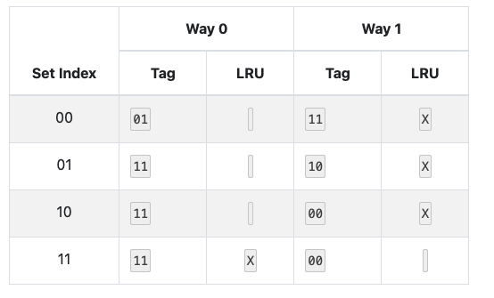 

-  I15.5: 2-way set associative cache, 4 accesses

  	

  - first: `0x0010`

    - go to index `0x10` and look for tag `0x00` - it's there, so this is a hit
    - just need to update and make tag `0x11` the LRU now

  - second: `0x0111`

    - go to index `0x11` and look for tag `0x01` - there's also there
    - update to make tag `0x11` the LRU

  - third and fourth: `0x0100` and `0x0100`

    - go to index `0x00`, look for tag `0x01` - it's there 
    - make tag `0x11` the LRU

  - final answer

    	

### In Class 16: Amdahl's Law and an Introduction to Write Caching

- I16.1: Applying Amdahl's Law

  	

  - we have
    $$
    \begin{align*}
    T_\text{new} &= T_\text{old} \left(1- \alpha + \dfrac \alpha k \right) \\
    &= 388(1-0.59 + \dfrac{0.59}{1.5}) \\ 
    &= 311.69
    \end{align*}
    $$

- I16.2: Applying Amdahl's Law

   

  - trick: we are not speeding up memory access - but rather the ALU operations, so $\alpha = 1- 0.62 = 0.38$

  - first calculate the new time $T_\text{new}$
    $$
    \begin{align*}
    T_\text{new} &= T_\text{old} \left(1- \alpha + \dfrac \alpha k \right) \\
    &= 921(1-0.38 + \dfrac{0.38}{2}) \\
    &= 746.01
    \end{align*}
    $$

  - then, calculate the ratio to get speed up
    $$
    \begin{align*}
    \text{speedup} &= \dfrac{T_\text{old}}{T_\text{new}} \\
    &= \dfrac {921}{746.01} \\
    &= 1.23
    \end{align*}
    $$

  - or, you can use the formula
    $$
    \begin{align*}
    \text{speedup} &=  \dfrac{1}{\left(1 - \alpha + \dfrac \alpha k \right)} \\
    &= \dfrac{1}{1-0.38 + \frac {0.38}{2}} \\
    &= 1.23
    \end{align*}
    $$

- I16.3: Applying Amdahl's Law

  	

  - so here, we can speed up the ALU so $\alpha = 0.9$

  - need to rework the formula a bit
    $$
    \begin{align*}
    T_\text{new} &= T_\text{old} \left(1- \alpha + \dfrac \alpha k \right) \\ \\
    422 &= 676\left(1 -  0.9 + \dfrac {0.9}{k}\right) \\
    k &= \dfrac{676(0.9)}{422 -67.6} \\
    &= 1.716
    \end{align*}
    $$

- I16.4: Counting Cache Misses

  	

  - part 1 
    - let's worry about the inner loop first (but assuming this is our first iteration of the outer loop)
      - every time you access an element, it loads the next 16 bytes i.e next 2 integers, so you get 1 miss, 1 hits on every 2 access
        - meaning for every 2 integers, you get 1 miss, there are 6907 integers, so you have half of those are misses
      - so it'll be something like $6907 / (16 / 8) = 3453.5 \approx 3454 \text{ misses}$ 
        - (alternatively, you can think of it as the entire array of `int` is $6907 \times 8 \text{ bytes}$, then we do $55256 / 16 \approx 3454$ as this is the number of lines we'll need - take a miss on all of those)
      - note: always round up for these things
    - then the outer loop
      - the cache is 65536 bytes large - we are accessing the same 6907 integers over and over &rightarrow; that's $6907 \times 8 = 55256 \text{ bytes}$ 
      - so the entire array `A` can fit into the cache, so we only have to go to the data source in the first iteration of the outer loop
      - for every iteration after that, we'll get all cache hits
    - so overall solution is just 3454
  - part 2
    - inner loop
      - same thing above 
      - it's $21917 / (16 /8 ) \approx 10959 \text{ misses}$ 
      - note: it's important that you round **at this step**
      - note: this is a very version of this question because the array is twice as big as the cache so you don't have to deal with the case where some of the array overlaps while some does not
    - outer loop
      - total size of the array `A` is now $21917 \times 8 = 175336 \text{ bytes}$ so it no longer fits in our cache
      - since it doesn't fit, every iteration we incur this cost 
      - so total is $10959 \times 10 = 109590 \text{ misses}$

- I16.5: Introducing to Write Caching

  - variation 1

    	

    - since it's a write miss - focus on the write allocate policy
    - since it's write allocate - we read the data from the data source INTO the cache, then we edit the data WITHIN the cache
    - note that since it's a write, you are not reading anything from the cache, you're only reading from the data source to put into the cache
  
  - variation 2
  
    	
  
    - it's a cache hit so we focus on the write back policy - in this case it's writethrough
    - ==note: checking if something exists in the cache does not count as "reading"==
      - so in this case, no reading was done
    - the data gets written to the cache AND memory (right away)
  
  - variation 3
  
    	
  
    - cache hit so focus on writeback policy
    - again, we don't do any reading here because it already exist in the cache
    - the data is only written to the cache (and in time, it will get written to memory)


## Practice Quiz 

### R3.1: Caches - Location Ranking Based on Properties

- ==important point==: loser to the CPU means A) faster, B) smaller size, C) smaller cache lines, and D) more expensive

- variation 1

   

- variation 2

   

  

### R3.2: Caches - Implementation Properties to Bits

- question

  	

  - part 1: offset bits

    - the cache line is 16 bytes &rightarrow; $\log_2(16) = 4$ bits for the offset

  - part 2: # of slots

    - you first get the size (64 kB) in bytes and divide it by the cache line size
      $$
      (64 \times 1024 \text{ bytes}) / 16 = 4096 \text{ slots } \\
      $$

  - part 3: index bits

    - since this is not direct-mapped, we need to find the **number of sets**
      $$
      \begin{align*}
      4096 \text{ slots} / 8 &= 512 \text{ sets}\\
      \log_2(512) &= 9 \text{ bits}
      \end{align*}
      $$
      so we need 9 bits for the offset

  - part 4: tag bits

    - so we have 48 bits, 9 goes to the index, 4 goes to the offset, so 35 bits goes to the tag

### R3.3: Interpreting cache metadata

- question 

   

  - part 1

    	

    - slot 7 &rightarrow; index 7 &rightarrow; index bits are `011`
    - offset 2 &rightarrow; offset bits are `10`
    - the tag bits at slot 7 currently is `0011101`
    - we know the address is $(\text{tag bits} + \text{index bits} + \text{offset bits})$ &rightarrow; `0b001110111110`

  - part 2

     

    - skipping 2 offset bits (counting right to left), next 3 bits are the index bits &rightarrow; in this case they are `0b100` (slot 4)
    - now check the tag that's in slot 4 (`0b1101101`) vs the current tag (`0b0000101`) - they are not the same, so it'll be a cache miss

  - part 3

     

    - do the same thing as above, we're looking at slot 7 here 
    - the tag matches up - it'll be a cache hit

  - part 4

    	

    - looking at slot `0b101 = 5`
    - tag matches up so it's a cache hit
    - offset is `0b01 = 1` which is element `0xf8`

### R3.4: Determining where data is placed in a cache

- question

  	

  - offset bits: $\log_2(256) = 8 \text{ bits} = 2 \text{ hexits}$
  - index bits: $\log_2(256) = 8 \text{ bits} = 2 \text{ hexits}$
  - so we will be looking at hexits at index 2 and 3 (counting from the rightmost bit and calling that index 0)
  - we're looking for something with index bits set to `125 = 0x7d` 
  - 3rd and 4th one fits this criteria

### R.3.5: Adding a cache to a processor

- question

  	

  - first, a speed up of 8 means that 
    $$
    \begin{align*}
    \text{speedup} &= \dfrac{T_\text{old}}{T_\text{new}} \\
    8 &= \dfrac{288 \text{ ns}}{T _\text{new}} \\
    T_\text{new}&= 36 \text{ ns}
    \end{align*}
    $$

  - now we want a hit rate $x$ such that 
    $$
    \begin{align*}
    T_\text{hit}(x) + T_\text{miss}(1-x) &= 36 \text{ ns } \\
    5(x) + 288(1-x) &= 36 \text{ ns} \\
    -283 x &= -252 \\
    x &= 0.89
    \end{align*}
    $$

  - so you'd need a hit rate of 0.89 to get a speed up of 8

### R3.6: Adding a second level cache

- question 

  	

  - part 1

    	

    - write-back so the write just have to happen in the cache
    - in this case, it just have to happen in the L1 cache 
    - so it's $2 \text{ ns}$

  - part 2

    	

    - since the eviction is clean, we don't have to do anything in terms of writing it back
    - the line is in L2 - so we transfer from L2 to L1 &rightarrow; $24 \text{ ns}$
    - then we have to read from the L1 &rightarrow; $2 \text{ ns}$
    - so it's $26 \text{ ns}$

  - part 3

    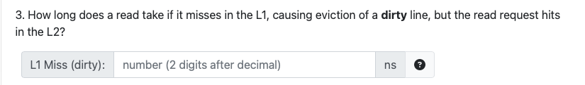	

    - first, we need to transfer the dirty line to L2 &rightarrow; $24 \text{ ns}$
    - then we're essentially handling a miss in L1 with a clean line 
      - the line is in L2 - so we transfer from L2 to L1 &rightarrow; $24 \text{ ns}$
      - then we have to read from the L1 &rightarrow; $2 \text{ ns}$
    - so it's $50 \text{ ns}$ overall

  - part 4

    	

    - since the line is clean, no work done in terms of write back
    - we go to the data source, read it into the L2 &rightarrow; $72 \text{ ns}$
    - transfer from L2 to L1 &rightarrow; $24 \text{ ns}$
    - read from L1 &rightarrow; $2 \text{ ns}$
    - total is $98 \text{ ns}$

  - part 5

    	

    - no work done on write-back for L1 eviction
    - for L2, you need to evict and write-back to memory &rightarrow; $72 \text{ ns}$
    - then we're essentially handling a read miss in L2 with a clean line
      - we go to the data source, read it into the L2 &rightarrow; $72 \text{ ns}$
      - transfer from L2 to L1 &rightarrow; $24 \text{ ns}$
      - read from L1 &rightarrow; $2 \text{ ns}$
    - total is $170 \text{ ns}$

  - part 6

    	

    - first let's define some terms
      $$
      \begin{align*}
      L1_\text{hit} &= \text{percentage we hit the L1 cache} = 0.55 \\
      L2_\text{hit} &= \text{percentage we hit the L2 cache} = (1-0.55)(0.92) \\
      L2_\text{miss} &= \text{percentage we miss the L2 cache} = (1-0.55)(0.08)
      
      \end{align*}
      $$

      - for the L2 stuff, just think of it in terms of we only go to the L2 cache if we miss in the L1 cache

    - calculations
      $$
      \begin{align*}
      T_\text{total} &= (L1_\text{hit} \times T_\text{L1 hit}) + (L2_\text{hit} \times T_\text{L1 miss, L2 hit}) + (L2_\text{miss} \times T_\text{L1 miss, L2 miss}) \\
      &= 0.55(2) + (1-0.55)(0.92)(26) + (1-0.55) (0.08)(98) \\
      &= 15.392 \text{ ns}
      \end{align*}
      $$

      - the times are from the previous questions

## Corrections 

### Question 1: Designing a Pipeline

- this was from the midterm 

- question

   

  - you have to combine consecutive cycles so you want to combine the two that's the smallest 
    - in this case 338 and 328 is the smallest consecutive phases that you can combine
    - so now the stages are $418, 706, 422, 280, 422, 367$
    - and since it's parallel, it'll take as long as the longest stage so it's 706 ps
  - from there you can calculate the throughput by doing $10^3 / 706 \approx 1.42 \text{ GIPS}$

### Question 2: Caches - Bits to Implementation Properties

- question

   

- part 1

   

  - as we know, how big the cache line is influence the number of offset bits, and vice versa
  - here, there are 4 offset bits &rightarrow; $2 ^4 = 16$ byte cache line

- part 2

   

  - now this is related to the number of index bits
  - there are 9 index bits &rightarrow; $2^9 = 512$

- part 3

    

  - 32 KB = 32768 bytes
  - so we know we have 512 sets &rightarrow; each set have $32768 / 512 = 64 \text{ bytes/set}$ 
  - now we now every line has 16 byes $\dfrac{64 \text{ bytes}} {\text{set}} \times \dfrac{\text{lines}}{16 \text{ bytes}} = \dfrac{4 \text{ lines}}{\text{ set}}$ 
  - which means that it is 4-way associative 

### Question 3: Ordering Memory

- question 

   

  - the general idea is
    - the caches get smaller as you get closer to main memory 
    - the caches get more expensive as you get closer to main memory
  - (keep in mind that some of these are a little ambiguous because they have differing metric - some in terms of size, some in term of cost &rightarrow; answer key states that there may be multiple correct orders)

### Question 4: Compare Cache Configurations (associativity)

- question

   

  - part 1 
    - we need to figure out how many cache slots there are &rightarrow; this is $32768 \text{ bytes} / 128 = 256 \text{ slots}$ 
    - to represent 256 slots, we need $\log_2(256) = 8 \text{ bits}$ 
  - part 2
    - when we make the cache 8 way associative, we have now 8 times less cache slots &rightarrow; $256 \text{ slots} / 8 = 32 \text{ sets}$ 
    - to represent this we need $\log_2(32) = 5 \text{bits}$ 
  - part 3
    - fully associative means any cache line can go into any slot - there is no need for an index &rightarrow; 0 bits needed
    - (or you can think of it as 1 huge set - we need $\log_2(1) = 0$ bits)

### Question 5: Interpreting cache meta data

- question

   

- part 1

   

  - you kinda have to reconstruct this, so we know the following from the picture
    - tag: `0b 0001110` (set 2, way 0)
    - index: `0b 010` (because it was set 2 - hence index 2)
    - offset: `0b 10` (because it was offset 2 - only 2 bits because there's only 4 total offset)
  - putting them all together and you'll get `0b 000111001010`

- part 2

   

  - breaking down the address
    - offset: `10`
    - index: `100`
    - tag: `1100101`
  - the tag at index `100` is `0b0100101` or `0b1011001` so it does not match the tag we have &rightarrow; it'll be a miss

- part 3

   

  - breaking down the address
    - offset: `00`
    - index: `011`
    - tag: `0110010`
  - at index `011`, the tag is `0b0110010` which matches &rightarrow; so it will hit

- part 4 

   	

  - breaking down the address
    - offset: `01`
    - index: `101`
    - tag: `1100101`
  - if we got to index `101`, the tag there is `0b1100101` so it matches &rightarrow; we get a hit
  - then in the cache set (way-0), offset 1 is `c3`

### Question 6: Masking Out the Index

- question

   

  - part 1 

    - we know that we'll need $\log_2(32) = 5 \text{ bits}$ for the offset
    - we also know we'll need $\log_2(512) = 9 \text{ bits}$ for the index
    - so we need something like `0b (insert leading 0s) 0011 1111 1110 0000`
    - which turns out to be `3FE0`

  - part 2

     

    - since both the offset and index takes up 14 bits, this means we only need the last **4 hex digits** (`0xbbc0`)
    - we convert this to binary: `0b 1011101111000000`
    - then we cut off the last 5: `0b 10111011110`
    - then we keep the last 9: `0b 111011110 ` 
    - that's the index bits

### Question 7: Cache misses the best and worst

- question

   

  - we use Belady where whenever we need to evict something, we look far into the future and evict that one that we will not need again for the longest time
  - (the other variations will ask for the worst eviction policy - which mean that you look into the future, and evict the one that you'll need again very soon)
  - note: **be careful about whether they're asking about hits or misses**

### Question 8: Adding a second level cache

- question 

   

- part 1

   

  - it's given in the question, a hit in L1 is 3 ns

- part 2

   

  - (remember we're assuming evictions are clean)
  - miss in the L1 it hits in the L2, so we transfer data from L2 to L1 &rightarrow; takes 49 ns
  - then we read it from the L1 (a "hit" now if you want to think about it that way) &rightarrow; 3 ns
  - 52 ns overall

- part 3

   

  - miss in L1, miss in L2, hit in main memory
  - transfer data from main memory to L2 &rightarrow; 82 ns
  - transfer data from L2 to L1 &rightarrow; 49 ns
  - read data from L1 &rightarrow; 3 ns 
  - overall it's 134 ns

- part 4

   

  - this question builds on the previous answers
    $$
    \begin{align*}
    \text{average access} &= 0.61 (3\text{ ns}) + (1-0.61)(0.83)(52 \text{ ns}) + (1-0.61)(1-0.83)(134 \text{ ns})  \\
    &= 27.5466 \\
    &\approx 27.55 \text{ ns}
    \end{align*}
    $$

  - it's basically just the percentage of time things happen multiply by the time it'll take when that thing happens

### Question 9: Cache miss/hit rates depending on stride length

- question

    

  - part 1
    - since the stride is less than the size of a cache line, this makes things easier
    - let say our cache line is 16 bytes
      - if our stride is 1: in every cache line, we take 1 compulsory miss and get 15 hits
      - if our stride is 2: in every cache line, we take 1 compulsory miss and get 7 hits (ish)
      - if our stride is 3: in every cache line, we take 1 compulsory miss and get 5 hits
    - point is: the hit count will go change as we increase/decrease the stride, but miss count stay the same
      - note that this is NOT the case if the stride starts getting bigger than cache line - it becomes a bit more complicated
  - part 2
    - in the case that the new stride length is larger than the cache line size, the miss rate must be 1 (the hit rate must be 0), because we never access more than one item per cache line

### Question 10: Adding a cache to a processor

- question 

   

  - a speed up of 2 means that the new time is $148 / 2 = 74 \text{ ns}$

  - we want a hit rate $x$ such that 
    $$
    \begin{align*}
    74 \text{ ns} &= x(6 \text{ ns}) + (1-x)(154 \text{ ns}) \\
    &= 6x + 154 - 154x \\
    148 x &=  80 \\
    x &\approx 0.54
    \end{align*}
    $$

  - (you could have also used the speed up formula and solved it from there - this just made more intuitive sense to me) 


# Quiz 4

## In class Assignment

### In Class 17: Write Caching

- I17.1: Determining Hit or Miss

   

  - basically, you had to check if the cache line valid (i.e `V == 1`) and that the tag in the address is the same as the tag `T`
  - you can get the tag from the address by shifting it by an appropriate amount
    - in this case: index is $\log_2(2048 / 128) =4$ bits and offset is $\log_2(128) = 7$ bits 
    - so we need to right shift by 11 bits
    - (usually we need to AND it at the end so that the front is all 0 but here we magically assume that's not an issue)
  - code: `(V == 1 && (A >> 11) == T)`

- I17.2: Determining Need for Writeback

   

  - we need to write back when there's a conflict and we are evicting
    - that means the cache line is valid, our tag is the same as the tag currently there (hence, conflict) and the data is dirty so we have to write it back
    - here, to get the tag we shift by 11
  - note: conflict means `T != A >> 11`
  - code: `(V == 1 && D == 0 && (T != (A >> (5 + 6))))`

- I17.3: Writeback cache

  - variation 1

     

    - `0x79 = 0b1111 00 1`
    - index = 00, offset = 1, the tag matches up, so we return `0x97`

  - variation 2

     

    - `0xf9 = 0b11111 00 1`
    - the tag doesn't match up so this is a miss
    - since the data is valid and dirty - we have to write it back to memory

- 17.4: Computing cache write access time

  - variation 1 (write back + write allocate)

     	

    - time for each actions
  
      - cache hit = 25 
      - cache miss and evict clean = 100 (25 to read from the cache, 75 to read from data source and overwrite current line)
      - cache miss and evict dirty = 175 (25 to read from the cache, 75 to write dirty data to source, 75 to read data from source)
  
  
    - math
      $$
      \begin{align*}
      \text{total time} &= \text{hit} + \text{evict clean} + \text{evict dirty} \\
      &= 0.77(25 ) + (0.23)(0.84)(100) + (0.23)(0.16)(175) \\
      &= 45.01 \text{ ns}
      \end{align*}
      $$
  
  - variation 2 (write through + no write back)
  
     
  
    - since it's a write through cache, no matter if writes are hits are miss - we always write to the data source
      - write hit: we write to both cache and data source (but since they can happen in parallel we take the bigger one of these 2)
      - write miss: write straight to data source 
    - the answer is 15 ns

(skip in-class 18 because it's a try it out type thing - basically you want row-wise access in the inner most loop)

### In Class 19: Cache Coherence (MESI)

- I19.1: MESI Protocol States

  - variation 1

     

    - since someone is writing to the same data that you have, the one you have is now STALE
    - so you need to go to invalidate and just get rid of what was there before

  - variation 2

     

    - since you're still the only with this data, you stay in exclusive
    - so E and None

  - (all the variations can be done by tracing the flow diagram)

- I19.2: Deriving Cache Line Size

   

  - (the last cache is referring to more towards the end of the graph, where performance flattens out)
  - since stride size of 256, 512, and 1024 bytes have the same performance - this means that we're likely missing on every access, so we can conclude that line size is 256

- I19.3: Deriving Memory Access Time

   

  - since towards the end, we're missing on all accesses - this means that we're likely just accessing things from main memory every time 
  - so the performance towards the end is main memory performance &rightarrow; we see that it's 90 ns

- I19.4: Deriving the size of the last level cache

   

  - it starts taking longer at around 256 MB and peaks around 1 MB
  - this means that we start falling out of the cache somewhere between there (array no longer fully fits in the cache so we start having more misses)

- I19.5: Deriving size of main memory

   

  - there's no real indication of the max size of main memory
  - since performance is constant until about 8MB - we can say that memory is at least as big as 8 MB (or more)
  - (though realistically, we can't determine that from this graph, since if we run out of memory, everything just crashes)

(skip in class I20 because it's writing pseudo code)

### In Class 21: Fun with File Descriptors

- I21.1: Single process FD behaviour (offset)

  - variation 1

     

    - first `fd1` will return as 3 or something like that (since 0, 1 and 2 are always taken)

    - `fd2 = 3 + 1 = 4` (though this doesn't make any sense since we didn't open any file, this fd doesn't exist in the FD table)

    - we then call `dup2` which makes `fd2` point to the same thing `fd1` is (the `myfile.txt` file) &rightarrow; so now `fd1/2` share the same offset

    - we read 224 bytes then read 717 bytes, that's 941 bytes overall 

    - since `fd2`'s offset is the same as `fd1`'s offset - the answer is 941

  - variation 2

     

    - `fd1` and `fd2` are completely separate (i.e they have their own offsets)

- I21.2. Single process FD behavior (value read)

   

  - code analysis

    ```c
    int fd1 = open("myfile.txt", O_RDWR, 0); 
    int fd2 = open("myfile.txt", O_RDONLY, 0);
    // note that these are separate FD - they DO NOT share offsets
    
    char buf[4096];
    int filler = 'c';
    char writebyte = 'X';
    char readbyte;
    memset(buf, filler, 4096); // buf = [c, c, c, c, c, ... 4096 times] 
    ssize_t nbytes = write(fd1, buf, 160); // myfile = [c, c, c, ... 160, other...]
    nbytes = write(fd1, &writebyte, 1); // myfile = [c, c, ... 160, X, other, ...]
    nbytes = read(fd2, buf, 69); // read the first 69 bytes (all c's)
    nbytes = read(fd2, &readbyte, 1); // read the 70th byte - still c
    ```

  - variation 2

     

    - here, `fd1` and `fd2` point to the something in the OFT (same offset)
    - so we're continuing to read from where `fd1` left off writing &rightarrow; we don't know what might be in the file 

- I21.3. FD Behavior with threads

  - variation 1

       

    - in the first thread

      - it created a new FD called `fd2`
        - this is the same as the original `fd` so we are pointing to `myfile.txt`
      - then read 139 bytes from `fd2/fd` (because they are the same)

      - in the second thread
        - we create a new `fd2` by calling `open`
        - this `fd2` is completely separated from `fd` because we called `open` again 
          - also threads have separate namespaces so this `fd2` has nothing to do with the one in thread 1
        - so then we read 736 bytes

    - so for T2, the offset of `fd2` is 736

  - variation 2

     

    - in this case, T2 creates a new `fd2 = 6` but since we call `dup2`, `fd2` points to the same object as `fd` (and `fd` is shared between the threads)
      - point: threads share the same fd and same offset
    - here, we don't know the ordering, but it doesn't matter since they're both progressing by offset by some amount and by the end the total amount is going to be `370 + 550 = 920`

### In Class 22: File Representation

- I22.1: Computing Rotational Latency and Bandwidth

  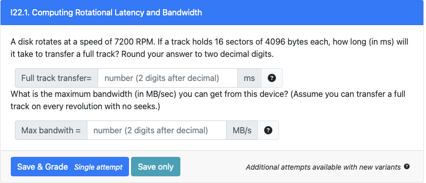 

  - part 1

    - this is basically asking for the time it takes for a full rotation because that's the same as the time needed to read a full track if there are no seeks
      $$
      \begin{align*}
      
      \text{Time for 1 revolution} &= \dfrac{60 \text{ seconds}}{7200 \text{ rotations}} = \dfrac{1\text{ s}}{120 \text{ rotation}} \\
      &= \dfrac{1}{120} \times 1000 \text{ ms} \\
      &= 8.33 \text{ ms}
      \end{align*}
      $$

  - part 2

    - a track has 16 sectors which has 4096 bytes, we want to first find the total data per track
      $$
      \text{Data per track} = 16 \text{ sectors} \times \dfrac{4096 \text{ bytes}}{\text{sector}} = 65536 \text{ bytes} \times \dfrac{1 \text{ MB}}{2^{20} \text{ bytes}} \approx 0.0625 
      $$

    - bandwidth is the amount of data transferred over time and we know that it takes 8.33 ms to get the entire track
      $$
      \text{Bandwidth =} \dfrac{0.0625 \text{ MB}}{8.33 \times 10^{-3} \text{ seconds}} = 7.5 \text{ MB/s}
      $$
      
      (another way to think of this is we currently have $0.0625 \text{ MB/revolution}$, can just multiply that by rotations per seconds)
      $$
      \dfrac{0.0625 \text{ MB}}{\text{revolution}} \times \dfrac{7200 \text{ revolution}}{\text{ 60 seconds}} = 7.5 \text{ MB/s}
      $$
      

- I22.2: 

   

  - part 1

    - the answer is No
    - key thing to consider is how many seeks are needed
    - in the first case, we need 6 seeks (one before each pair of contiguously allocated blocks)
    - in the second, we also need 6 seeks (one at the beginning and then one before each of the non-contiguous blocks (the light blue))

  - part 2

    - key point

      - for contiguous blocks, you don't need to seek again as they are on the same track
        - so you only pay the transfer time for each of the sector
      - non-contiguous blocks, you'll have to seek to the new track 
        - AND once you're on the right track, you'll have to spin the disk some time to find the right sector &rightarrow; on average it will take half a rotation to get to the right place
        - so it's Transfer Time Per Block + Rotational Latency 

    - transfer time per block

      - disk spins at 7200 RPM or 120 rotations per second &rightarrow; 8.333 ms per rotation (or per track)
      - there are 128 sector on a track so time to get 1 sector is $8.333 / 128 = 0.065 $ ms (since 1 block is 1 sector)

    - rotational latency

      - we said it was half the time for 1 full rotation
      - $8.333 \text{ ms} / 2 = 4.166 \text{ ms}$

    - formula is something like
      $$
      \begin{align*}
      \text{Sequential Reading} &= (\text{transfer time for all block}) + (\text{seek + rotational delay for non-cont blocks} )\\
      &= (80 \times 0.065) + ((80-33) \times (6.9 + 4.166)) \\
      &= 525.34 \text{ ms}
      \end{align*}
      $$

      - the first bracket it's 80 because all of them have to pay it anyways 
      - (alternatively you could have done 33 in the first bracket, 47 in the second bracket AND add transfer time)

  - part 3: 

    - key: since it's random, we have to pay the seek and rotational latency every time
      $$
      80 \times (6.9 + 4.166 + 0.065) = 890.54 \text{ ms}
      $$
      

- I22.3. Layout Score

    

    

   a thing to keep in mind here is that there are 3 types of answers: something that's true but not relevant to our question, something that's true and relevant to our question, something that's false

   1. True and relevant. We get better performance this way because we don't incur seek time
   2. False. If they're on the same platter we still have to seek, it's when they're on the same cylinder that we don't have to seek
   3. True and relevant. We would get better performance this way 
   4. True but irrelevant. This would actually get us worst performance - which is not what the question is asking for
   5. True and relevant. We would get better performance because we don't have to seek
   6. True but irrelevant. This would get us worst performance because we have to seek 

- I22.4. Computing File Read time using Layout Score

    	

   - first let's figure out read time
     $$
     \begin{align*}
     \text{read time for 1 track} &= \dfrac{60 \text{ seconds}}{10,000 \text{ rotation}} \times 10^3 \text{ ms} = 6 \text{ ms/rotation (or track)} \\
     \text{read time for 1 sector} &= \dfrac{6 \text{ ms /track}}{16 \text{ sector/track}} = 0.375 \text{ ms / sector} \\
     \end{align*}
     $$

   - we also know that the rotational latency is half the time of a rotation
     $$
     \text{rotational latency } = 6 / 2 = 3 \text{ ms}
     $$

   - then we can find out number of contiguous blocks and number of non-contiguous blocks
     $$
     \begin{align*}
     \text{\# of contiguous block} &= (18 - 1) \times 0.34 = 5.78 \text{ blocks} \\
     \\
     \text{\# of non-contiguous block} &= 17 - 5.78 = 11.22 \text{ blocks}
     \end{align*}
     $$

   - for every contiguous block, we just have to pay the read time; but for every non contiguous block, we have to pay the seek time + rotational delay + read time
     $$
     \text{total} = 5.78(0.375 ) + 11.22(5.8 + 3 + 0.375) \approx 105.11 \text{ ms}
     $$
     another way to do it straight up is by doing this formula 
     $$
     \begin{align*}
     \text{total} &= (\text{number of blocks} - 1) \times (\text{transfer time} + (1-  \text{layout score})(\text{seek time} + \text{rotational latency})) \\
     &= (18-1) \times (0.375 + (1- 0.34)(5.8 + 3)) \\
     &\approx 105.11 \text{ ms}
     \end{align*}
     $$
     so basically it's saying every block pays the read time, and the non contiguous block (the $1 - 0.34$) have to pay extra rotational delay and seek time
     this works because the layout score is quite literally just a percentage of blocks that are contiguous

- I22.5. Comparing single-extent allocation to block-based allocation

    

   - again from the RPM we know that read time is 6 ms per track and 3 ms of rotational array 

   - here, the time to read 1 sector is $6 / 256 = 0.0234375 \text{ ms / sector}$

   - calculate the old time (random access)

     - since it's random access, we pay a $(\text{seek} + \text{rotational delay} + \text{read time)}$
       $$
       T_{\text{old}} = 3840 (4.2 + 3 + 0.0234375 ) = 27738 \text{ ms}
       $$

   - calculate the new time (extent based)

     - the trick here is that we have to pay as many seeks as the number of cylinders that the file takes up

       - (but we don't have to pay any rotational delay or anything like that - just read time per sector)

     - sectors per cylinder: $256 \times 2 \times 4 = 2048 \text{ sectors / cyclinder}$ 

       - (number of sector on a track, by the number of tracks on a surface, by the number of surface in a disk) 

     - so our files take up $3840 / 2048 \approx 2 \text{ cylinders}$ since we have to round up

       - i.e take the ceiling

     - putting it together
       $$
       \begin{align*}
       T_\text{new} &= \text{total seek time} + \text{total read time} \\
       &= (2 \times 4.2) + (3840 \times 0.0234375) = 98.4
       \end{align*}
       $$

       - ==note: don't have to pay rotational delay because the extents are aligned to the cylinder boundaries==

   - calculating speed up
     $$
     \text{speedup} = \dfrac{T_\text{old}}{T_\text{new}} = \dfrac{27738}{98.4} = 281.89
     $$
     

## Practice Quiz

### R4.1: Impact of Stride on Throughput

- question

   

  - since there's literally no cache, every access will go to memory &rightarrow; hence the same speed

### R4.2: Abstract Stride Across Eviction Policies

- question

   

- part 1

  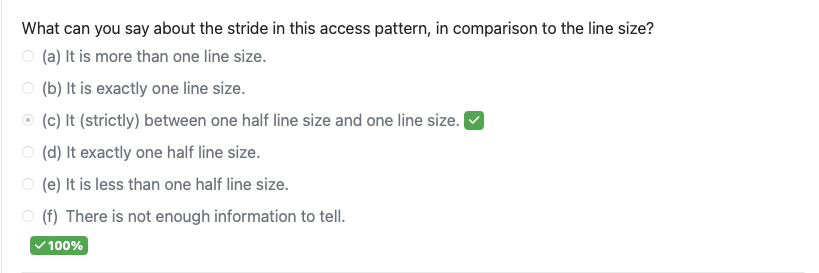 

  - if the stride was exactly half the line size, everything will appear twice
  - if the stride was exactly the line size, everything will appear once
  - since most things occur twice but C only appears once, this is the answer
  - analogy 
    1. If your step length is exactly half the size of a sidewalk block, you'll step twice in each block, making each block appear twice during your walk.
    2. If your step length matches the size of a sidewalk block, you'll step once in each block, and each block will only appear once during your walk.
    3. However, if your step length is somewhere between these two, it's like walking with a stride that's a bit longer than half a sidewalk block. Sometimes, you'll take one step inside a block, and sometimes you'll take two steps before moving to the next block. This means that while most blocks are visited twice, some blocks get skipped on the second step.

- part 2

   

  - if it only hold 4 lines &rightarrow; implies that A and E will have the same index 
    - so if we do simple replacement, when E comes, we'll evict A, then A comes again and we evict E, but B,C,D stays 
  - if we do LRU 
    - when E comes we evict A 
    - when A comes we evict B
    - B comes we evict C
    - and we keep doing that so we don't get any more hits

- part 3

   

  - the cache is big enough where we don't have to evict anything, we just take compulsory misses

### R4.3: Comparing State transitions between MSI and MESI

- variation 1

   

  - the answer is referencing starting in Invalid
    - in MESI, we could potentially go to Exclusive if the data has never been read before
    - in MSI, you could only go to Shared
  - another possible answer is Core 2 reads a cache line
    - if Core 2 reads a cache line held in Core 1's cache line that is exclusive, it will transition Core 1's cache line from exclusive to shared

### R4.4: Balancing write through and write back performance

- question

   

  - let $x$ be the hit rate

  - average access time for write back (write allocate) cache
    $$
    x(5) + (1-x)(14)
    $$

    - first thing is the time it takes for a cache hit
    - 2nd thing is the time it takes for a cache miss (since all lines are clean, we don't have to actually do any write back, just write from memory to cache)

  - average access time for write through

    - it's just 7 because we can write to cache and memory in parallel
    - if it's a hit - we write to both the cache and memory (in parallel - also makes sense that writing to the cache takes less time than writing to memory so we just use 7)
    - if it's a miss- we write straight to memory 

  - formula
    $$
    \begin{align*}
    5x + (1-x)(14) &= 7 \\
    5x + 14 - 14x &= 7 \\
    -9x &= -7 \\
    x &= 7/ 9 \approx 0.78 
    \end{align*}
    $$

### R4.5: File systems - I/O Redirection Implementation

- question 

   

- part 1

   

  - first to create a NEW fd - you need to `create`
  - basically you want to open the new file that you will write to 
  - `O_WRONLY|O_CREATE` means to set it to write only (only valid choice, but could have been write and read too) and `O_CREATE` means to create a new file if that one doesn't exist
  - `O_APPEND` just means we write to the very end of the file regardless of where the offset is (not quite sure why we need it - just to be safe I guess)

- part 2

   

  - we want STDERR FD to now point to our new file descriptor (mind the order)

### R4.6: Relative Disk Drive Performance

- question

   

  - key: 
    - If the disk spins more slowly, than the RPM for the disk decreases. That means that one rotation takes longer for the second drive.
    - If a rotation takes longer, then it also takes longer for sector to pass under the head (i.e., the transfer time will increase) and it takes longer for the sector to move under the head once the head is positioned on the proper track. This extra transfer time and rotational latency will cause fewer bytes to be transferred in a given amount of time so the throughput will decrease. The seek time is how long it takes to move the heads to a track and that is not a function of how fast the disk is spinning.
  - part 1
    - it spins slower so it takes longer to read the data from the tracks
    - it takes longer to transfer the same amount of data &rightarrow; so throughput is lower
  - part 2
    - seek time has nothing to do with rotational speed
    - the arm goes in and out and places itself onto one of the tracks
    - so seek time is exactly the same
  - part 3:
    - same as part 1, since it spins slower it takes more time to transfer data

### R4.7. Fun with File Descriptors

- question 

   

- part 1

    

  - the offset is at 0, read 1 byte so you get `V`

- part 2

   

  - the offset for B is still at 0, so it also reads `V`

- part 3

   

  - note that `write` will overwrite what was already there (it will not add)
  - so the array after writing will be `V,P,W,L,S,K,...`
  - since A's offset is still at 1, it'll get `P`

- part 4

   

  - after writing the 2 bytes, B's offset was at 3
    - recall array now looks like `V,P,W,L,S,K,...`
  - so now if it reads, it gets `L`


## Corrections

### Question 1: MESI Pairings

- part 1

   

  - since this is both respect to the address itself, we know that both these cache slots will be touching the cache line at `0x3487`

  1. it's possible for `(S, S)` to happen when the slots are sharing some data
  2. not possible because C2 also claims to have the data while C1 claims to exclusively have the data
  3. not possible because C1 has a modified version of the data, while C2 claims to have a shared (if that was a the case, C1 state should be shared too - means the modification has been written back)
  4. possible because this is how they start
  5. possible if C2 reads the line exclusively and C1 still hasn't read anything
  6. not possible because they both claim to have the data exclusively

- part 2

    

  - this is basically just saying with respect to the slots in the cache - if we don't know that they both map to the same address, they might just contain different lines 
    - in which case, we can't say anything about the combination of states, because by themselves, the individual states are all valid
  - so the answer is actually all

### Question 2: Computing cache writeback times

- question 

   

  - a hit will take 18 ns
  - a miss + clean eviction will take 144 (to load from memory) + 18 (to read from cache) = 162 ns
  - a miss + dirty eviction will take 144 (to write dirty data) + 144 (load data from memory) + 18 (to read from cache) = 306 ns
  - putting that all together

  $$
  \begin{align*}
  \text{average write time} &= 0.65(18) + (0.35)(0.67)(162) + (0.35)(0.33)(306) \\
  &\approx 85.02 \text{ ns}
  \end{align*}
  $$

### Question 3: Writeback cache

- question

   

  - `0xfe = 0b11111110`
    - offset: `0`
    - index: `11`
    - tag: `11111`
  - the tag at index 11 is `01001` so it's a <u>miss</u>
  - since the valid bit is on and the dirty bit is off, we don't have to write back, we just have to replace (i.e simply just evict the line)

### Question 4: Applying Amdahl's Law

- question 

   

  - we have the formula for speed 
    $$
    \begin{align*}
    \text{speedup} &= \dfrac{T_\text{old}}{T_\text{new}} \\
    &= \dfrac{1}{1 - \alpha + \dfrac \alpha k} \\
    \dfrac{670}{394} &=  \dfrac{1}{1- 0.24 + \dfrac{0.24}{k}} \\
    k &\approx 2.18 \
    \end{align*}
    $$

### Question 5: Stride Exercises for Oversizing Arrays

- question

   

-  part 1

   

  - we take on 256 compulsory miss (1 for every line we access)
  - since the cache fully fits in the cache, for the next 9999 times, we get all hits
  - thus only 256 misses

- part 2

   

  - note that this question is asking about the set number index
  - it wraps around and we get set number 0

- part 3

   

  - same as above, this is set number 6 (off by 1 here)

- part 4

   

  - very hard question

  - as above, for the extra 13 cache lines, they will wrap around to the first 13 sets

    - we will call them "affected sets"

  - for these affected sets, due to our access pattern, we will miss on every line 

    - also due to our eviction policy, we'll always evict the next one we need 
    - the hard part is that you're taking a miss on $16 + 1$ lines (because of the extra line)

  - for the non-affected sets, they remain in the cache, so all subsequent accesses you get hits

    - so you take 16 compulsory miss per set 

  - the math
    $$
    \begin{align*}
    \text{affected sets} &= 10,000 \times (13 \times 17) \\
    \text{unaffected sets} &= (16 - 13) \times 16 \\
    \text{total} &= \text{affected sets} + \text{unaffected sets}
    \end{align*}
    $$

- part 5

  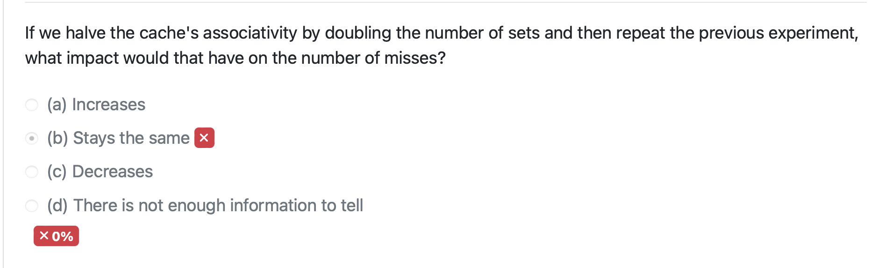 

  - if you increase the number of sets, the number of lines missed per sets shrinks 
    - so the $16 + 1$ becomes like $8 + 1$
  - and so the number of misses <u>**decreases**</u>

### Question 6: Applying Amdahl's Law

- question 

   

- part 1

   

  - this is a slightly more complicated version of Amdahl's Law 

    - also note that there are no portion of the program that's not sped up (that used to be the $1-\alpha$ part - that's now 0)

  - we can do 
    $$
    \begin{align*}
    \text{speedup}
    &= \dfrac{1}{0 + \dfrac {\alpha_1} {k_1} + \dfrac{\alpha_2}{k_2}} \\ 
    &= \dfrac{1}{\dfrac{0.18}{2.4} + \dfrac{0.82}{2.3}} \\
    &\approx  2.32
    \end{align*}
    $$

- part 2

   

  - we also know 
    $$
    \begin{align*}
    \text{speedup} &= \dfrac{T_\text{old}}{T_\text{new}} \\
    T_\text{new} &= T_\text{old} / \text{speedup} \\
    &= 341 / 2.32 \\
    &\approx 147.15
    \end{align*}
    $$

### Question 7: A "Pipe" of Two File Descriptors

- question

   

  - so basically, what 5 would look like is a `command.txt` file with a bunch of linux commands, and then when you PIPE the command into the terminal, it reads the commands from the text file instead of the stuff from your terminal 
  - conversely, 3 would be a blank file at first and the shell would write to this file instead of writing to the terminal

  1. 1 is stdout, this is pointing stdout to the right end of the pipe (fd 3)
     - (inserting into the pipe means to write to the file)
  2. False. This is just not possible
  3. True. If we want to re-direct the output of the shell to our output file - we can write to 3
  4. False, `2` is actually STDERR so not really what we want to do
  5. True. Child processes share fd with its parent
  6. False. Since `fd` now points to the same thing as `3`, when you close 3, you can still reference that file with `fd`

### Question 8: FD Behavior with threads

- question

   

  - note that `fd2`  in both threads uses `fd` 
    - and `fd` was shared from its parents
    - so `fd2` in both threads are pointing to the same thing AND they are sharing the same offset
  - we don't really know which one will run or finish first but we know that at the end, it would have moved $368 + 809 = 1177$ bytes

### Question 9: Disk Fundamentals

- question

   

  - part 1
    - note that there are 2 face on a platter
    - on one face we have $1024 \text{ tracks} \times \dfrac{16 \text{ sectors}}{\text{tracks}} = 16384 \text{ sectors} $
    - so one 2 face we have  $16384 \times 2 = 32768$
  - part 2
    - there are no seeks required if the 2 is located on the same cylinder 
    - so we have 
      - 1 track have 16 sectors
      - on both face of the platter that's 32 sector
      - there are 2 platter so that's 64 sector per cylinder 
    - `46700 // 64 = 729` and `16394 // 64 = 256` so they are not on the same cylinder

### Question 10: Relative Disk Drive Performance

- question 

   

  - part 1
    - loser bits along a track means shorter sectors, which means faster sector transfer time (you're grabbing more bits under the same distance or time)
    - so throughput would be better 
  - part 2
    - we didn't say anything about seek time so that'll still be the same
    - (note that if we somehow made the tracks closer together - that perhaps will decrease seek time)
  - part 3
    - just like part 1
    - lower sector transfer time because you get shorter sectors so you can finish earlier


# Next Quiz + Midterm 2

## In Class Assignment 

### In Class 23: File Representation 

- I23.1: Counting IO for meta data blocks in Single Extent Indexes

   

  - for extent based, once you get the inode you will get the address of the start of the file on disk
    - and all the subsequent bytes are stored contiguously
    - once you have the start, it's pretty easy to get to byte offset `x`, just do `start + x` &rightarrow; so this takes 1 read only
  - but you also have to do a read first to get the inode, so the answer is 2

- I23.2: Counting IO for meta data blocks in Multi-level Indexes

  - method 1: counting indexes

     

    - we know inode points to some $n$-depth indirect block

      - first we need to figure out how many pointers we can fit in an indirect block
        - blocksize is 8192 and disk address is 8 bytes each 
        - $8192 / 8 = 1024$ pointers can fit on a indirect block

      - the file has 1048576, how many indirect block will we need 
        - $1048576 / 1024 = 8$ so we'll need 8 of those pointer tables
        - this mean that our tree will be depth 2 (not counting the inode)

    - picture 

       

    - we need to read the inode, read address from the double-indirect block, read the address from the direct block AND read the actual data itself

    - we'll have 4 reads

  - method 2: simple math 

     

    - we just want to be able to quickly determine how many LEVELS this tree has 
    - instead of looking at indices, we can look at block count we have &rightarrow; $368992 +1 $ (because 0-index)
    - first - we must find how many addresses (pointers) fit into a block &rightarrow; $8192 / 4 = 2048$ addresses
    - if we have 1 level only (just an indirect block)
      - that indirect block points to 2048 addresses which is 2048 different data blocks 
      - $2048 \ll 368,993$ so we cannot get to our desired block
    - if we have 2 levels
      - the first (double) indirect blocks point to 2048 indirect blocks which point to 2048 data blocks 
      - this means we are pointing to a total of $2048 ^2 $ data blocks 
      - we can see that $2048^2 = 4,194,304 \gg 368,993$ so we can definitely get to our desired block
    - thus we will have 2 levels and require 4 reads
    - (note: here we don't do any subtraction stuff - that's only for hybrid)

  - <u>**NOTE**</u>: for these questions it's always $2 + (\text{number of levels})$ - the extra 2 is for reading the inode and then the data block itself

- I23.3: Counting IO for meta data blocks in Hybrid Indexes

   

  - note: the direct block, the indirect block stuff is all in the inode table
  - we can store $1024 / 4 = 256$ addresses per block
  - again, we can look at the number of blocks we want &rightarrow; $43655 + 1 = 43656$
  - the first 8 direct pointers won't get us our desired block &rightarrow; $43656 - 8 = 43648$
  - the indirect pointer can get us to $43648 - 256 = 43392$ 
    - not quite there yet 
  - using our double indirect block: $43392 - (256)^2 = -22144$
    - so our block number will be in the double indirect blocks
  - this means that it'll require 4 reads

- I23.4. Manually Mapping logical block numbers in Multi-level Indexes

   

  - a very slow way to do this
  - 11923 is the first indirect block 
    - zero-th entry in that row holds LBN range 0 - 7
    - first entry in that row holds LBN range 8 - 15
    - ...
    - fourth entry in that row holds LBN range 32 - 39
    - fifth entry in that row holds LBN range 40 - 47
      - what we want 
      - the address at the fifth entry is 27455
  - go to row 27455 
    - this row holds LBN range 40 - 47 &rightarrow; so LBN 44 is in index 4
    - value at index 4 is 48114
  - ==note: this one is assuming there is 2 levels always==

- I23.5. Manually Mapping logical block numbers in Hybrid Indexes

   

   

  - each block table contains 8 adddress
  - block number 35 = 36 block count
  - first 4 direct pointer &rightarrow; $36 - 4 = 32$
  - first 1 indirect pointer &rightarrow; $32 - 8 = 24$
  - so it has to be in the double indirect block
    - so we go to 51982
    - first column gets us 8 block $24 - 8 = 16$
    - second column gets us 8 block $16 - 8 =8$
    - third column get us 8 block $8  -8 = 0$ &rightarrow; so we know it's in address 47131
  - in row 47131, it'll be the last column in this row so 51911
  - (note: if we do the block count - when we are counting, don't do 0-index i.e 2nd column literally mean the 2nd column)

- another way to do 23.5

  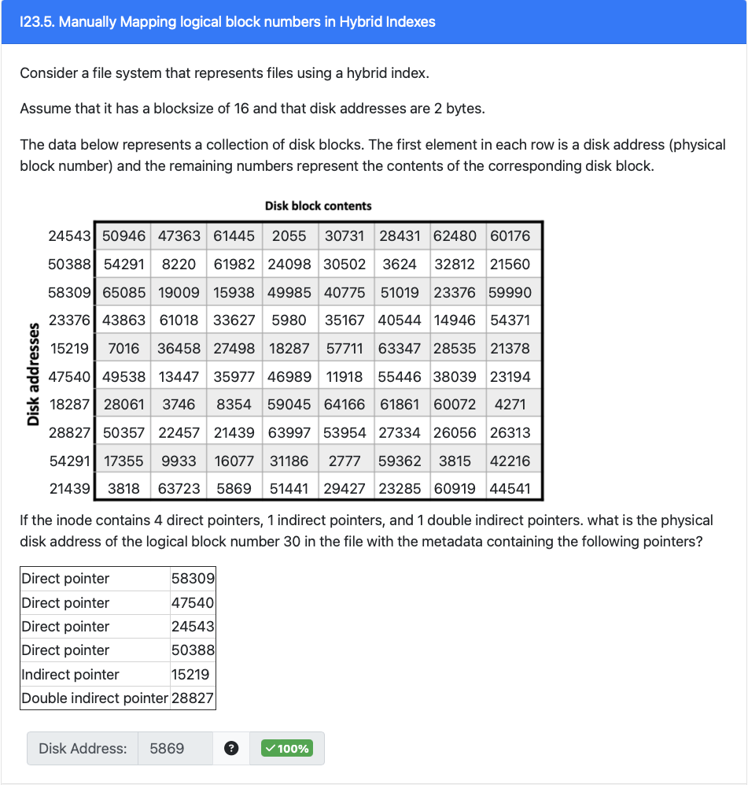 

  - ==here, everything will be 0 indexed==
  - direct blocks: $30 - 4= 26$ &rightarrow; not there yet
  - indirect blocks: $26 - 8 = 18$ &rightarrow; not there yet
  - double indirect blocks: $18 - 8^2 = -46$
    - it will be in the double indirect blocks 
    - go to 28827
  - now, find which indirect blocks to go to from the double-indirect blocks
    - `18 // 8 = 2`
    - go to the 2nd column (0 index) at row 28827
    - points to 21439, go there
  - find which index points to our data block
    - `18 % 8 = 2`
    - go to 2nd column (0 index) at row 21439
    - data is 5869

## Corrections

### Question 2: Disk Fundamentals

- question

   

  - part 1
    - there are 2 platter on the disk, each with 2 surfaces and each surface contains 4096 tracks 16 sectors
    - math: $2 \times 2 \times 4096 \times 16 = 131072$
  - part
    - you need to figure out how many sectors there are per cylinder, so 1 track across all surfaces (there are 4 total surface) and you can find out how many sectors
      - $2 \times 2 \times 16 = 64$
    - you see what cylinder the sectors fall in
      - `195897 // 32 = 3060`
      - `195864 // 32 = 3060 `
      - they are on the same cylinders so you don't need a seek

### Question 3: Hardware vs. Software

- question

   

  - pretty straightforward 
  - note that the pipelined implementation was a hardware thing
  - also note that you can potentially speed up hardware or software using a cache

### Question 4: Multicore Processor Access Rate

- question 

   

  - something potentially tricky to watch out for is if a line has the same index bit and gets put in the cache, it might evict something else that was already there
  - also it's only asking for misses on core 1

- part 1

   

  1. core 1 miss (put `0x47e` into the cache)
  2. core 1 hit
  3. core 1 miss (put `0x4ca` into the cache, in a non-conflict spot)
  4. core 1 hit
  5. core 1 hit
  6. core 1 miss (put `0xdca` into the cache)

  - so 3 total misses for <u>core 1</u>

- part 2

   

  - first 3 is the same A&rightarrow; 2 miss and we have `0x47e` and `0x4ca` in Core 1's cache

  4. core 2 miss &rightarrow; `0x4ca` is now in S state (still usable by core 1)
  5. core 1 hit
  6. core 1 hit (since `0x4ca` did not get evicted)
  7. core 1 miss

  - still just 3 miss for core 1

- part 3

   

  1. core 1 miss (put `0x84c` into the cache)
  2. core 1 miss (put `0x8e4` into the cache - non conflict)
  3. core 1 miss (put `0x143` into the cache - non conflict)
  4. core 1 hit
  5. core 1 hit
  6. core 1 miss (put `0x1e6` into the cache and evict `0x8e4`)

  - 4 misses for core 1

- part 4

   

  - first 3 is the same A&rightarrow; 3 miss and we have `0x84c, 0x8e4, 0x143` in our cache
  - core 2 miss
    - since `0x143` was in M in Core 1, a remote write would cause us to invalidate that
    - so core 1 cache now only has `0x84c`, `0x8e4`

  5. core 1 miss (put `0x143` into the cache)
  6. core 1 hit
  7. core 1 miss

  - in total there's 5 misses for core 1

### Question 5: Ordering Memory

- question

   

   

  - general idea is the closer you are to the memory, you have smaller size, smaller line size, faster, and more expensive
  - (I got the last 2 wrong, because 51 cents per GB means it's more expensive than 13 cents per GB but I got that backwards)

### Question 6: File Descriptor Basics

- question

   

  1. True, there's only 1 vnode per file
  2. False, they'll get separate FD if they call `open` separately, each with their own offset
  3. True, if they call `open` separately, they'll get 2 different FD which have their own offset so they have to point to different things in the OFT (though the entries in OFT will point to the same vnode)
  4. False, the actual value of the FD is dependent on how many files you currently have opened, so it's impossible to say without knowing the code for the threads

### Question 7: Investigating Overhead in FS Indexes

- question

   

  - each block can contain $8192 / 8 = 1024 \text{ addresses}$
  - <u>**important note**</u>: for the multi-index, if the file size is like 11, all of the entries can <u>be direct pointers</u> to the data block itself

- part 1

   

  - if we have 1025 blocks, multi-index would require 2 pointer blocks (1 indirect pointer for the first 1024, and 1 more for the extra 1 block)
  - hybrid would just need 1 indirect pointer (because first 8 is direct), so it can cover $1018$ using the indirect

- part 2

   

  - it's best to think about these as "if they'll need index pointers"
    - so a file that can be represented with all direct pointers mean there are 0 index pointers
    - and since both representation will have the same number of direct pointers (to actually point to the data block), these are not too interesting, we'll rather look at the number of index pointers they'll need
  - the multi-level index can have 11 direct pointers while the hybrid only has 8 direct pointers
    - so if our file size is 9, multi-level can still use direct pointers (0 index pointers) while hybrid will need to use its indirect pointers (1 index pointers)
    - so this is a valid solution

- part 3

   

  - <u>important note</u>: we can assume that the file is as big as needed
  - so if our file is big enough such that the multi-index requires indirect or double indirect blocks (similarly hybrid might need too as well)
  - so in this case, if we access LBN 0 
    - for hybrid, we'll ALWAYS use a direct pointer
    - but for multi-index, depending on the size, we MAY use a indirect pointer (or even double-indirect) &rightarrow; and we can make the file size as big as possible

- part 4

  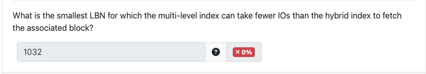 

  - a bit related to part 2
  - if we can get the hybrid index to use indirect block and multi-level index to use all direct blocks, multi-level will require less IO access
  - so if we have size 9, this will be the expected behaviour &rightarrow; <u>this is LBN 8</u>

### Question 8: Bumping Cache Parameters

- question

   

- answer key: If we decrease the associativity, we might:

  1. Decrease the overall cache size, while holding everything else constant.
     - in this case, can think of decreasing the associativity as literally decreasing the number of slots we have, so  just need less index bits
     - and if we're keeping everything else the same we can just think of it as shrinking the cache 
  2. Increase the number of index bits and therefore the number of sets. This then requires we decrease the number of tag bits or increase the overall number of address bits.
  3. Increase the number of offset bits and therefore the cache line size. This then requires we decrease the number of tag bits or increase the overall number of address bits.

### Question 9: Stride Exercises Across a Fixed-Size Array

- question 

   

- part 1

   

  - note that this is direct mapped- so we'll have the "affected" vs "unaffected" cache sets problem that we had on the quiz

    - i.e some pairs of lines accessed map to the same slot in our direct-mapped cache &rightarrow; so each time we access one of such a pair, we evict the other one, and we end up missing on *every* access to such pairs

  - <u>**tricky part**</u>: each stride is 2 lines

    - this means that `j = 0` maps to cache 0, but `j = 1` maps to cache 2, `j = 2` maps to cache 4, etc
    - due to the nature of the stride size and the fact that our cache is direct mapped (whole-fully dependent on the index bits), cache 1, cache 3, cache 5, will never be used 
    - to make things a bit easier &rightarrow; <u>**we can think of this as saying our cache lines is 32 bytes, and decreasing the number of cache slots we have**</u> 
      - (this works because even if we load in 32 bytes, the last 16 bytes is never used/empty, so the logic is the same)
    - so we say we have <u>**16384 total lines**</u>

  - the inner loop tries to access `16397` lines &rightarrow; this is slightly bigger than our cache so we'll have some "spillage"

    - $16397 - 16384 = 13$ cache lines will spill over 
    - this "spilled over" cache slots/lines <u>will incur 2 miss</u> (1 for the original line, then 1 more for the extra spilled line - just like the quiz question)
      - and since they keep evicting each other, you will have to incur these 2 misses for every outer-loop iteration
    - the other 16384 lines will <u>only incur compulsory misses</u>

  - finally, the math
    $$
    \begin{align*}
    \text{total misses} &= \text{affected miss} + \text{unaffected miss} \\
    &= 10,000(13)(2) + (163884 - 13) \\
    &= 276,371
    \end{align*}
    $$
    (I was shockingly closed, I just missed the fact that we incur 2 miss per cache lines)

- part 2

   

  - this is a more classic question, since the stride size is smaller than the line size, we can pay attention to <u>misses per line</u> instead
  - we are trying to access $16397 \times 8 = 131176 \text{ bytes}$ 
    - (note that this is the number of bytes we're trying to access - not indices, index of the last byte would be - 1 of the quantity above)
    - <u>**this can fit fully into the cache**</u>
    - this quantity will require $131176 / 16 = 8198.5 \approx 8199$ cache lines 
  - we take 1 miss per cache line and we only ever take compulsory misses on that first iteration
  - so the answer is 8199 misses

- part 3

  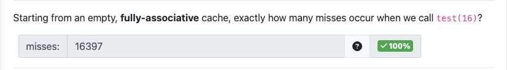 

  - for this problem, we no longer has the weird empty lines problem, since it's fully associative, if there's an empty spot, we will fit it in there
  - so we're trying to access 16397 cache lines (the inner for loop)
    - we have enough slots in our cache to fit this many lines
    - again, we won't have the weird overlapping/empty slots issue because we always use up the entirety of our cache 
  - so we fit them all into our cache and every outer loop iteration, we'll have it in the cache &rightarrow; just take the original compulsory misses
  - in total we take 16397 compulsory miss

- part 4

   

  - for this question, the stride is a bit bigger, but again, since we don't care about indices &rightarrow; if there's open space we'll put it there
  - so in the same way, we only take compulsory misses in the first iteration
  - note: we can't fit the entire array in our cache (i.e `16397 * 32 > 2^19`) but this <u>**does not matter**</u>
    - (this is where I went wrong during the exam)
    - because we do not try to access the entire array
    - we try to access 16397 different cache lines within the array, and we <u>only have to remember these specific cache lines</u>
    - so the fact that our cache can fit 16397 cache lines in it is enough
    - (for direct mapped cache, the index actually matter for the mappings so that's why we tend to care about how big the actual array is, we want to be wary of the wrap arounds)
  - total is 16397 misses

- part 4: freebie

   

  - key: 

     


# Quiz 5

## In Class 

### I24: Directories

- I24.1: Decode Directories (Inode to Name)

   

  - you could use the `rec_len` field to skip over directory that you know isn't `0x66` inode
  - so we look for `66 00 00 00` since it is in little-endian
    - we get `66 00 00 00 14 00 08 0a 50 6f 6c 61 72 20 62 65 61 72 00 00`
    - `66 00 00 00` is the inode
    - `14 00` is the `rec_len`
    - `08` is the type (regular)
    - `0a` means the name length is 10
    - `50 6f 6c 61 72 20 62 65 61 72 00 00` is the name
      - DO NOT CONVERT TO LITTLE ENDIAN since they are just a series of bytes
      - this translates to "Polar bear"

- I24.2: Decode Directories (Inode to Type)

   

  - cheat a bit and look for `02 00 00 10` (little endian)

     

  - so we can see that `rec_len` is `0x0014`

  - and the next byte after that is `d_type` and its `04` meaning it's a directory

- I24.3: Decode Directories (Name to Inode Number)

   

  - `"Wildebeest"` in hex is `57 69 6c 64 65 62 65 65 73 74` (can look for this directly because it's a string - no such thing as endianness)

     

  - working backwards we see `d_namelen` is `0x0a`

  - `d_type` is `0x0a`

  - `d_rec_len` is `0x0014`

  - and `d_ino` is `0x 00 00 00 66`

### I25: Comparing Ext2 and V

- I25.1: ext2 versus V6 max file size

   

  - we can think of this question in terms of data blocks
    - let's just say the number of address we can have in a block is `num_pts`
  - at most, v6 can have 7 indirect pointers and 1 double-indirect pointers 
    - that's `7 * num_ptrs + (num_ptrs ** 2)`
  - at most, ext2 can have 12 direct, 1 indirect, 1 double indirect, 1 triple indirect
    - that's `(12 * num_ptrs) + (num_ptrs) + (num_ptrs ** 2) + (num_ptrs ** 3)`
  - so it's clear to see that ext2 can hold more data blocks can represent bigger files

- I25.2: ext2 versus V6 ease of contiguous allocation

   

  - v6 uses a free list and ext2 uses a bitmap <u>within a block group</u>
  - there's more locality in ext2 (because it's bitmap per block group and you try to allocate files within 1 block group)
  - so ext2 will do a better job storing files contiguously on disk

- I25.3: ext2 versus V6 directory entries (simple)

   

  - in v6, directory entries can only have names that's up to 14 bytes in length
  - so v6 can't even represent this directory

- I25.4: ext2 versus V6 number of IOs

  - variant 1

     

    - a block can store $1024 / 4 = 256$ pointers per block
    - this file is pretty big - so we'll use the set up where we have 7 indirect and 1 double-indirect
    - $6273 - (256 \times 7) = 4481$ so the block doesn't live in any of the 7 indirect, we need to go to double indirect
    - since it's in the double indirect, you need to read the inode, the double indirect, the indirect, then the data itself &rightarrow; so 4 reads
    - but since the <u>inode is already in memory</u>, you only have to do 3 reads

  - variant 2

     

    - a block can store $1024 / 4 = 256$ pointers per block
    - $387114 - 12 = 387102$ so it doesn't live in the direct block
    - $387114 - (256) - (256 ^2) = 321310$ so it doesn't live in the indirect block or the double-indirect block
    - thus it lives in the triple indirect block
      - you need to read the inode, the triple indirect, the double indirect, the indirect, then the data itself &rightarrow; so 5 reads
      - but since the <u>inode is already in memory</u> - you only have to do 4 reads

### I28: Translating addresses using a TLB 

- I28.1: TLB translations (32-bit addresses)

   

  - we need $\log_2(4096) = 12$ bits or 3 hex digits for the offset
  - so the VPN is `0xc9c74` &rightarrow; this maps to `0x2be1e`
    - we have the permissions and privilege needed
    - need to glue the offset (`051`) at the end of the PBN to get `0x2be1e051`
    - note: if we didn't have the permission or privilege required then we just fault

- I28.2: TLB translations (random sizes)

   

  - we need $\log_2(256) = 8$ bits or 2 hex digits for the offset
  - so VPN is `0xfc24` &rightarrow; map to `0x20a37b`
    - we have the permissions required
    - glue the offset (`88` ) on at the end and get `0x20a37b88`

- I28.3: TLB translations (unaligned offset)

   

  - we need $\log_2(64) = 6$ bits
    - this unfortunately does not translate very well to hex digit, so we'll have to operate in bits
  - `0x664 = 0b11001 100100`
    - offset is `0b100100`
    - VPN is `0b11001 = 0x19` (add 0s at the front)
  - this VPN maps to `0x1a7` as the PBN
    - we have the permission and privilege required
    - in binary this is `0b110100111 100100` (added offset at the end)
    - in hex this is `0x69E4`

### I29: VM - Page Tables and Page Replacement

- I29.1: Counting page faults

   

  - from the loop parameter <u>does not matter at all</u>
    - we will be accessing the very last byte of the buffer - so to get that data we will need the array in memory at some point
  - the size of `buffer` is $1024 \times 1024 \times 8 = 2^{23}$ (times 8 because each element is a 8-byte int)
  - since the data is allocated contiguously, $(1024 \times 1024 \times 8) / 2048 = 2^{23} / 11 = 2^{12} = 4096$ pages will be needed
    - this means that we'll take 4096 page fault as we're loading it in (since we start with none in memory)

- I29.2: Single-level page table VM systems

   

  - pages are 1024 bytes (both in physical and virtual space) means that we need $\log_2(1024) = 10$ bits for the offset
  - since our virtual address space is 19 bits, the VPN is $19 - 10 = 9$

  - TODID: what about the metadata business 
    - metadata is more so for the physical address and is related with the PTE

- I29.3: Single-level page table VM systems

   

  - since we're talking about physical pages &rightarrow; look at the PTE (that's what the VA maps to)
  - <u>**note**</u>: understanding this question
    - usually, if our PTE is 4 bytes long, that means our physical address space is 32 bits long
    - however, since we have the offset, our physical address space is actually only $32 - \log_2(\text{page\_size})$ - because we then append the offset at the end, then we get 32 bit long address again
    - in this scenario, they are saying we leave no space for the offset bits, meaning we can (technically) use all of the 32 bits to represent PBN (barring the metadata)
    - further: this means that the OS will need a new way to figure out how indexing works 
  - so now we our PBN can use 32 bits - but we need 5 bits for the metadata, so it's $32 - 5 = 27$
  - so we can represent $2^{27}$ page

- I29.4: Single-level page table VM systems (aligned)

   

  - here, we need to reserve some bits for offsets or metadata
    - you will need $\log_2(1024) = 10$ bits for offset 
    - but remember that our x86 PTE points to the start of the page, so we don't actually need the 10 offset bits 
    - so the PTE entry can potentially look like `0x101010 xxxxxxx`
      - where the `x`s are where the offset should be &rightarrow; you can imagine them being all 0s as we are physically pointing to the start of a page
      - however, people thought that using those bits as all 0s is very wasteful (after all, you can just right shift and get rid of those bits, same thing as having them as all zeros) &rightarrow; so instead they'll use these offset bits for something else...metadata! 
      - so here, we can use all these `x`'s as metadata bits, since we have less metadata bits than we do offset bits, some of them will even be unused &rightarrow; point is, we don't have to allocate any more bits for metadata, they can just use the offset bits
    - you only need 5 bits for the metadata so you can use that and leave 5 unused
  - 4 byte PTE means you have 32 bits, then we have $32 - 10 = 22$ bits
  - so we can represent $2^{22}$ bits

- I29.5: Single-level page table VM systems

   

  - recall that we <u>**use some bits in the VPN to serve as an index into the page tables**</u>
    - note that here we only have 1 level page table while in the x86 there was 4 levels
  - our PTE are 2 bytes so 16 bits
    - we can store $256 / 2 = 128$ PTE per page tables
    - that means we'll need $\log_2(128) = 7$ bits as an index
    - since pages themselves are 256 bytes, we'll need $\log_2(256) = 8$ bits as an offset 
    - so we have $16 - 7 - 8 = 1$ bit leftover 
    - so we have 1 unused bit 
  - note: this is kinda similar to caching now??

### I30: The Clock Algorithm

- I30.1: The Clock Algorithm

   

  - initial state: `0xc0 (1), 0xc1 (0), 0x8b (1), 0xb1 (1)`, hand at position 2 (`0xb1`)
  - access `0xc0`
    - new state: `0xc0 (1), 0xc1 (0), 0x8b (1), 0xb1 (1)` (nothing changes)
  - access `0xb1`
    - new state: `0xc0 (1), 0xc1 (0), 0x8b (1), 0xb1 (1)` (nothing changes)
  - access `0xc0`
    - new state: `0xc0 (1), 0xc1 (0), 0x8b (1), 0xb1 (1)` (nothing changes)
  - access `0x8b`
    - new state: `0xc0 (1), 0xc1 (0), 0x8b (1), 0xb1 (1)` (nothing changes)
  - access `0x8b`
    - new state: `0xc0 (1), 0xc1 (0), 0x8b (1), 0xb1 (1)` (nothing changes)
  - access `0x21`
    - need to evict
      - `0xb1` is in use, so we'll skip it, but set the used bit to 0
      - `0xc0` (because clockwise) is in use, so we'll skip it, but set the used bit to 0
      - `0xc1` is not in use &rightarrow; replace it with `0x21` and mark the use bit 
    - new state: `0xc0 (0), 0x21 (1), 0x8b (1), 0xb1 (0)`
  - access `0xc0`
    - new state: `0xc0 (1), 0x21 (1), 0x8b (1), 0xb1 (0)`
  - access `0x8b`
    - new state: `0xc0 (1), 0x21 (1), 0x8b (1), 0xb1 (0)` (nothing changes)

- I30.2: The Two-handed Clock Algorithm

   

  (very wordy)

   

  - same as above, just remember

    - when you need to evict something, you move the write hand first, and you write back 1 thing
    - remember as you're traversing over other in used entries with replacement hand, set the used bit to 0

  - answer

     

    

## Practice Quiz

### R5.1: Unix directory properties

- question

   

  - you need to have the inode number (cuz the directory entry job to provide name to inode mapping)
  - (not in the question) you also need the name of the directory entry

### R5.2: Find PBN from extent-based file

- question

   

  - since it's extent base, it's contiguous
  - so LBN 0 &rightarrow; PBN 170, so LBN 3 &rightarrow; PBN 173

### R5.3: Understanding File System Structures

- question

   

  1. a directory &rightarrow; this is a chunk of byte in memory, and only the OS can access this
     - also we know within the chunk of bytes, there are `dirent struct`
  2. this is the inode 
  3. this is the job of a directory entry

  - another question is "A file containing the name of another file" &rightarrow; this is a Soft Link

### R5.4: Ext2 Reachable Fork

- question

   

  - we know that we can fit $1024 / 4 = 256 $ address per block
  - so from this double indirect block, we can reach $256 \times 256 = 65,536 \text{ blocks}$

### R5.5: File System Performance Comparison

- question

   

  2. False. It has bigger blocks so reading a singular block would take longer (more data to soup up)
  3. True. Bigger block size means more wasted space (especially at the end of files)
  4. True. Recall that $\text{throughput} = \dfrac{\text{data}}{\text{time}}$. The data amount is the same between the implementations, but the time for A will be less because there are less blocks and <u>likely less seeks</u>
  5. False. Like number 4, it'll have less seeks

  

### R5.6: Comparing Ext2 and V6 

- question

  - variation 1

     
  
    1. True. Has a lot to do with block groups:
       - in ext2, files are fit into the same block group
         - and within block group there's locality, so there's likely less seeks
         - while v6 allocates free space wherever
       - so far large files, ext2 will take less seeks because the file will be in the same block group
    2. True. Same thing, locality in ext2 means less seeks
    3. True. ext2 has a triple indirect which is already bigger than V6
  
  - variation 2
  
     
  
    - False. Ext2 has better locality so will need less seeks
    - False. They're both block based systems so they shouldn't have external fragmentation
    - True. Ext2 has better locality so likely less seeks and thus higher throughput
    - True. This file is quite small - likely to be less than a block, so both Ext2 and V6 will use direct pointers - however, in the inode, there are more entries in Ext2 (which maybe empty - but space are still allocated). So in this case V6 takes up less space (basically because it has a smaller block size)

### R5.7: Process Basis

- question

   

  1. True. Modern processors do this translation using the Memory Management Unit (MMU) for systems with virtual memory
     - note: while the hardware is capable of translating a virtual address to a physical address on every instruction that accesses memory, in practice, this does not happen as often thanks to the efficiency of the TLB and the fact that many instructions operate on data within the same page, allowing them to use the same base physical address with different offsets
  2. False. `fork` creates a new address space, `exec` just replaces values within the address space
  3. True. This is a fundamental feature of virtual memory, allowing systems to use more memory addresses than there is physical RAM, often utilizing secondary storage (like a hard disk) to compensate
  4. False. Some have more privilege levels than others (can be more than 2, but at least 2)
  5. False. Virtual memory is a partnership between hardware and software

### R5.8: Tracing Fork

- question

   

- part 1

   

  - it only prints when `pid == 0` which only occurs when it's in the child process

- part 2, 3, 4

   

  - the first process happens when `i = 0`, when the child process gets spawned, it inherits the `i` value as well, hence in the first child process, `i = 0`
  - walking through the code
    - first iteration in the parents
      - `i = 0`
      - calls `fork` so we have 1 child process
      - increments `i` and iterate again
    - first child process
      - begins execution immediately after the `fork()` call with `i = 0` (since the value of `i` is copied from the parent at the time of `fork()`)
      - will print `i = 0`
      - also has its own loop counter and will proceed to the next iteration, performing its own `fork()` to create a grandchild (child 2)
    - second iteration of the parents
      - the parent process continues with `i = 1`.
      - calls `fork()` again, creating another new process (child 3).
    - grand child process (child 2)
      - process starts with `i = 1` because it is forked by the first child during the second iteration of the loop
      - it will also print "I am 1\n" because, like all newly created child processes, `fork()` returns 0
    - child 3
      - also start with `i = 1` and print "I am 1\n" because `fork()` will return 0 in this new child process 
      - (after printing, this child will end because the for loop terminates because `i` is already 1)
    - so overall there are 3 child process 
      - notice that they print "I am 0/1" so it's only 2 unique things

- another attempt at explaining

    

  - squiggly line next to `pid` means that it's non-zero
  - so we can see the `pid === 0` happens 3 times (see boxed)
  - those are also 3 different processes (if you go down the left branch - those are same processes aka the parent continuing to be a parent) 
    - the numbers next to the edges are counts of processes - so there are 4 total processes (2 child, each with 1 grand child)

(skip R5.9 because it's not that relevant)

### R5.10: TLB translations

- question 

   

- part 1

   

  - the page is 4096 byte long &rightarrow; you need $\log_2(4096) = 12 \text{ offset bits} = 3 \text{ hexits}$
  - so the first 3 hexit is the offset &rightarrow; `0xe45`

- part 2

   

  - this means that the VPN is the remaining of the hexits &rightarrow; `0xe76cf`
  - this VPN maps to `0x674` &rightarrow; this is the physical page number (not the actual address)

- part 3

   

  - you just have to glue on the offset at the end
  - `674 + e45 = 0x674e45`

- part 4

   

  - the access permission is Read and for privilege is User
  - since all the options involve OS so privilege is not a problem
  - however, it's Read only data so we cannot do a Execute and Write

### R5.11: Calling Convention - T/F

- variant 1

   

  - False. Local variables are referenced using negative offset from the base pointer, but function variables are referenced a positive offset from the base pointer

- variant 2

   

  - False. You can access everything using just the stack pointer, just a bit harder because you need to know the size of things

- variant 3

   

  - False. It's using a positive access

  

## Corrections

### Question 1: Directory entry constraints

- question

   

  1. False. If the machine is already a little-endian machine, no reordering is needed - they were made to interpret and understand little-endian numbers
  2. True. There's a `d_type` field in the `dirent` struct and we see that `DT_LINK` means that it's a symbolic link
  3. False. We don't know how long the name is (it can be shorter than the max length) and the filenames are also not null-terminated, so we don't even know when the name ends.
  4. True. Since we know the type we will know the size of each field, and since we know the `nam_len`, we'll know the length of the file name too, all left is to pad to get `rec_len`

### Question 2: Relationship between parent and child processes

- question

   

  1. False. Both processes will have their own file descriptor table - so even though they share the same index, one can close and not affect the other (ref count will just decrease)

      

  2. True. Immediately after `fork`, the child process and the parent process is just continuing from where they were, unless an `exec` is called to make the child run a different process

  3. True. Same picture as above, after we call `fork`, the parent's FD table is copied over, and thus so is all the entries (pointers) so now the entries in the OFT have a new thing pointing to it (at least 2 things pointing to it)

  4. False. This doesn't really make any sense - processes can't see into each other 

### Question 3: File System - Links

- question

   

- part 1

   

  - a directory by itself will always have a link count of 2 (the parent, then itself)
  - since toys has 1 subdirectory, this subdirectory will point to toys as its parent, thus an additional link count
  - so in total we have 3 

- part 2

   

  1. False. A hard link means that the newly created directory points to the same inode as another directory &rightarrow; so it reuses an inode and the number of the inode does not increase
  2. True. Same reason as 1
  3. False. Since there are now 2 directory entry that points to that inode, the link count will increase
  4. True. Same reason as 3

- part 3

   

  1. False. Same reason as 4

  2. True. In a soft link, you are basically creating a new file, then putting a path in that file and redirecting people to that new path. Since you are creating a new file - the number of inodes increases
  3. False. Same reason as 2
  4. True. In a soft link, since you are not referencing a previous inode, but rather creating a new file, the number of inodes will stay the same

### Question 4: Adding Fragments to a File System

- question

   

  - allowing tail end of fails to share blocks (putting files into the empty blocks of other files)
    - say we have 2 files that each require 1.5 blocks &rightarrow; this will in total take up 3 blocks (1 for A, 1 for B, 0.5 of A and 0.5 of B gets put into fragments within block 3)

  1. False. It's up to the privileges and permissions that prevents someone accessing data (goes for any file system) - no more usual exposure than it is with any other 
  2. False. If you can grow and shrink your block size - internal fragmentation wouldn't be a problem (but external would be - but that's unrelated)
     - so we wouldn't even need this fragment shit
  3. True. You're using up ends of the block that would otherwise be wasted without fragments
  4. True. But a lot of assumptions for these
     - we'll never use up more blocks than we would without fragments
     - so it's <u>possible</u> that we will need less seeks
     - <u>**a ton of deductive reasoning**</u> (since we know first 2 is wrong)

### Question 5: Interpreting a Hybrid Inode

- question 1

   

- part 1

   

  - we can store $64 / 4 = 16 \text{ pointers per block}$ 
  - using the direct pointers we can reach 7 data blocks, using the indirect pointer we can reach 16 data blocks &rightarrow; so overall can reach 23 blocks
  - each data block is 64 bytes, so the max file size is $23 \text{ blocks} \times \dfrac{64\text{ bytes}}{\text{block}} = 1472 \text{ bytes}$

- part 2

  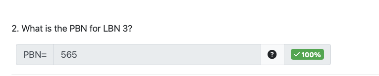 

  - this is just index 3 in the inode, which is PBN 565

- part 3

   

  - this is index 7 (but the 8th entry) in the inode because the first 7 entry are direct pointers
  - so it's PBN 725

- part 4

   

  - we know that this will be in the direct block, so we can do $16 - 7 = 9$
  - and within the indirect block, index 9 will get you the PBN for it
  - (can also think of it as $9 \mod 16^0$)

### Question 6: ext2 versus V6 directory entries

- question

   

  - we can think of this in the worst case and in the best case 
    - best case is names are 5 bytes each 
    - worst case is names are 8 bytes each
  - v6
    - it does not matter whether it's best case or worst case - v6 `dirent` struct is padded to take up 16 bytes
  - ext2 
    - best case: we have $4 + 2 + 2 + 5 = 13 \text{ bytes}$ but we have to pad to be 4-aligned &rightarrow; it'll be 16 bytes
    - worst case: we have $4 + 2 + 2+ 8 = 16 \text{ bytes}$ which does not need padding
  - you can see that in any case, v6 and ext2 takes the same amount of data 

### Question 7: File System Data Structures

- question

   

  (the options are There will be one, There will be 2, There will be more than 2, Not enough information to know)

  1. This structure is usually managed by the OS - and the point is to provide abstraction despite what FS might be mounted, so there should be 1
     - OS maintains a collection of open file entries that is the open file table &rightarrow; so they all have to be the same type, so there's only 1 OF entries
     - (the key here is asking if the OS takes care of it or FS)
  2. This is generally a part of the operating system's standard C library and not specific to any file system. So there should only be 1
     - file <u>type</u> are defined by the OS so it's just 1 
  3. We know from class that v6 uses a linked list structure to allocate inodes while ext2 uses a bitmap structure so there will be 2
     - also inodes are laid out on disk - so it's based on the file system
  4. The struct can to express the diff values that the FS will take (i.e how many blocks are in the FS, etc), but we need the OS need to have a consistent structure to differentiate between the two
     - but basically, the OS uses this, so just have 1

- TODO:

   

### Question 8: Choose-Your-Own-Address TLB Adventure

- question 

   

- part 1

   

  - so we want to pick an entry in the TLB that doesn't allow read &rightarrow; the 2nd entry 
  - this virtual page number if this is `0xa38aca52`
    - to get a full address, you have to add an offset (12 bits or 3 hexit because $\log_2(4096) = 12$)
    - so we could have chosen any random combination of 3 hexadecimal digit but I went safe and chose `000`
    - so overall we have `a38aca52000`

- part 2

   

  - this is basically asking for a virtual address that's not in the TLB
  - an easiest thing to do is just take any VPN that's in the TLB and change 1 digit 
    - this works because the VPN omits the offset, which spans the entirety of the page
    - so if you change any 1 digit in the VPN, we're at a completely different page

### Question 9: Tracing Fork

- question

   

  - we can draw the following

     

    - the number along the edges are the <u>**count**</u> of processes, <u>**not the pid**</u>
    - you can see that squiggly line is non-zero `pid`

  - part 1

     

  - part 2, 3, 4 

     

    - not that we enter the for loop (and thus print) 4 times (for process count 3, 6, 4, 8 - because `pid[1] = 0` for them)

    2. of process 3, 6, 4, 8 that runs &rightarrow; only process 4 and 8 has `pid[0] = 0` so we print it twice
    3. for the 4 process that enter the `for` loop and prints, they each run 3 times and print 3 times &rightarrow; we print 12 (not all unique but they'll still print)
    4. again, 4 processes enter the `for` loop so 4 distinct process is producing the output

### Question 10: When does the OS get to run

- question

   

  1. True. This causes an exception, which hands control over to the OS (it's a trap)
  2. False. When the timer runs out, the OS gets to run, but while the program is an infinite loop, there's no way for the OS to know about this and to intervene
  3. True. This is a system call
  4. False. This is a hardware thing

### Question 11: Hardware or Software

- question

   

  1. False. We check the `pid` to know if it's a parent or child &rightarrow; happens in software
  2. False. Bringing in pages and managing the TLB is a OS thing
     - i.e when there's a page fault, OS takes care of it
  3. True. Caching happens on the hardware level
  4. True. The hardware waits for the info to be available before proceeding
     - this also happens way too often for us to use the OS every time
  5. False. Again, this is a OS thing
  6. True. Same as 4


